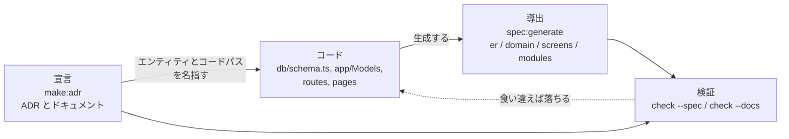
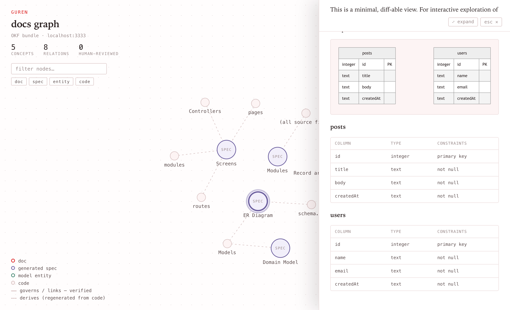

# スペックアンカード開発

AIエージェントは、人間が手作業でドキュメントを正しく保てる速度を超えて
コードを書きます。Gurenの答えはひとつの原則です:

> **導出できるものは導出し、できないものは宣言し、常に検証する。**
> (Derived where possible, declared where not, checked always.)

- **導出(Derived)** — コードから証明できるものはコードから生成します。
  ER図、ドメインモデル、画面一覧、モジュールマップ、エンティティの
  完全なコンテキスト。
- **宣言(Declared)** — コードで表現できないものは書き残し、対象の
  コードへ明示的にリンクします。意思決定、ビジネスルール、背景。
- **検証(Checked)** — どちらも機械的に検証されます。古くなった生成
  ビューや切れたdocリンクは、コードレビューではなくチェックが落とします。

その結果、コードが動いても嘘をつかない仕様が手に入ります — あなたに
とっても、リポジトリで作業するすべてのエージェントにとっても。

3 つの層がどう噛み合うかを図にすると、こうなります。



## 導出: スペックビュー

```bash
bunx guren spec:generate
```

は `docs/spec/` に4つのMarkdownビューを生成します。それぞれが1つの
問いに答えます:

| ファイル | 答える問い |
|------|--------------------|
| `er.md` | データベースはどんな形か? `db/schema.ts` 由来のMermaid ER図 — カラム・型・キー、エッジはモデルのリレーション宣言から |
| `domain.md` | ドメインオブジェクトは何か? モジュールごとにグループ化したモデルのクラス図(カーディナリティ付き) |
| `screens.md` | 各画面は何を受け取るか? ページ → Props型 → それを描画するルート |
| `modules.md` | アプリはどう分割されているか? モジュール・所属モデル・モジュール間依存 |

出力は決定的で、コード変更なしの再生成はバイト単位で一致します。
だからファイルはコミットされ、PRのdiffが「その変更が仕様に何をしたか」
をそのまま見せます。手で編集してはいけません — 信頼を人に頼らないため
のドリフトゲートがあります:

```bash
bunx guren check --spec    # メモリ内で再生成し、ドリフトがあれば非ゼロexit
```

## 導出: エンティティコンテキスト

```bash
bunx guren context User
```

は1つのモデルについてプロジェクトが知るすべてを結合します — テーブルと
カラム、双方向のリレーション、バリデーションスキーマ付きのルート、
コントローラのアクション、Props付きInertiaページ、Resource、Policy、
ファクトリ、シーダー、テスト、そして紐付いたドキュメント。エージェント
向けには `--json`、同名モデルは `--module <name>` で解決します
(`--module app` はアプリルートを指します)。MCP接続エージェントには
`guren_entity_context` ツールとして同じバンドルが提供されます。

## 宣言: ドキュメントとコードの紐付け

意思決定やビジネス背景は `docs/`(および `modules/<name>/docs/`)配下の
Markdownとして残します。このディレクトリは
[Open Knowledge Format](https://github.com/GoogleCloudPlatform/knowledge-catalog/tree/main/okf)
(OKF)バンドルです: 各文書はYAML frontmatter付きのMarkdownで、フォーマットが
必須とする唯一のフィールドが `type`、リレーションは通常のMarkdownリンクと
Gurenの検証付き拡張で表現します:

```yaml
---
type: adr
status: stable            # draft | stable | deprecated(省略時 = stable)
entities: [Invoice]
related:
  - app/Http/Controllers/InvoiceController.ts
  - modules/billing/**
generated: { by: human:ada, at: 2026-07-25T09:00:00Z }
verified: { by: human:grace, at: 2026-07-26T09:00:00Z }
---
```

- `entities` はモデルのクラス名でリンクします — `bunx guren context Invoice`
  が、次にそのモデルを触る誰かにこの文書を提示します。
- `related` はモデル以外のコードを統べる文書のためのファイル/globリンクです。
  どちらもOKFに対するGurenの生産者拡張です(OKFは追加キーを明示的に許容します)。
- 本文中の通常のMarkdownリンクはOKF自身のリレーション機構で、これも検証
  されます — `[orders](/adr/0002-orders.md)` は文書自身の `docs/` バンドル
  ルートから、相対パスは文書の場所から解決されます。
- `generated` と `verified` は「誰が書いたか」「誰が確認したか」をOKFの
  actor規約(`human:<id>`、`process:<id>`、エージェントは `<producer>/<version>`)
  で記録します — エージェントが保守するコーパスでは、この来歴こそが文書を
  信頼可能にします。
- モデルとコントローラからは JSDoc タグで逆リンクを張れます:
  `/** @docs docs/adr/0001-billing.md */`(それ以外のファイルのタグは走査されません)
- `issues` は、その文書が属するGitHubのIssueやPull Requestを指します:
  `issues: [412, "acme/shop#398", https://github.com/acme/shop/pull/9]`。
  番号だけならアプリ自身のリポジトリ(`origin` リモートから解決)です。
  `#412` の書き方は引用符で囲んでください。引用符のない `#` はYAMLの
  コメント開始で、行の残りを飲み込みます。タスク一覧・進捗・担当は
  Issue側に置き、文書は意思決定とこのリンクだけを持ちます。`guren check`
  は読めない項目を警告しますが、GitHubには一切問い合わせないので
  ゲートはオフラインのままです。

意思決定はジェネレータで記録します:

```bash
bunx guren make:adr "Billing cycle is end-of-month" --entity Invoice --issue 412
```

`docs/adr/` 配下に採番されたファイルを作り、frontmatterを記入済みに
します。`--entity` は既存のコードから `entities:` と `related:` を
自動補完し、`--by` は `generated.by` のactor(既定はgitの作者)を
上書きします。`--issue`(カンマ区切りで複数可)は `issues:` を埋めます。
新規Gurenアプリには、この規約を説明するシードADRが最初から同梱されています。

`bunx guren context Invoice` の末尾には **Linked issues** セクションが付き、
リンクされた文書が宣言するIssueが並びます。次にそのモデルを触る人が、
既に紐付いている作業に気づけるためのものです。内容はfrontmatterだけから
読み、状態や担当は `gh issue view` 一発で確認します。

## 閲覧: ドキュメントビューアー

`bun run dev` は読み取り専用のビューアーも
`http://localhost:3333/_guren/docs` にマウントします(`dev` スクリプトの
`GUREN_DOCS=1` で有効化。本番では決して起動せず、自分のマシンからしか
到達できません)。バンドル全体をインタラクティブなリレーショングラフ —
文書・エンティティ・コードパスがノード、検証済みリンクがエッジ — として
描画し、ノードをクリックするとfrontmatter・trust tier・リンク検証結果
付きでその文書が開きます。図は `devDependencies` に `mermaid` があれば
描画されます(新規アプリには最初から入っています)。



「自分のマシンからしか到達できない」のは前提ではなく強制です。接続元が
ループバックアドレスであるとランタイムが確認できたリクエストだけを処理し、
判定できないリクエストは通さずに `403` で拒否します。`bun run dev` は
その情報を渡すので、通常のワークフローで追加の設定は要りません。別の方法で
アプリを起動していて接続元をランタイムが報告できない場合は、拒否メッセージが
`GUREN_ALLOW_UNVERIFIED_PEER=1` を案内します。ネットワークから到達できない
ホストでのみ設定してください。`/_guren/mcp` の MCP エンドポイントも同じ
ガードで保護されています。

ガードが確認するのは接続であって呼び出し元ではありません。接続をローカルで
終端して開発サーバーへ転送するもの — リバースプロキシ、コンテナのポート
公開、ngrok のようなトンネル — はループバックの接続元として見えるため、
その背後のトラフィックは受け入れられます。`GUREN_MCP=1` で起動した開発
サーバーの前にトンネルを置かないでください。MCP エンドポイントはプロジェクト
にファイルを書き込めます。

## 検証: ゲート

`bunx guren check` は、route/controller/pageの整合性チェックと並んで、
切れたdocリンク(リネームされた `related` パス、存在しなくなった
エンティティ、宛先を失った `@docs` タグ)と古くなったスペックビューを
報告します。プレーンなコマンドは情報提供で、CIをゲートする(非ゼロexit)
のはスイートフラグです:

```bash
bunx guren check --docs    # docリンクのみ
bunx guren check --spec    # スペックドリフトのみ
bunx guren check --arch    # アーキテクチャ境界のみ
```

docs/specのチェックはどちらもコンテンツ起動です: `docs/` も
`docs/spec/` も `@docs` タグもなければ結果ゼロなので、規約を採用する
まで何も赤くなりません。`check --changed`(エージェントハーネスの
edit hookがルート・コントローラ・モデル・スキーマ・ページの編集後に
実行するモード)では、検証はその変更が影響しうる範囲に絞られ、ループは
高速なままです。CIではフルのゲートが走ります。

## なぜエージェントに効くのか

古いドキュメントは、AIエージェントにとって「ないより悪い」存在です —
エージェントは嘘を全幅の信頼で読みます。導出ビューはコードから再生成
され、宣言リンクはcheckスイートが検証するので、`bunx guren context Invoice`
を実行したエージェントが得るコンテキストは「リンクと導出ビューは検証済み
だとチェッカーが確認したもの」です(本文の鮮度は文書ごとの宣言で、
OKFの `stale_after: <date>` を設定した文書はその日を過ぎると警告
されます)。新規アプリのエージェントハーネスはこのループを
教えます — モデルに触る前にエンティティコンテキストを引く、ファイルを
動かしたらfrontmatterも同じ変更で更新する、構造を変えたらスペックビュー
を再生成する — そしてedit hookがそれを機械的に強制します。

## 次のステップ

- [Why Guren](./why-guren.md) — フレームワークのエージェントネイティブ設計における位置づけ。
- [CLIリファレンス](./cli.md) — 全コマンド・フラグ・CIでの使い方。
- [アーキテクチャ](./architecture.md) — 導出ビューの土台になっている規約。
