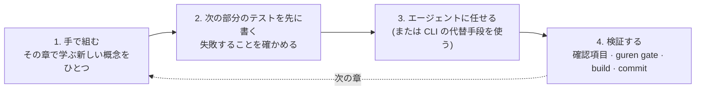

# Guren チュートリアル

このコースでは、空のディレクトリからブログを作り、デプロイするところまで進みます。ブログにはユーザー、コメント、タグ、ファイルアップロード、メール、エージェント向けのインターフェースがそろい、アーキテクチャもドキュメントとして残ります。分量が多いので、Rails Tutorial と同じく最初から順番に進めることを前提にしています。最後まで終えれば、Web アプリケーションを作ってリリースできるようになります。コードを打つ作業の多くはコーディングエージェントに任せ、何をリリースするかの判断は手元に残したまま進められます。

汎用のチュートリアルとの違いは、この後半の部分にあります。Guren はエージェントと一緒に開発することを前提に作られたフレームワークです。エージェントが読むハーネスを入れ、エージェントの出力が必ず通るゲートを用意し、ルート契約を使ってアプリそのものをエージェントから呼び出せるツールにします。このコースでは、こうした仕組みを HTTP、セッション、リレーショナルなモデリング、テストと並べて学びます。2026 年のエンジニアには、どちらの知識も必要になるからです。

途中で知らない用語が出てきたら、[用語集](../guides/glossary.md) を見てください。

## 各章の進み方

第 2 章からは、どの章も同じ 4 つの段取りで進みます。

1. **手で組む。** その章で新しく出てくる概念を、手を動かしてコードにします。テーブルとモデル、ログイン、ポリシー、中間テーブルといったものです。3 つ目の CRUD 画面まで手で書くことはなく、そこはジェネレーターとエージェントに任せます。一度自分で書いておくと、4 つ目の段取りで他人が書いたコードの良し悪しを判断できるようになります。
2. **次の部分のテストを先に書く。** アプリの次の部分を作る前に、それを判定するテストを書いて実行し、失敗することを確かめます。このテストで、エージェントの成果物をどんな条件で受け入れるかを先に決めておきます。打ち込んだコードを確かめるためのテストとは役割が違います。
3. **エージェントに任せる。** エージェントに送るプロンプトは、章の中に一字一句そのまま載せています。任せる場面にはどれも、毎回同じ結果になる代替手段 (`bunx guren add …` や `make:*` コマンド、または書くべきファイル) を添えています。エージェントを契約していなくても最後まで進められるようにするためで、コース自体を機械的に検証できるようにするためでもあります (後述)。
4. **検証する。** 章に載っている短い確認項目に沿ってエージェントの出力をレビューし、`bunx guren gate` を実行してからコミットします。

章の本文には「エージェントが書くはずのコード」を載せていません。エージェントの出力は毎回変わりますし、モデルも入れ替わっていくからです。本文に載せた手書きのコードを参照実装とし、エージェントが書いたものはテスト、確認項目、ゲートで判定します。こうして、どのエージェントの出力に対しても受け入れてよいかを判断できる基準が身につきます。特定のエージェントが出すコードの形を覚えるわけではありません。

コース全体を通して扱うテーマがもうひとつあります。**エージェントハーネス**で、用意された環境として使うだけでなく、それ自体を学ぶ対象として扱います。各章でエージェントに任せる場面では、ハーネスの一部を実際に使います。第 1 章の hook から始まり、glob で対象ファイルを絞ったルール、スキル、2 つのサブエージェント、開発用の MCP エンドポイントと続きます。第 8 章では、ルール、スキル、サブエージェントの指示書を自分で書きます。その直前の第 7 章では、エージェントが何かを忘れる場面を見て、二度と忘れさせないために何が必要かを確認します。

## 作るもの

作るのはブログです。実際に運用するブログに必要な機能をひととおりそろえます。

| 章 | できあがるもの |
|---|---|
| 1〜4 | 雛形から作ったアプリ (git 管理、テストスイート、CI ゲート、Docker イメージ付き) と、バリデーションとページネーションを備えた投稿機能 |
| 5〜8 | パスワードとセッションによるユーザー管理、保護されたルート、著者だけが編集できる投稿、プロジェクトに合わせて手を入れたハーネス |
| 9〜11 | コメント、タグ、カバー画像とギャラリー、自分の投稿にコメントが付いたときの通知メール |
| 12〜13 | エージェントからツールとして呼び出せるアプリと、アーキテクチャを自動でドキュメントにする仕組み |
| 14 | 同じアプリにデータベースに保存するセッションとレート制限を加え、第 1 章から使っている CI ゲートを通したうえで本番モードで動かす |
| 15 | 機能をもうひとつ、今度は逆の順序で作る。バックエンドがまだ無い段階で画面を静的ファイルとして公開して顧客に触ってもらい、そのあと同じコードのまま本物のバックエンドを持つ機能に昇格させる |

## 章立て

各章は前の章が終わったところから始まるので、順番どおりに進めてください。

| # | 章 | 所要時間 |
|---|---|---|
| 1 | [ゼロから出荷できるアプリへ](./01-zero-to-deployed.md) | 40 分 |
| 2 | [リクエストを 1 つ手で組む](./02-one-request-by-hand.md) | 45 分 |
| 3 | [posts テーブル](./03-the-posts-table.md) | 60 分 |
| 4 | [バリデーションとリソース](./04-validation-and-resources.md) | 60 分 |
| 5 | [ユーザーとパスワード](./05-users-and-passwords.md) | 75 分 |
| 6 | [ルートを保護する](./06-protecting-routes.md) | 60 分 |
| 7 | [認可と、ゲートが見逃すもの](./07-authorization.md) | 60 分 |
| 8 | [エージェントにプロジェクトを教える](./08-teach-the-agent.md) | 60 分 |
| 9 | [リレーションシップ](./09-relationships.md) | 90 分 |
| 10 | [ファイル](./10-files.md) | 60 分 |
| 11 | [イベントとメール](./11-events-and-mail.md) | 75 分 |
| 12 | [アプリをエージェントのツールにする](./12-agent-tools.md) | 75 分 |
| 13 | [古びないドキュメント](./13-documented.md) | 60 分 |
| 14 | [本番](./14-production.md) | 45 分 |
| 15 | [プロトタイプファースト](./15-prototype-first.md) | 60 分 |

## 前提

- **[Bun](https://bun.sh) 1.4.2。** 必須なのはこれだけです。雛形のデータベースは SQLite が既定なので、データベースサーバーを別に入れる必要はありません。
- **git。** 各章の最後にコミットします。
- **TypeScript。** 型、async/await、モジュールなど、今の TypeScript の書き方に慣れていることを前提にします。React と Inertia の知識は前提にしていません。必要な分だけを第 2 章で説明し、そこから少しずつ広げていきます。
- **コーディングエージェント(任意)。** 本文では Claude Code を使います。ハーネスは Codex、Cursor、Copilot、OpenCode にも対応していて、エージェントに任せる場面にはどれも、エージェントを使わない代替手段があります。
- **Docker(任意)。** 第 1 章と第 14 章でコンテナイメージをビルドします。それ以外は Bun だけで動きます。

## このコースが正しさを保つ仕組み

各章に載っているコマンドとファイルは、フレームワーク自身の CI が現行リリースに対して章の順にすべて実行しており、章の終わりごとにゲートとビルドも走らせています。手順が動かなくなるようなフレームワークの変更は、読者がつまずく前に、フレームワークのビルドの失敗として見つかります。日本語版も同じ仕組みで英語版と照合しています。文章は翻訳していますが、コードは英語版とバイト単位で同じです。

この版は `create-guren-app` 1.17 と Guren 2.28 で動作を確認しています。雛形がもっと新しいバージョンを表示しても、章の内容はほぼそのまま使えるはずです。手順と実際の画面が食い違う場合は、[CLI リファレンス](../guides/cli.md) で現在のコマンド一覧を確認してください。

> [!TIP]
> まず 10 分ほどで試したい場合は、[Getting Started](../guides/getting-started.md) を見てください。アプリを雛形から作り、リクエストをひとつ最初から最後まで追いかけます。全体を通してやりたくなったら、ここに戻ってきてください。コードを自分で書くよりエージェントに指示して作りたい場合は、[エージェントと作る](../agent-course/00-overview.md) に進んでください。2 本の実装計画で勉強会アプリを作ります。
