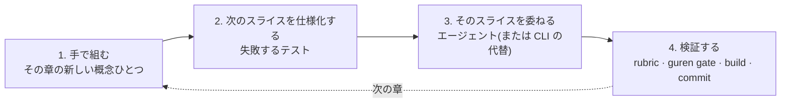

# Guren チュートリアル

このコースでは、空のディレクトリから始めて、ユーザー、コメント、タグ、ファイルアップロード、メール、エージェントインターフェース、そして自分自身を文書化するアーキテクチャを備えたブログをデプロイするところまで進みます。長いコースですし、Rails Tutorial がそうだったように、順番どおりに取り組むことを前提にしています。完走すれば、Web アプリケーションを作って出荷できるようになります。しかも、タイピングの多くをコーディングエージェントに任せながら、何を出荷するかは自分が握ったままで。

その後半こそが、このコースを汎用的なチュートリアルではなく Guren のコースにしている部分です。Guren はエージェント時代のために作られています。エージェントが読むハーネスを導入し、エージェントの出力が通らなければならないゲートを備え、ルート契約によってアプリ自体をエージェントが呼び出せるツールにします。このコースでは、HTTP、セッション、リレーショナルなモデリング、テストと並べてそれらを教えます。2026 年に働くエンジニアには両方が必要だからです。

途中で見慣れない用語が出てきたら [用語集](../guides/glossary.md) を参照してください。

## 各章の進み方

第 2 章以降、すべての章は同じ 4 拍子で進みます。

1. **手で組む。** その章の新しい概念ひとつを担うコードを、自分で書きます。テーブルとモデル、ログイン、ポリシー、中間テーブル。3 つ目の CRUD 画面を手で書くことはありません。それはジェネレーターとエージェントの仕事です。概念を一度自分で書くことが、第 4 拍で他人の書いたものを判断できる根拠になります。
2. **次のスライスを仕様化する。** アプリの次のピースがまだ存在しないうちに、それを判定するテストを書き、赤で走らせます。これは自分のタイピングのテストではなく、エージェントから何を受け入れるかの宣言です。
3. **そのスライスを委ねる。** 章がプロンプトを一言一句そのまま示します。委任には必ず決定的な代替、つまり `bunx guren add …` や `make:*` コマンド、あるいは書くべきファイルが併記されます。エージェントの契約が無くても完走でき、コース自体を機械的に検証できるようにするためです(後述)。
4. **検証する。** 章が示す短い rubric に照らしてエージェントの出力をレビューし、`bunx guren gate` と `bun run build` を実行して、コミットします。

章の本文に「エージェントが書くであろうコード」は載りません。エージェントは非決定的で、モデルは入れ替わります。本文の手書き版が参照実装であり、テストと rubric とゲートがエージェント版を判定します。身につくのは特定のエージェントの出力の形ではなく、どのエージェントの出力であっても受け入れ可否を判断する基準です。

もうひとつ、コース全体を貫くものがあります。**エージェントハーネスは背景ではなく教材です。** 各章の委任は、第 1 章の hook から glob スコープの rule、skill、2 つの subagent、開発用 MCP エンドポイントまで、ハーネスの一片を実際に使わせます。第 8 章では自分の rule、skill、subagent brief を書きます。その直前の第 7 章で、エージェントが何かを忘れる様子と、二度と忘れさせないために何が要るかを見た上で。

## 作るもの

ブログと、本物のブログに必要なすべてです。

| 章 | できあがるもの |
|---|---|
| 1〜4 | 雛形生成したアプリ。git 管理下で、テストスイート、CI ゲート、Docker イメージ付き。バリデーションとページネーション付きの投稿 |
| 5〜8 | パスワードとセッションを持つユーザー、保護されたルート、著者だけが編集できる投稿、そして自分のプロジェクトに合わせて形作ったハーネス |
| 9〜11 | コメント、タグ、カバー画像とギャラリー、自分の投稿にコメントが付いたときのメール |
| 12〜13 | エージェントが呼び出せるツールとして公開したアプリ、自分自身を文書化するアーキテクチャ |
| 14 | 同じアプリにデータベースバックのセッションとレート制限を付け、第 1 章で与えられた CI ゲートの後ろで本番モードで動かす |

## 章立て

各章は前の章の終わりから始まります。順番どおりに進めてください。

| # | 章 | 所要時間 |
|---|---|---|
| 1 | [ゼロから出荷できるアプリへ](./01-zero-to-deployed.md) | 40 分 |
| 2 | [リクエストをひとつ、手で](./02-one-request-by-hand.md) | 45 分 |
| 3 | [posts テーブル](./03-the-posts-table.md) | 60 分 |
| 4 | [バリデーションとリソース](./04-validation-and-resources.md) | 60 分 |
| 5 | [ユーザーとパスワード](./05-users-and-passwords.md) | 75 分 |
| 6 | [ルートを保護する](./06-protecting-routes.md) | 60 分 |
| 7 | [認可、そしてゲートに見えないもの](./07-authorization.md) | 60 分 |
| 8 | [エージェントに自分のプロジェクトを教える](./08-teach-the-agent.md) | 60 分 |
| 9 | [リレーションシップ](./09-relationships.md) | 90 分 |
| 10 | [ファイル](./10-files.md) | 60 分 |
| 11 | [イベントとメール](./11-events-and-mail.md) | 75 分 |
| 12 | [アプリをエージェントのツールにする](./12-agent-tools.md) | 75 分 |
| 13 | [古びないドキュメント](./13-documented.md) | 60 分 |
| 14 | [本番](./14-production.md) | 45 分 |

## 前提

- **[Bun](https://bun.sh) 1.1 以降。** 必須なのはこれだけです。雛形は SQLite が既定なので、データベースサーバーの導入は不要です。
- **git。** 各章はコミットで終わります。
- **TypeScript。** 型、async/await、モジュールといった現代の TypeScript に慣れていること。React と Inertia の知識は前提にしません。第 2 章で必要最小限を導入し、そこから積み上げます。
- **コーディングエージェント(任意)。** 章で示すのは Claude Code です。ハーネスは Codex、Cursor、Copilot、OpenCode にも対応し、すべての委任にエージェント無しの代替があります。
- **Docker(任意)。** 第 1 章と第 14 章でコンテナイメージをビルドします。それ以外は Bun だけで動きます。

## このコースが正しさを保つ仕組み

各章のすべてのコマンドとファイルは、フレームワーク自身の CI が現行リリースに対して章の順に実行し、各章末にゲートとビルドを走らせています。ある手順を壊すフレームワークの変更は、あなたの午後ではなくフレームワークのビルドを落とします。日本語訳も同じ仕組みで英語版と照合されます。散文は翻訳し、コードはバイト単位で同一です。

この版は `create-guren-app` 1.13 と Guren 2.16 に対して検証済みです。雛形がより新しいバージョンを表示しても、章の内容はほぼそのまま通用するはずです。手順と画面が食い違ったら、[CLI リファレンス](../guides/cli.md) に現行のコマンド一覧があります。

> [!TIP]
> まず 10 分版から試したい場合は、[Getting Started](../guides/getting-started.md) がアプリを雛形生成してリクエストひとつを端から端まで見せます。全体をやりたくなったらここに戻ってきてください。
