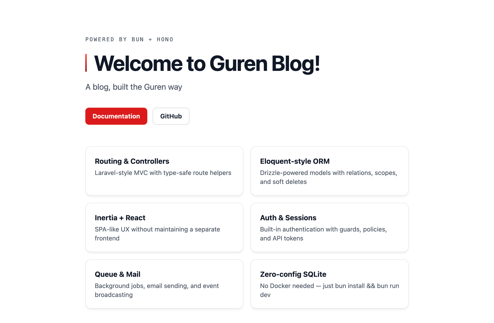

# 第 1 章: ゼロから出荷できるアプリへ

この章では、Guren アプリを雛形から作り、雛形に何が用意されているかを読んでいきます。次に、テストを先に書いてから変更をひとつ手で加えます。その次の変更はコーディングエージェントに任せ、ハーネスがその作業をどう検査するかを確認します。最後に、どこでも動かせるコンテナイメージを作ります。以降の章もすべて、ゲートが通り、コミットが済み、いつでもリリースできる状態で終わります。

この章だけは [4 つの段取り](./00-overview.md#各章の進み方) に沿っていません。準備のための章で、まだ手で組むものがないからです。代わりに、以降の章で前提になる道具の使い方を覚えます。テストランナー、`guren gate`、エージェントハーネスの 3 つです。

**この章で学ぶこと:**

- 本文と同じアプリになるよう、すべての選択肢をあらかじめ指定して雛形からアプリを作る方法
- 新しいアプリに最初から入っているもの: テスト、CI ワークフロー、エージェントハーネス
- `bunx guren gate` が実行する内容と、それが CI と同じコマンドである理由
- `.claude/settings.json` の 3 つの hook が、`guren check` と `guren gate` の結果をエージェントに返す仕組み
- 変更の前に失敗するテストを書き、それを通す進め方
- `guren deploy` でアプリをコンテナイメージにする方法

## 1. アプリの雛形を生成する

雛形生成ツールを対話的に実行すると、4 つの質問が表示されます。ここでは答えをコマンドラインで先に渡して、このコースで説明するアプリと同じものを作ります。

```bash run
bunx create-guren-app guren-blog --mode ssr --db sqlite --agents claude --git
```

- `--mode ssr` では、ページをまずサーバー側でレンダリングします。もうひとつのモード `spa` では、中身が空の HTML を送り、ブラウザ側でレンダリングします。
- `--db sqlite` ならデータベースサーバーは要りません。データベースのファイルは、最初に開かれたときに `./data/` の下に作られます。第 14 章で、同じアプリを Postgres に移します。
- `--agents claude` を付けると、Claude Code 向けのエージェントハーネスが入ります。`--agents all` なら Claude Code、Codex、Cursor、Copilot、OpenCode 向けをまとめて入れ、`none` なら何も入れません。このコースの内容はどのエージェントでも同じように進められ、それを支えているのがハーネスです。
- `--git` を付けると、リポジトリを初期化して最初のコミットまで作ります。これで、どの章もコミットで締めくくれます。

雛形生成ツールはテンプレートをコピーし、自動生成した `APP_KEY` と `DATABASE_URL=./data/guren.db` を書いた `.env` を作って、依存関係をインストールします。できたアプリのディレクトリに移動します。

```bash run
cd guren-blog
```

## 2. 動かす

```bash run background
bun run dev
```

**チェックポイント:** [http://localhost:3333](http://localhost:3333) を開きます。「Welcome to Guren Blog!」という見出しのウェルカムページが表示され、その下に機能紹介のカードが 6 枚並んでいるはずです。



`dev` スクリプトは 3 つのことを行います。まず `.guren/` の下の型付きマニフェストを再生成し(`bun run codegen`)、次に `GUREN_MCP=1` と `GUREN_DOCS=1` を付けてサーバーを起動します。この 2 つのフラグで、開発時専用の MCP エンドポイントが `/_guren/mcp` に、Docs Graph ビューアが `/_guren/docs` にマウントされます。第 8 章で前者にエージェントを接続し、第 13 章で後者に中身を入れていきます。どちらも本番環境には存在しません。

開発サーバーはこのターミナルで動かしたままにしておきます。以降のコマンドは、もう 1 つターミナルを開き、`guren-blog` の中で実行してください。

## 3. 生成されたファイルを読む

新しいアプリは小さいので、ひと通り読んでもそれほど時間はかかりません。この章で扱うファイルは次のとおりです。

```text
guren-blog/
├── app/Http/Controllers/HomeController.ts   # 唯一のコントローラー
├── resources/js/pages/Home.tsx              # 唯一のページ
├── routes/web.ts                            # 2 本のルート
├── lang/en/messages.json                    # 翻訳カタログ
├── tests/HomeController.test.ts             # 唯一のテスト
├── .github/workflows/ci.yml                 # CI: ゲートひとつ
├── CLAUDE.md                                # エージェントが最初に読むもの
├── .claude/                                 # rules、skills、agents、hooks
└── .mcp.json                                # 開発用 MCP エンドポイント
```

### リクエストの経路

`routes/web.ts` では 2 つの URL を設定しています。1 つ目はコントローラーのメソッドを指定し、2 つ目はハンドラーをその場に直接書いています。インラインのハンドラーは、1 行で済む処理なら問題ありませんが、それより大きな処理には向きません。

```ts
import { Router } from '@guren/core'
import HomeController from '../app/Http/Controllers/HomeController.js'

export function registerWebRoutes(router: Router): void {
  router.get('/', [HomeController, 'index'])

  // Health check endpoint for load balancers and uptime monitors
  router.get('/health', (c) => c.json({ status: 'ok' }))
}
```

`HomeController.index` はページに渡す props を組み立て、ページをレンダリングします。`pages.Home` は文字列ではなく、`resources/js/pages/` の下のファイルから生成された型付きの参照です。受け取れる props は、ページコンポーネントの `Props` インターフェースで決まります。ページが宣言していない prop を渡したり、必須の prop を渡し忘れたりすると、`bun run typecheck` が失敗します。

```ts
import { Controller } from '@guren/core'
import { pages } from '@/.guren/pages.gen'

export default class HomeController extends Controller {
  async index(): Promise<Response> {
    const props = {
      // Message text lives in lang/en/messages.json (key typed by codegen).
      message: this.t('messages.welcome', { name: 'Guren Blog' }),
    }

    return this.inertia(pages.Home, props, { title: 'Guren Blog' })
  }
}
```

`this.t()` は `lang/en/messages.json` から文言を読みます。キーにも型が付いているので、存在する `messages.welcome` はコンパイルが通り、存在しない `messages.hello` はコンパイルエラーになります。Guren には実行時の間違いをコンパイルエラーに変える仕組みが数多くあり、これはその最初の例です。

### テスト

`tests/HomeController.test.ts` は実際の `src/app.ts` を起動し、ポートもブラウザも使わずにリクエストを送ります。

```ts
import { beforeAll, describe, it } from 'bun:test'
import { TestApp } from '@guren/testing'
import app from '../src/app.js'

// Boots the real src/app.ts so tests share its configuration.
describe('app', () => {
  let http: TestApp

  beforeAll(async () => {
    http = await TestApp.fromApp(app)
  })

  it('serves the translated home page', async () => {
    const response = await http.get('/').assertOk()
    await response.assertBodyContains('Welcome to')
  })

  it('answers the health check', async () => {
    await http.get('/health').assertOk()
  })
})
```

テストを実行します。

```bash run
bun test
```

テストは 2 件で、どちらも通ります。第 2 章からは、このようなテストを、対象のコードより*先に*書きます。

### CI ワークフロー

`.github/workflows/ci.yml` で重要なステップは 1 つだけです。

```yaml
      - name: Gate
        run: bunx guren gate --deps
```

CI の中身はこれだけです。CI で検査される内容は、どれも同じコマンドで手元でも実行できます。

## 4. ゲート

```bash run
bunx guren gate
```

`gate` は 6 つのステージを順に実行し、どこかで失敗するとそこで止まります。ステージは **codegen**(型付きマニフェストの生成)、**typecheck**、**lint**、**check**、**audit**、**test** で、このうち 2 つは Guren 独自のものです。

- `guren check` は、アプリを動かさずにコードを読んで検証します。すべてのルートが実在するコントローラーメソッドを指しているか、すべての `pages.X` が実在するページファイルを指しているか、各ページの props がコントローラーから送られるものと一致しているかなど、放っておけば実行時に初めて発覚する問題を十数項目にわたって確かめます。
- `guren audit` は静的なセキュリティレビューです。バリデーションや認証の無い変更系ルート、生の SQL、ソースに書かれたシークレット、マスアサインメントなどを検出します。新しいアプリでは何も報告されません。

このコースは、これらのステージの性質を 1 つ前提にしています。コードを書いたのが人でもエージェントでも、同じステージで同じように判定されるという性質です。次の節の内容も、この性質があって成り立ちます。

## 5. ハーネス

`--agents claude` を付けたので、`CLAUDE.md`、`.claude/`、`.mcp.json` が作られています。これらをまとめて**エージェントハーネス**と呼びます。エージェントがコードを書く前に読むもの、ファイルを編集した後に実行されるもの、ターンを終える前に必ず実行されるものがそろっています。

`.claude/settings.json` を開いてください。見てほしいのは次の 3 つの hook です。

```json
{
  "hooks": {
    "SessionStart": [
      { "hooks": [{ "type": "command", "command": "cd \"${CLAUDE_PROJECT_DIR}\" && bunx guren context 2>/dev/null || true" }] }
    ],
    "PostToolUse": [
      {
        "matcher": "Edit|Write|MultiEdit",
        "hooks": [{ "type": "command", "command": "bun \"${CLAUDE_PROJECT_DIR}/.claude/hooks/check-after-edit.ts\"" }]
      }
    ],
    "Stop": [
      { "hooks": [{ "type": "command", "command": "bun \"${CLAUDE_PROJECT_DIR}/.claude/hooks/gate-on-stop.ts\"", "timeout": 300 }] }
    ]
  }
}
```

- **`SessionStart`** は、エージェントの最初のターンが始まる前に、`bunx guren context` の出力をコンテキストに読み込ませます。出力はすべてのモデル、ルート、コントローラー、ページをまとめた地図で、最後にフレームワークの API シグネチャの要約が付いています。これでエージェントは、`node_modules` を読まなくても、プロジェクトの構成を把握した状態で作業を始められます。
- **`PostToolUse`** は、ファイルを編集するたびに実行されます。編集したファイルがルート、コントローラー、モデル、スキーマ、ページのいずれかであれば、`.claude/hooks/check-after-edit.ts` が `guren check` を実行し、指摘をそのままエージェントに返します。そのため、修正も同じターンの中で済みます。
- **`Stop`** は、コミットしていない変更を残したままエージェントがターンを終えようとしたときに実行されます。`.claude/hooks/gate-on-stop.ts` が `guren gate` を実行し、どれかのステージが失敗すれば、ターンの終了を一度だけ止めて指摘をエージェントに返します。ゲートが失敗している間は、エージェントは変更を完了と報告できません。

Claude Code は hook をセッションのカレントディレクトリで実行します。このディレクトリはエージェントが `cd` するたびに変わるので、どのコマンドも、セッションを開始したディレクトリを表す `${CLAUDE_PROJECT_DIR}` を起点にしています。

エージェントに見えている内容を確認してみましょう。

```bash run
bunx guren context
```

`.claude/` のそれ以外のファイルは、セッションの開始時ではなく、必要になったときに読み込まれます。

- **`rules/`** には、領域ごとに検証済みの API ルールが入っています(`orm-models.md`、`controllers-http.md`、`routes-codegen.md`、`testing.md`、`docs-and-spec.md`、`comments.md`)。各ファイルは frontmatter の `paths` で対象のファイルを指定しているので、たとえば `routes-codegen.md` は、エージェントがルートを編集するときに初めて読み込まれます。
- **`skills/`** は、依頼に応じてエージェントが従う手順です。`scaffold`(ファイルを手で書かずに `bunx guren make:*` を使う)、`feature`、`db-manage`、`dev-workflow`、`plan-write` などがあります。
- **`agents/`** には、それぞれ専用の指示書を持つ 2 つのサブエージェント、`code-review` と `test-writer` が入っています。
- **`.mcp.json`** は、`dev` スクリプトがマウントした開発用 MCP エンドポイントの場所をエージェントに伝えます。これでエージェントは、動いているアプリに問い合わせられます。

どれも Claude Code の機能で、公式ドキュメントにそれぞれのページがあります。[hooks](https://code.claude.com/docs/ja/hooks) ([hooks のガイド](https://code.claude.com/docs/ja/hooks-guide) もあります)、[`CLAUDE.md` とルール](https://code.claude.com/docs/ja/memory)、[スキル](https://code.claude.com/docs/ja/skills)、[サブエージェント](https://code.claude.com/docs/ja/sub-agents)、[MCP](https://code.claude.com/docs/ja/mcp) の各ページです。Guren が用意した中身より詳しいことを知りたくなったら、これらのページを参照してください。

以降の章でこれらを 1 つずつ使い、第 8 章では自分で書きます。ここでは、このあと実際に動くところを見る 2 つの hook に注目してください。

## 6. 最初の変更を手で加える

ホームページにタグラインを追加します。以降の章と同じく、まずテストを書き、それから変更を加えます。

タグラインが表示されることも確かめるよう、テストファイルを置き換えます。

```ts file=tests/HomeController.test.ts
import { beforeAll, describe, it } from 'bun:test'
import { TestApp } from '@guren/testing'
import app from '../src/app.js'

// Boots the real src/app.ts so tests share its configuration.
describe('app', () => {
  let http: TestApp

  beforeAll(async () => {
    http = await TestApp.fromApp(app)
  })

  it('serves the translated home page', async () => {
    const response = await http.get('/').assertOk()
    await response.assertBodyContains('Welcome to')
  })

  it('shows the tagline', async () => {
    const response = await http.get('/').assertOk()
    await response.assertBodyContains('A blog, built the Guren way')
  })

  it('answers the health check', async () => {
    await http.get('/health').assertOk()
  })
})
```

実行すると失敗しますが、これは意図したとおりです。一度も失敗したことのないテストは、何も確かめていないのと同じです。

```bash run expect-fail
bun test
```

では、テストを通しましょう。タグラインもウェルカムメッセージと同じく prop として渡します。コントローラーが送り、ページが `Props` で宣言してレンダリングします。`app/Http/Controllers/HomeController.ts` を次の内容に置き換えます。

```ts file=app/Http/Controllers/HomeController.ts
import { Controller } from '@guren/core'
import { pages } from '@/.guren/pages.gen'

export default class HomeController extends Controller {
  async index(): Promise<Response> {
    const props = {
      // Message text lives in lang/en/messages.json (key typed by codegen).
      message: this.t('messages.welcome', { name: 'Guren Blog' }),
      tagline: 'A blog, built the Guren way',
    }

    return this.inertia(pages.Home, props, { title: 'Guren Blog' })
  }
}
```

続いて `resources/js/pages/Home.tsx` を置き換えます。変更するのは、`Props` の `tagline` フィールドと、それを表示する段落の 2 か所です。この段落で、雛形にあった「The Laravel of TypeScript. Edit `resources/js/pages/Home.tsx` to get started.」の段落をまるごと置き換えます。ページのそれ以外の部分は変えていません。

```tsx file=resources/js/pages/Home.tsx
import { Head } from '@inertiajs/react'
interface Props {
  message: string
  tagline: string
}

const features = [
  { title: 'Routing & Controllers', desc: 'Laravel-style MVC with type-safe route helpers' },
  { title: 'Eloquent-style ORM', desc: 'Drizzle-powered models with relations, scopes, and soft deletes' },
  { title: 'Inertia + React', desc: 'SPA-like UX without maintaining a separate frontend' },
  { title: 'Auth & Sessions', desc: 'Built-in authentication with guards, policies, and API tokens' },
  { title: 'Queue & Mail', desc: 'Background jobs, email sending, and event broadcasting' },
  { title: 'Zero-config SQLite', desc: 'No Docker needed — just bun install && bun run dev' },
]

export default function Home({ message, tagline }: Props) {
  return (
    <>
      <Head title="Guren Blog" />
      <main className="min-h-screen bg-g-page font-sans text-g-text">
        <div className="mx-auto max-w-3xl px-6 py-20">
          <p className="mb-5 font-mono text-xs tracking-[0.18em] uppercase text-g-text-2">
            Powered by Bun + Hono
          </p>
          <h1 className="mb-4 flex items-center gap-4 text-5xl font-bold tracking-tight text-g-heading">
            <span aria-hidden className="h-10 w-[3px] shrink-0 rounded-full bg-[image:var(--g-tick)]" />
            {message}
          </h1>
          <p className="mb-8 text-lg text-g-text-2">{tagline}</p>

          <div className="mb-12 flex flex-wrap gap-3">
            <a
              href="https://guren.dev/docs"
              className="inline-flex items-center rounded-g-ctl bg-g-accent px-4 py-2 text-sm font-bold text-g-on-accent transition hover:bg-g-accent-down"
            >
              Documentation
            </a>
            <a
              href="https://github.com/gurenjs/guren"
              className="inline-flex items-center rounded-g-ctl border border-g-line-strong bg-g-panel px-4 py-2 text-sm font-bold text-g-text transition hover:border-g-muted"
            >
              GitHub
            </a>
          </div>

          <div className="grid gap-4 sm:grid-cols-2">
            {features.map((f) => (
              <div
                key={f.title}
                className="rounded-g-card border border-g-line bg-g-panel p-5 shadow-g-card"
              >
                <h3 className="mb-1 font-bold text-g-heading">{f.title}</h3>
                <p className="text-sm text-g-text-2">{f.desc}</p>
              </div>
            ))}
          </div>

          <div className="mt-12 rounded-g-card bg-g-ink p-6">
            <h2 className="mb-3 font-mono text-xs tracking-[0.18em] uppercase text-g-on-ink-muted">
              Next steps
            </h2>
            <div className="space-y-2 font-mono text-sm text-g-on-ink">
              <p><span className="text-g-on-ink-muted">$</span> bunx guren add auth</p>
              <p><span className="text-g-on-ink-muted">$</span> bunx guren add resource posts</p>
              <p><span className="text-g-on-ink-muted">$</span> bunx guren make:model Post</p>
            </div>
          </div>
        </div>
      </main>
    </>
  )
}
```

```bash run
bun test
```

テストは 3 件とも通ります。ブラウザをリロードすると、タグラインが表示されています。`tagline` をコントローラーにだけ追加してページに書き忘れた場合や、その逆の場合は、`bunx guren gate` が **typecheck** で止まっていたはずです。コントローラーの呼び出しは `Props` インターフェースに対して型検査されるからです。ゲートを実行して変更全体に問題がないことを確かめ、コミットします。

```bash run
bunx guren gate
```

```bash run
git add -A
git commit -m "feat: add a tagline to the home page"
```

## 7. 変更をエージェントに任せる

今度は同じ種類の変更をエージェントに任せ、hook がどう動くかを見ていきます。`guren-blog` の中でエージェントを起動してください(Claude Code なら `claude` コマンドです)。`SessionStart` hook があるので、最初のメッセージの時点で、5 節で表示したプロジェクトの地図がすでにコンテキストに入っています。まず、エージェントに次のプロンプトを送ります。

```text
Explain this project: what does `bunx guren context` report, which hook runs when you edit `routes/web.ts`, and which one runs when you end a turn with uncommitted changes?
```

返ってきた答えを `.claude/settings.json` と見比べてください。3 つの hook と、それぞれが実行する内容をすべて挙げているはずです。`guren gate` に触れていなければ、そのエージェントは `CLAUDE.md` を読んでいません。作業を任せる前に、使っているエージェントのこうした傾向は把握しておきましょう。

次に、作業を任せます。エージェントに次のプロンプトを送ります。

```text
Move the tagline text out of `HomeController` into `lang/en/messages.json` as `messages.tagline`, and read it through `this.t()` like the welcome message. Keep the tests unchanged and green.
```

エージェントとのやり取りの記録では、次の 2 点に注目してください。

1. エージェントが `HomeController.ts` を編集すると、`PostToolUse` hook が `guren check` を実行して結果を返します。問題のない編集なら何も報告されません。エージェントがキーを打ち間違えていれば、エージェントが次の作業に移る前に `check` の指摘が届きます。
2. エージェントが作業を終えようとすると、`Stop` hook が `guren gate` を実行します。codegen が型付きの翻訳キーを再生成し、typecheck が `messages.tagline` の存在を確かめ、テストが実行されます。すべてのステージが通って初めてターンが終わります。

**手元にエージェントが無い場合は、** 同じ変更を手で加えてください。変更するファイルは次の 2 つです。

```json file=lang/en/messages.json fallback
{
  "welcome": "Welcome to :name!",
  "tagline": "A blog, built the Guren way"
}
```

```ts file=app/Http/Controllers/HomeController.ts fallback
import { Controller } from '@guren/core'
import { pages } from '@/.guren/pages.gen'

export default class HomeController extends Controller {
  async index(): Promise<Response> {
    const props = {
      // Message text lives in lang/en/messages.json (keys typed by codegen).
      message: this.t('messages.welcome', { name: 'Guren Blog' }),
      tagline: this.t('messages.tagline'),
    }

    return this.inertia(pages.Home, props, { title: 'Guren Blog' })
  }
}
```

どちらの方法でも、受け入れる前に結果をレビューしてください。以降の章でも、エージェントの出力をレビューするための確認項目を毎回載せます。最初の確認項目は短めです。

- `HomeController.ts` がタグラインを `this.t('messages.tagline')` で読み込んでいて、英語の文言が残っていない。
- `lang/en/messages.json` に `tagline` キーがあり、それ以外は変わっていない。
- `tests/HomeController.test.ts` が変更されておらず、テストが通る。
- `bunx guren gate` が通る。

```bash run
bunx guren gate
```

```bash run
git add -A
git commit -m "refactor: read the tagline from the translation catalog"
```

これで、このコースで以降交互に繰り返していく 2 種類の変更を、どちらも一度ずつ経験しました。テストを先に書いてから自分で加えた変更と、仕様を決めてエージェントに任せ、結果を検証した変更です。

## 8. 出荷する

本番用の Dockerfile は Guren で生成できます。

```bash run
bunx guren deploy --target docker
```

生成された `Dockerfile` を開いてください。2 段階のビルドになっています。1 段階目では依存関係をすべてインストールして `bun run build` を実行します。2 段階目では、サーバーが実行時に読むもの(`@/` のインポートエイリアスを定義した `tsconfig.json` と、`bin/`、`src/`、`app/`、`config/`、`routes/`、`modules/`、`db/`、`lang/`、`public/`、`.guren/`)だけを軽量なイメージにコピーし、`NODE_ENV=production` で `bun bin/serve.ts` を起動します。Docker が入っていれば、イメージをビルドして動かしてみましょう。コンテナは 3333 番ポートを公開しますが、このポートは開発サーバーが使っているので、先に `bun run dev` を止めておいてください。

```bash manual
docker build -t guren-blog .
docker run --rm -p 3333:3333 --env-file .env guren-blog
```

本番モードで起動したときはバナーが出ません。サーバーが起動すると、コンテナは `[guren] Listening on http://0.0.0.0:3333` という 1 行だけを出力します。このアドレスはコンテナ内ですべてのインターフェースにバインドしていることを表していて、手元のマシンからは今までどおり `localhost:3333` でアクセスできます。もう一度 [http://localhost:3333](http://localhost:3333) を開いてください。表示は同じですが、今度はコンテナの中で動くアプリの本番ビルドが返しています。このコンテナは、誰のマシンでも同じように動かせます。確認したら Ctrl-C で止めてください。注意点が 2 つあり、どちらも第 14 章で対処します。1 つはコンテナが開発用の `.env` を読んでいること、もう 1 つは SQLite のファイルがコンテナの中にあるため、コンテナを止めるとデータがすべて消えることです。

Docker 用の設定をコミットします。

```bash run
git add -A
git commit -m "chore: add the Docker recipe"
```

**どこでホストするか**は自由に選んでください。コースの内容はホスト先に左右されません。`bunx guren deploy --target fly` や `--target railway` を使うと、同じ Dockerfile に加えて、それぞれのプラットフォームが必要とする設定ファイルも書き出されます。コンテナイメージを動かせるホスト(Render、Koyeb、Docker の入った VPS など)なら、Dockerfile だけで動きます。第 14 章では、Postgres とデータベースに保存するセッションを使い、手前に CI ゲートを置いた実際のデプロイを一通り行います。

## ここまでの状態

- SSR と SQLite で動く Guren アプリができ、git には読者のコミットが 3 つあります。
- テストスイートが失敗するところと通るところを、両方とも確かめました。
- CI が実行するゲートがあり、それが手元で実行するゲートと同じものだと分かりました。
- `guren check` と `guren gate` の指摘を、読者が見るより先にエージェントへ返すハーネスが入っています。
- Dockerfile もできています。

## よくあるつまずき

- **`bunx create-guren-app` が質問してきた。** 4 つのフラグのどれかが抜けているか、綴りが間違っています。上のコマンドなら 4 つすべてを指定しています。対話できないシェルで `--git` を省くとリポジトリが作られず、この章のコミットが「not a git repository」で失敗します。
- **`git commit` が「Please tell me who you are」で失敗する。** `git config user.name` と `git config user.email` を一度設定してから、コミットをやり直してください。
- **手順 6 で何も変えていないのに `bun test` が通る。** 失敗を確認する前に `Home.tsx` を置き換えてしまっています。順序が大事です。テストを先に書き、失敗することを確かめてから変更を加えてください。
- **エージェントの `Stop` hook が走らなかった。** この hook は、コミットしていない変更があるときにしか実行されません。ターンを終える前に自分でコミットするエージェントは、hook のゲートを通りません。そのため、この章ではコミットの前に `bunx guren gate` を手で実行しています。
- **ポート 3333 が使用中。** 開発サーバーは空いている次のポートを探して使い、実際に使ったポートを表示します。3333 だと決めつけず、起動時の表示を確認してください。

## 演習

以下の演習は、どれも後の章では使いません。ファイルを変更する演習はブランチ (`git switch -c exercise/…`) で行い、終わったらブランチだけでなく作業内容も元に戻してください。手順は、`git switch main` のあと `git reset --hard` と `git clean -fd` を実行し、最後に `git branch -D exercise/…` でブランチを消します。`git clean -fdn` を先に実行すると、何が消えるかを確認できます。一度もコミットしていないブランチには何も記録されていないので、ブランチを消しても変更は消えず、編集も新しいファイルも作業ツリーに残ります。`reset --hard` なら、編集しただけのものに加えて途中で `git add` したものも戻せるので、`restore` ではなくこちらを使います。特に `db/migrations/` の下に残ったファイルは、次に `bun run dev` を実行したときに、確認なしでデータベースに適用されてしまいます。

1. 雛形が作ったワークフローは `bunx guren gate --deps` を実行しますが、ここまで手元で実行してきたのは `bunx guren gate` です。`--deps` 付きのほうを実行してみてください。`--deps` で何が追加されますか。ネットワークにつながっていないマシンではどうなりますか。
2. `bunx guren doctor --next` を実行してください。報告された項目から 1 つ選び、それを直すと何が良くなるかを説明してください。提案の中には、まだ作っていない本番アプリ向けのものも含まれています。どれがそれに当たるかも答えてください。

## 次へ

[第 2 章: リクエストを 1 つ手で組む](./02-one-request-by-hand.md) では、テストを先に書きながら、空のファイルからルート、コントローラー、ページを作ります。2 つ目のページはエージェントに任せます。
