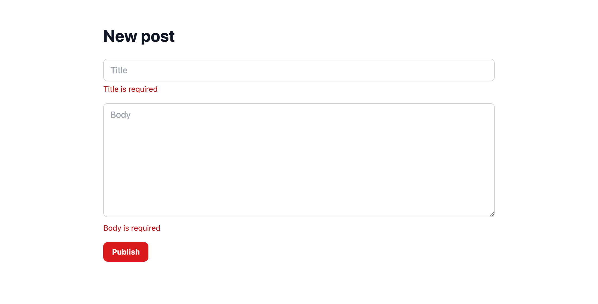

# 第 4 章: バリデーションとリソース

第 3 章では、スキーマをコントローラーの中に書き、ページにはフィールドをそのまま詰めたオブジェクトを渡していました。この章では、そのどちらにも決まった置き場所を用意します。1 つはバリデーターファイルで、人が読んで分かるエラーメッセージを持たせ、ルート・コントローラー・フォームの 3 か所で共有します。もう 1 つはリソースクラスで、ブラウザから投稿がどう見えるかをここで決めます。そのあと編集、削除、ページネーションをテストで仕様にしてエージェントに任せ、取り込む前に `code-review` サブエージェントにもう 1 人のレビュアーとして目を通してもらいます。

**この章で学ぶこと:**

- バリデーションの置き場所と、1 つの Zod スキーマからルート契約・コントローラー・フォームの型がそろう仕組み
- バリデーションに失敗したとき JSON リクエストと Inertia のフォームにそれぞれ何が返るかと、メッセージが `form.errors` に届くまでの流れ
- リソースの役割と、ページに生のレコードを渡さない理由
- 生成マニフェストの `Data.Post` がリソースの変更に追随する仕組み
- サブエージェントに変更のレビューを頼む方法と、返ってきた指摘の扱い方

開発サーバーを起動していなければ、起動しておきます。

```bash run background
bun run dev
```

## 1. まずテストを書く: 人が書くようなエラーメッセージ

いまの `POST /posts` に空のフォームを送ると、スキーマで弾かれはしますが、エラーの文言は Zod の既定のままです。まず、どんな文言にしたいかをテストに書きます。`tests/PostController.test.ts` にテストを 1 つ追加してください。

```ts file=tests/PostController.test.ts
import { beforeAll, beforeEach, describe, expect, it } from 'bun:test'
import { TestApp } from '@guren/testing'
import app from '../src/app.js'
import { resetDatabase } from '../config/database.js'
import { Post } from '../app/Models/Post.js'

describe('PostController', () => {
  let http: TestApp

  beforeAll(async () => {
    http = await TestApp.fromApp(app)
  })

  beforeEach(async () => {
    await resetDatabase()
  })

  it('lists posts, newest first', async () => {
    await Post.create({ title: 'First post', body: 'Hello' })
    await Post.create({ title: 'Second post', body: 'Again' })

    const response = await http.get('/posts').assertOk()
    const html = await response.text()
    const first = html.indexOf('First post')
    const second = html.indexOf('Second post')
    if (first === -1 || second === -1 || second > first) {
      throw new Error('expected the newer post to be listed before the older one')
    }
  })

  it('shows one post', async () => {
    const post = await Post.create({ title: 'Read me', body: 'The whole body' })

    const response = await http.get(`/posts/${post.id}`).assertOk()
    await response.assertBodyContains('The whole body')
  })

  it('answers 404 for a post that does not exist', async () => {
    await http.get('/posts/999').assertNotFound()
  })

  it('serves the form for a new post', async () => {
    await http.get('/posts/create').assertOk()
  })

  it('stores a post and redirects to it', async () => {
    await http.post('/posts', { title: 'Written in a test', body: 'By a test' }).assertRedirect()

    const post = await Post.where('title', 'Written in a test').first()
    expect(post).not.toBeNull()
    expect(post?.body).toBe('By a test')
  })

  it('rejects an empty post with a message per field', async () => {
    await http
      .post('/posts', { title: '', body: '' })
      .assertStatus(422)
      .assertJsonPath('errors.title.0', 'Title is required')
      .assertJsonPath('errors.body.0', 'Body is required')
  })
})
```

```bash run expect-fail
bun test
```

失敗しているのはメッセージの比較だけで、ステータスはすでに 422 になっています。このテストのような素の JSON リクエストでバリデーションに失敗すると、Guren はステータス 422 と、フィールド名をキーにした `errors` を持つ JSON を返します。各フィールドの値はメッセージの配列です。Inertia のフォームから送信したときは別の形で返るので、そちらは第 3 節で確かめます。

## 2. バリデーター

スキーマをコントローラーから専用のファイルに移し、エラーメッセージを付けます。`app/Http/Validators/PostValidator.ts` を作成してください。

```ts file=app/Http/Validators/PostValidator.ts
import { z } from 'zod'

export const PostPayloadSchema = z.object({
  title: z.string().trim().min(1, 'Title is required').max(120, 'Title must be 120 characters or fewer'),
  body: z.string().trim().min(1, 'Body is required'),
})

export type PostPayload = z.infer<typeof PostPayloadSchema>
```

次に、このスキーマをルートに結び付けます。`routes/web.ts` を次の内容に置き換えます。

```ts file=routes/web.ts
import { Router } from '@guren/core'
import HomeController from '../app/Http/Controllers/HomeController.js'
import AboutController from '../app/Http/Controllers/AboutController.js'
import ContactController from '../app/Http/Controllers/ContactController.js'
import PostController from '../app/Http/Controllers/PostController.js'
import { Post } from '../app/Models/Post.js'
import { PostPayloadSchema } from '../app/Http/Validators/PostValidator.js'

export function registerWebRoutes(router: Router): void {
  router.get('/', [HomeController, 'index'])
  router.get('/about', [AboutController, 'index']).name('about')
  router.get('/contact', [ContactController, 'index']).name('contact')

  router.group('/posts', (posts) => {
    posts.get('/', [PostController, 'index']).name('posts.index')
    posts.get('/create', [PostController, 'create']).name('posts.create')
    posts.get('/:id', { bind: { id: Post }, name: 'posts.show' }, [PostController, 'show'])
    posts.post('/', { name: 'posts.store', body: PostPayloadSchema }, [PostController, 'store'])
  })

  // Health check endpoint for load balancers and uptime monitors
  router.get('/health', (c) => c.json({ status: 'ok' }))
}
```

`body: PostPayloadSchema` は**ルート契約**と呼ばれるもので、これを書いただけではリクエストは検証されません。コントローラーのアクションで実際に検証しているのは `validateBody()` の呼び出しで、その呼び出しが抜けていないかは `guren audit` が確認します。契約は codegen に情報を渡すためにあります。ルートのボディ型が生成される `ApiRoutes` に含まれ、次の節ではこの型を使ってフォームに型を付けます。

コントローラーは、スキーマをバリデーターから import するように書き換えます。

```ts file=app/Http/Controllers/PostController.ts
import { Controller } from '@guren/core'
import { pages } from '@/.guren/pages.gen'
import { Post } from '../../Models/Post.js'
import { PostPayloadSchema } from '../Validators/PostValidator.js'

export default class PostController extends Controller {
  async index(): Promise<Response> {
    const posts = await Post.orderBy(['id', 'desc'])

    return this.inertia(pages.posts.Index, {
      posts: posts.map((post) => ({ id: post.id, title: post.title, body: post.body })),
    })
  }

  async show(): Promise<Response> {
    const post = this.model(Post)

    return this.inertia(pages.posts.Show, {
      post: { id: post.id, title: post.title, body: post.body, createdAt: post.createdAt },
    })
  }

  async create(): Promise<Response> {
    return this.inertia(pages.posts.New, {})
  }

  async store(): Promise<Response> {
    const data = await this.validateBody(PostPayloadSchema)
    const post = await Post.create(data)
    return this.redirect(`/posts/${post.id}`)
  }
}
```

```bash run
bun test
```

テストが通りました。スキーマは 1 つだけで、それをルート契約、コントローラー、そして次の節で扱うフォームの 3 か所が使います。

## 3. メッセージを表示する

ルート契約をフロントエンドから参照できるように、マニフェストを再生成します。

```bash run
bun run codegen
```

続いてフォームを置き換えます。変更点は 2 つで、データの型をルートから導出するようにしたことと、`form.errors` を表示するようにしたことです。

```tsx file=resources/js/pages/posts/New.tsx
import { Head, useForm } from '@inertiajs/react'
import type { ApiRoutes } from '@/.guren/api-client.gen'
import type { RouteBody } from '@guren/inertia-client/typed-forms'
import { route } from '@/.guren/routes.gen'

type PostForm = RouteBody<ApiRoutes, 'posts.store'>

export default function NewPost() {
  const form = useForm<PostForm>({ title: '', body: '' })

  return (
    <>
      <Head title="New post" />
      <main className="min-h-screen bg-g-page font-sans text-g-text">
        <div className="mx-auto max-w-3xl space-y-6 px-6 py-12">
          <h1 className="text-3xl font-bold text-g-heading">New post</h1>
          <form
            className="space-y-4"
            onSubmit={(event) => {
              event.preventDefault()
              form.post(route('posts.store'))
            }}
          >
            <div>
              <input
                value={form.data.title}
                onChange={(event) => form.setData('title', event.target.value)}
                placeholder="Title"
                className="w-full rounded-g-ctl border border-g-line-strong bg-g-panel px-3 py-2 text-g-text transition outline-none placeholder:text-g-muted focus:border-transparent focus:outline-2 focus:-outline-offset-1 focus:outline-g-accent"
              />
              {form.errors.title && <p className="mt-1 text-sm text-g-danger">{form.errors.title}</p>}
            </div>
            <div>
              <textarea
                value={form.data.body}
                onChange={(event) => form.setData('body', event.target.value)}
                placeholder="Body"
                rows={8}
                className="w-full rounded-g-ctl border border-g-line-strong bg-g-panel px-3 py-2 text-g-text transition outline-none placeholder:text-g-muted focus:border-transparent focus:outline-2 focus:-outline-offset-1 focus:outline-g-accent"
              />
              {form.errors.body && <p className="mt-1 text-sm text-g-danger">{form.errors.body}</p>}
            </div>
            <button type="submit" className="rounded-g-ctl bg-g-accent px-4 py-2 text-sm font-bold text-g-on-accent transition hover:bg-g-accent-down">
              Publish
            </button>
          </form>
        </div>
      </main>
    </>
  )
}
```

`RouteBody<ApiRoutes, 'posts.store'>` の中身は `{ title: string; body: string }` で、ルート契約を通じて `PostPayloadSchema` から導出されています。スキーマにフィールドを足せばフォームの型にも同じフィールドが増え、ルート名を打ち間違えれば型が `never` になります。データの形を書いたのはバリデーターの 1 か所だけで、それを書き写さずにブラウザ側まで届けられました。

**チェックポイント:** [http://localhost:3333/posts/create](http://localhost:3333/posts/create) を開き、何も入力せずにフォームを送信します。タイトル欄の下に「Title is required」、本文欄の下に「Body is required」と表示されるはずです。このとき返っているのは 422 ではありません。Inertia からのリクエストにはフォームへ戻る 303 リダイレクトが返り、メッセージは有効期間の短い `guren_validation_errors` cookie で引き継がれます。Inertia はこのリダイレクトをたどり、メッセージを `form.errors` に入れて同じページを描画し直しました。エラー処理のコードは 1 行も書いていません。



## 4. リソース

いまは `index` と `show` がそれぞれ投稿のオブジェクトを手で組み立てていて、含まれるフィールドも両者で食い違っています。このようにレコードをページ向けの形に変換するものを、Guren では**リソース**と呼びます。`app/Http/Resources/PostResource.ts` を作成します。

```ts file=app/Http/Resources/PostResource.ts
import { Resource } from '@guren/core'
import type { PostRecord } from '../../Models/Post.js'

export interface PostResourceData extends Record<string, unknown> {
  id: number
  title: string
  body: string
  createdAt: string
}

export class PostResource extends Resource<PostRecord, PostResourceData> {
  toArray(): PostResourceData {
    return {
      id: this.resource.id,
      title: this.resource.title,
      body: this.resource.body,
      createdAt: this.resource.createdAt,
    }
  }
}
```

サーバーの外から投稿がどう見えるかは、このリソースだけで決めます。列が 4 つしかないいまは、大げさな手続きに見えるかもしれません。しかし第 5 章でパスワードハッシュを持つユーザーが加わると、`passwordHash` が props に紛れ込まないように守るのがリソースの役目になります。これ以降は、**ページには生のレコードを渡さない**というルールで進めます。

コントローラーからリソースを使うようにします。

```ts file=app/Http/Controllers/PostController.ts
import { Controller } from '@guren/core'
import { pages } from '@/.guren/pages.gen'
import { Post } from '../../Models/Post.js'
import { PostResource } from '../Resources/PostResource.js'
import { PostPayloadSchema } from '../Validators/PostValidator.js'

export default class PostController extends Controller {
  async index(): Promise<Response> {
    const posts = await Post.orderBy(['id', 'desc'])

    return this.inertia(pages.posts.Index, {
      posts: posts.map((post) => new PostResource(post).toJSON()),
    })
  }

  async show(): Promise<Response> {
    const post = this.model(Post)

    return this.inertia(pages.posts.Show, {
      post: new PostResource(post).toJSON(),
    })
  }

  async create(): Promise<Response> {
    return this.inertia(pages.posts.New, {})
  }

  async store(): Promise<Response> {
    const data = await this.validateBody(PostPayloadSchema)
    const post = await Post.create(data)
    return this.redirect(`/posts/${post.id}`)
  }
}
```

ページ側では投稿の形を書き直さず、型を import して使います。

```tsx file=resources/js/pages/posts/Index.tsx
import { Head, Link } from '@inertiajs/react'
import type { PostResourceData } from '@/app/Http/Resources/PostResource'
import { route } from '@/.guren/routes.gen'

interface Props {
  posts: PostResourceData[]
}

export default function PostsIndex({ posts }: Props) {
  return (
    <>
      <Head title="Posts" />
      <main className="min-h-screen bg-g-page font-sans text-g-text">
        <div className="mx-auto max-w-3xl space-y-6 px-6 py-12">
          <div className="flex items-center justify-between">
            <h1 className="flex items-center gap-3 text-3xl font-bold text-g-heading">
              <span aria-hidden className="h-7 w-[3px] shrink-0 rounded-full bg-[image:var(--g-tick)]" />
              Posts
            </h1>
            <Link href={route('posts.create')} className="rounded-g-ctl bg-g-accent px-4 py-2 text-sm font-bold text-g-on-accent transition hover:bg-g-accent-down">
              New post
            </Link>
          </div>
          {posts.length === 0 && <p className="text-g-text-2">No posts yet.</p>}
          <div className="space-y-4">
            {posts.map((post) => (
              <article key={post.id} className="rounded-g-card border border-g-line bg-g-panel p-4 shadow-g-card">
                <Link href={route('posts.show', { id: post.id })} className="text-xl font-bold text-g-heading transition hover:text-g-accent-text">
                  {post.title}
                </Link>
                <p className="mt-2 text-sm text-g-text-2">{post.body}</p>
              </article>
            ))}
          </div>
        </div>
      </main>
    </>
  )
}
```

```tsx file=resources/js/pages/posts/Show.tsx
import { Head, Link } from '@inertiajs/react'
import type { PostResourceData } from '@/app/Http/Resources/PostResource'
import { route } from '@/.guren/routes.gen'

interface Props {
  post: PostResourceData
}

export default function PostShow({ post }: Props) {
  return (
    <>
      <Head title={post.title} />
      <main className="min-h-screen bg-g-page font-sans text-g-text">
        <div className="mx-auto max-w-3xl space-y-6 px-6 py-12">
          <Link href={route('posts.index')} className="text-sm text-g-accent-text transition hover:underline">
            All posts
          </Link>
          <h1 className="text-3xl font-bold text-g-heading">{post.title}</h1>
          <p className="font-mono text-xs text-g-text-2">{post.createdAt}</p>
          <p className="whitespace-pre-wrap text-lg">{post.body}</p>
        </div>
      </main>
    </>
  )
}
```

```bash run
bun run codegen
```

codegen はリソースも読み取るので、`.guren/data.gen.ts` から `PostResourceData` と同じ形の `Data.Post` が export されるようになりました。リソースを import せずに投稿の型を参照したいコードでは、こちらを使えます。続けてすべてのテストを実行します。

```bash run
bun test
```

テストは通ったままで、外から見える動作も変わっていません。テストがあれば、このように動作を変えずに中身を整理できます。

```bash run
bunx guren gate
```

```bash run
git add -A
git commit -m "feat: validate posts with messages and shape them with a resource"
```

## 5. CRUD の残りのテストを先に書く

残りは編集、更新、削除と、10 件ずつのページネーションです。テストファイルを次の内容に置き換えます。

```ts file=tests/PostController.test.ts
import { beforeAll, beforeEach, describe, expect, it } from 'bun:test'
import { TestApp } from '@guren/testing'
import app from '../src/app.js'
import { resetDatabase } from '../config/database.js'
import { Post } from '../app/Models/Post.js'

describe('PostController', () => {
  let http: TestApp

  beforeAll(async () => {
    http = await TestApp.fromApp(app)
  })

  beforeEach(async () => {
    await resetDatabase()
  })

  it('lists posts, newest first', async () => {
    await Post.create({ title: 'First post', body: 'Hello' })
    await Post.create({ title: 'Second post', body: 'Again' })

    const response = await http.get('/posts').assertOk()
    const html = await response.text()
    const first = html.indexOf('First post')
    const second = html.indexOf('Second post')
    if (first === -1 || second === -1 || second > first) {
      throw new Error('expected the newer post to be listed before the older one')
    }
  })

  it('paginates ten posts per page', async () => {
    for (let i = 1; i <= 11; i++) {
      await Post.create({ title: `Post ${String(i).padStart(2, '0')}`, body: `Body number ${i}` })
    }

    const firstPage = await http.get('/posts').assertOk()
    await firstPage.assertBodyContains('Post 11')
    await firstPage.assertBodyContains('Post 02')
    expect(await firstPage.text()).not.toContain('Post 01')

    const secondPage = await http.get('/posts?page=2').assertOk()
    await secondPage.assertBodyContains('Post 01')
    expect(await secondPage.text()).not.toContain('Post 02')
  })

  it('shows one post', async () => {
    const post = await Post.create({ title: 'Read me', body: 'The whole body' })

    const response = await http.get(`/posts/${post.id}`).assertOk()
    await response.assertBodyContains('The whole body')
  })

  it('answers 404 for a post that does not exist', async () => {
    await http.get('/posts/999').assertNotFound()
  })

  it('serves the form for a new post', async () => {
    await http.get('/posts/create').assertOk()
  })

  it('stores a post and redirects to it', async () => {
    await http.post('/posts', { title: 'Written in a test', body: 'By a test' }).assertRedirect()

    const post = await Post.where('title', 'Written in a test').first()
    expect(post).not.toBeNull()
    expect(post?.body).toBe('By a test')
  })

  it('rejects an empty post with a message per field', async () => {
    await http
      .post('/posts', { title: '', body: '' })
      .assertStatus(422)
      .assertJsonPath('errors.title.0', 'Title is required')
      .assertJsonPath('errors.body.0', 'Body is required')
  })

  it('serves the edit form with the post in it', async () => {
    const post = await Post.create({ title: 'Before', body: 'The old body' })

    const response = await http.get(`/posts/${post.id}/edit`).assertOk()
    await response.assertBodyContains('The old body')
  })

  it('updates a post and redirects to it', async () => {
    const post = await Post.create({ title: 'Before', body: 'The old body' })

    await http.put(`/posts/${post.id}`, { title: 'After', body: 'The new body' }).assertRedirect(`/posts/${post.id}`)

    const updated = await Post.findOrFail(post.id)
    expect(updated.title).toBe('After')
    expect(updated.body).toBe('The new body')
  })

  it('rejects an invalid update with the same messages', async () => {
    const post = await Post.create({ title: 'Before', body: 'The old body' })

    await http
      .put(`/posts/${post.id}`, { title: '', body: 'Still here' })
      .assertStatus(422)
      .assertJsonPath('errors.title.0', 'Title is required')
  })

  it('deletes a post and redirects to the list', async () => {
    const post = await Post.create({ title: 'Doomed', body: 'Gone soon' })

    await http.delete(`/posts/${post.id}`).assertRedirect('/posts')

    expect(await Post.find(post.id)).toBeNull()
  })
})
```

```bash run expect-fail
bun test
```

5 つのテストが失敗します。エージェントに任せる前に、テストをもう一度読んでおいてください。編集ページに投稿が渡ること、更新と削除のあとは利用者が期待するページへリダイレクトすること、不正な値での更新は作成と同じ形で失敗すること、11 件目の投稿は 2 ページ目に回ること。この部分の仕様は、これで出そろっています。

## 6. エージェントに任せる

エージェントに次のプロンプトを送ります。

```text
Complete the posts CRUD. Add `edit`, `update` and `destroy` actions to `PostController` using route model binding like `show`, and register `GET /posts/:id/edit` (`posts.edit`), `PUT /posts/:id` (`posts.update`, with `body: PostPayloadSchema`) and `DELETE /posts/:id` (`posts.destroy`). Add `resources/js/pages/posts/Edit.tsx` as a form like `New.tsx` that submits with `form.put`, and give `Show.tsx` an Edit link and a Delete button. Paginate `index` at ten posts per page with `Post.paginate` and the `paginate` helper, validating `?page=` with a `ListPostsQuerySchema` in the validator, and render the page links in `Index.tsx`. Use `PostResource` for every post sent to a page. `tests/PostController.test.ts` describes all of it; make it pass.
```

エージェントに任せる作業としてはここまでで最も大きいので、この章で紹介するハーネスの仕組みを使います。`.claude/agents/code-review.md` にある **`code-review` サブエージェント**です。サブエージェントは、専用の指示書と独立したコンテキストを持つエージェントで、メインのエージェントから呼び出して使います。このサブエージェントの指示書には Guren のコードレビューの手順が書かれています。まず `guren check` と `guren audit` を実行し、そのうえで 2 つのコマンドでは判断できない点を差分から読み取ります。

エージェントが完了を報告したら、下の確認項目を自分で確かめる前に、エージェントに次のプロンプトを送ります。

```text
Use the code-review subagent to review the uncommitted changes.
```

返ってきた指摘は、下の確認項目と見比べながら読んでください。決まった指示書に沿って読む 2 人目のレビュアーは、作業の最中にいる 1 人目とは別のところに気づきます。しかも、頼むのに書くのは 1 文だけです。第 8 章では、この指示書を自分で書きます。

**手元にエージェントが無い場合は、** 次の 6 ファイルを書きます。まず、バリデーターにクエリ用のスキーマを追加します。

```ts file=app/Http/Validators/PostValidator.ts fallback
import { z } from 'zod'

export const PostPayloadSchema = z.object({
  title: z.string().trim().min(1, 'Title is required').max(120, 'Title must be 120 characters or fewer'),
  body: z.string().trim().min(1, 'Body is required'),
})

export type PostPayload = z.infer<typeof PostPayloadSchema>

export const ListPostsQuerySchema = z.object({
  page: z.coerce.number().int().min(1).default(1),
})
```

```ts file=app/Http/Controllers/PostController.ts fallback
import { Controller, paginate, type PaginatedPageProps } from '@guren/core'
import { pages } from '@/.guren/pages.gen'
import { Post } from '../../Models/Post.js'
import { PostResource, type PostResourceData } from '../Resources/PostResource.js'
import { ListPostsQuerySchema, PostPayloadSchema } from '../Validators/PostValidator.js'

type PostsIndexProps = PaginatedPageProps<PostResourceData>

export default class PostController extends Controller {
  async index(): Promise<Response> {
    const { page } = this.validateQuery(ListPostsQuerySchema)
    const result = await Post.paginate({ page, perPage: 10, orderBy: ['id', 'desc'] })
    const paginator = paginate(result, { path: this.request.path ?? '/posts' })

    return this.inertia(pages.posts.Index, {
      data: result.data.map((post) => new PostResource(post).toJSON()),
      pagination: {
        meta: paginator.meta(),
        links: paginator.links(),
      },
    } satisfies PostsIndexProps)
  }

  async show(): Promise<Response> {
    const post = this.model(Post)

    return this.inertia(pages.posts.Show, {
      post: new PostResource(post).toJSON(),
    })
  }

  async create(): Promise<Response> {
    return this.inertia(pages.posts.New, {})
  }

  async store(): Promise<Response> {
    const data = await this.validateBody(PostPayloadSchema)
    const post = await Post.create(data)
    return this.redirect(`/posts/${post.id}`)
  }

  async edit(): Promise<Response> {
    const post = this.model(Post)

    return this.inertia(pages.posts.Edit, {
      post: new PostResource(post).toJSON(),
    })
  }

  async update(): Promise<Response> {
    const post = this.model(Post)
    const data = await this.validateBody(PostPayloadSchema)
    await Post.update({ id: post.id }, data)
    return this.redirect(`/posts/${post.id}`)
  }

  async destroy(): Promise<Response> {
    const post = this.model(Post)
    await Post.delete({ id: post.id })
    return this.redirect('/posts')
  }
}
```

```ts file=routes/web.ts fallback
import { Router } from '@guren/core'
import HomeController from '../app/Http/Controllers/HomeController.js'
import AboutController from '../app/Http/Controllers/AboutController.js'
import ContactController from '../app/Http/Controllers/ContactController.js'
import PostController from '../app/Http/Controllers/PostController.js'
import { Post } from '../app/Models/Post.js'
import { PostPayloadSchema } from '../app/Http/Validators/PostValidator.js'

export function registerWebRoutes(router: Router): void {
  router.get('/', [HomeController, 'index'])
  router.get('/about', [AboutController, 'index']).name('about')
  router.get('/contact', [ContactController, 'index']).name('contact')

  router.group('/posts', (posts) => {
    posts.get('/', [PostController, 'index']).name('posts.index')
    posts.get('/create', [PostController, 'create']).name('posts.create')
    posts.get('/:id', { bind: { id: Post }, name: 'posts.show' }, [PostController, 'show'])
    posts.get('/:id/edit', { bind: { id: Post }, name: 'posts.edit' }, [PostController, 'edit'])
    posts.post('/', { name: 'posts.store', body: PostPayloadSchema }, [PostController, 'store'])
    posts.put('/:id', { bind: { id: Post }, name: 'posts.update', body: PostPayloadSchema }, [PostController, 'update'])
    posts.delete('/:id', { bind: { id: Post }, name: 'posts.destroy' }, [PostController, 'destroy'])
  })

  // Health check endpoint for load balancers and uptime monitors
  router.get('/health', (c) => c.json({ status: 'ok' }))
}
```

```tsx file=resources/js/pages/posts/Index.tsx fallback
import { Head, Link } from '@inertiajs/react'
import type { PaginatedPageProps } from '@guren/core'
import type { PostResourceData } from '@/app/Http/Resources/PostResource'
import { route } from '@/.guren/routes.gen'

interface Props extends PaginatedPageProps<PostResourceData> {}

export default function PostsIndex({ data, pagination }: Props) {
  return (
    <>
      <Head title="Posts" />
      <main className="min-h-screen bg-g-page font-sans text-g-text">
        <div className="mx-auto max-w-3xl space-y-6 px-6 py-12">
          <div className="flex items-center justify-between">
            <h1 className="flex items-center gap-3 text-3xl font-bold text-g-heading">
              <span aria-hidden className="h-7 w-[3px] shrink-0 rounded-full bg-[image:var(--g-tick)]" />
              Posts
            </h1>
            <Link href={route('posts.create')} className="rounded-g-ctl bg-g-accent px-4 py-2 text-sm font-bold text-g-on-accent transition hover:bg-g-accent-down">
              New post
            </Link>
          </div>
          {data.length === 0 && <p className="text-g-text-2">No posts yet.</p>}
          <div className="space-y-4">
            {data.map((post) => (
              <article key={post.id} className="rounded-g-card border border-g-line bg-g-panel p-4 shadow-g-card">
                <Link href={route('posts.show', { id: post.id })} className="text-xl font-bold text-g-heading transition hover:text-g-accent-text">
                  {post.title}
                </Link>
                <p className="mt-2 text-sm text-g-text-2">{post.body}</p>
              </article>
            ))}
          </div>
          {pagination?.links?.pages && pagination.links.pages.length > 1 && (
            <nav className="flex gap-2 font-mono text-sm">
              {pagination.links.pages.map((page) => (
                <Link key={page.page} href={page.url ?? '#'} className="rounded-g-ctl border border-g-line px-3 py-1 text-g-text-2 transition hover:border-g-line-strong hover:text-g-heading">
                  {page.page}
                </Link>
              ))}
            </nav>
          )}
        </div>
      </main>
    </>
  )
}
```

```tsx file=resources/js/pages/posts/Show.tsx fallback
import { Head, Link } from '@inertiajs/react'
import type { PostResourceData } from '@/app/Http/Resources/PostResource'
import { route } from '@/.guren/routes.gen'

interface Props {
  post: PostResourceData
}

export default function PostShow({ post }: Props) {
  return (
    <>
      <Head title={post.title} />
      <main className="min-h-screen bg-g-page font-sans text-g-text">
        <div className="mx-auto max-w-3xl space-y-6 px-6 py-12">
          <Link href={route('posts.index')} className="text-sm text-g-accent-text transition hover:underline">
            All posts
          </Link>
          <h1 className="text-3xl font-bold text-g-heading">{post.title}</h1>
          <p className="font-mono text-xs text-g-text-2">{post.createdAt}</p>
          <p className="whitespace-pre-wrap text-lg">{post.body}</p>
          <div className="flex items-center gap-4">
            <Link href={route('posts.edit', { id: post.id })} className="text-g-accent-text transition hover:underline">
              Edit
            </Link>
            <Link
              href={route('posts.destroy', { id: post.id })}
              method="delete"
              as="button"
              onBefore={() => window.confirm('Delete this post?')}
              className="rounded-g-ctl border border-g-danger-chip px-3 py-1 text-sm font-bold text-g-danger transition hover:bg-g-danger-tint"
            >
              Delete
            </Link>
          </div>
        </div>
      </main>
    </>
  )
}
```

```tsx file=resources/js/pages/posts/Edit.tsx fallback
import { Head, useForm } from '@inertiajs/react'
import type { ApiRoutes } from '@/.guren/api-client.gen'
import type { RouteBody } from '@guren/inertia-client/typed-forms'
import type { PostResourceData } from '@/app/Http/Resources/PostResource'
import { route } from '@/.guren/routes.gen'

type PostForm = RouteBody<ApiRoutes, 'posts.update'>

interface Props {
  post: PostResourceData
}

export default function EditPost({ post }: Props) {
  const form = useForm<PostForm>({ title: post.title, body: post.body })

  return (
    <>
      <Head title={`Edit: ${post.title}`} />
      <main className="min-h-screen bg-g-page font-sans text-g-text">
        <div className="mx-auto max-w-3xl space-y-6 px-6 py-12">
          <h1 className="text-3xl font-bold text-g-heading">Edit post</h1>
          <form
            className="space-y-4"
            onSubmit={(event) => {
              event.preventDefault()
              form.put(route('posts.update', { id: post.id }))
            }}
          >
            <div>
              <input
                value={form.data.title}
                onChange={(event) => form.setData('title', event.target.value)}
                placeholder="Title"
                className="w-full rounded-g-ctl border border-g-line-strong bg-g-panel px-3 py-2 text-g-text transition outline-none placeholder:text-g-muted focus:border-transparent focus:outline-2 focus:-outline-offset-1 focus:outline-g-accent"
              />
              {form.errors.title && <p className="mt-1 text-sm text-g-danger">{form.errors.title}</p>}
            </div>
            <div>
              <textarea
                value={form.data.body}
                onChange={(event) => form.setData('body', event.target.value)}
                placeholder="Body"
                rows={8}
                className="w-full rounded-g-ctl border border-g-line-strong bg-g-panel px-3 py-2 text-g-text transition outline-none placeholder:text-g-muted focus:border-transparent focus:outline-2 focus:-outline-offset-1 focus:outline-g-accent"
              />
              {form.errors.body && <p className="mt-1 text-sm text-g-danger">{form.errors.body}</p>}
            </div>
            <button type="submit" className="rounded-g-ctl bg-g-accent px-4 py-2 text-sm font-bold text-g-on-accent transition hover:bg-g-accent-down">
              Save
            </button>
          </form>
        </div>
      </main>
    </>
  )
}
```

マニフェストを再生成し、仕様にしたテストを実行します。

```bash run
bun run codegen
```

```bash run
bun test
```

確認項目は次のとおりです。サブエージェントの指摘と見比べてください。

- `update` と `destroy` が `this.model(Post)` で投稿を取得し、`update` が `store` と同じ `PostPayloadSchema` で検証している。どちらのルートにも `bind` があり、`update` のルートには `body` もある。
- `index` が `?page=` を `validateQuery` とスキーマで検証している。`Number(query.page)` で変換しているだけなら指摘する。
- ページに渡る投稿はすべて `PostResource` を通っている。編集ページのフォームの型は `RouteBody<ApiRoutes, 'posts.update'>` になっている。
- `Show.tsx` の削除は、確認ダイアログ付きの `method="delete"` リンクで行っている。削除を行う `GET` ルートは作っていない。
- 11 件のテストがすべて通る。

**チェックポイント:** [http://localhost:3333/posts/create](http://localhost:3333/posts/create) で投稿を 12 件作り(フォームへの入力に付き合える範囲で、件数は減らしても構いません)、2 ページ目が表示されることを確かめてください。続けて 1 件を編集し、1 件を削除してみます。

```bash run
bunx guren gate
```

```bash run
bunx guren audit
```

今度は警告が 3 つ出ます。`POST`、`PUT`、`DELETE /posts` に認証チェックが無いという指摘です。指摘は正しく、残しているのも意図どおりで、第 6 章で対応します。

```bash run
git add -A
git commit -m "feat: complete the posts CRUD with pagination"
```

## ここまでの状態

- 人が読めるメッセージを持つバリデーターファイルがあり、ルートに結び付けてコントローラーから使い、フォームの型にもなっています。
- 投稿の見え方を決めるリソースと、それに追随する `Data.Post` 型があります。
- CRUD 一式とページネーションを 11 件のテストで仕様にし、エージェントが実装して、サブエージェントと読者自身でレビューしました。
- audit の警告 3 件を、意図して残しています。

## よくあるつまずき

- **`RouteBody<ApiRoutes, 'posts.store'>` が `never` になる。** ルートに `body:` 契約が無いか、契約を足したあとに codegen を実行していません。`routes/web.ts` を確認してから `bun run codegen` を実行してください。
- **422 のテストは通るのにブラウザにメッセージが出ない。** ページは `form.errors.title` を表示しています。フィールド名がスキーマのキーと完全に一致しているか確認してください。Inertia が埋めるのは、サーバーが返したキーのエラーだけです。
- **`Post.update` が `id` についてエラーを出す。** `update` の第 1 引数は `where` オブジェクトで、データは第 2 引数です(`Post.update({ id }, data)`)。バリデーション済みのデータに `id` が含まれることはなく、仮に含まれていても `fillable` で取り除かれます。
- **2 ページ目に何も出ない。** `perPage` が 10 になっていないか、`orderBy` が無いために挿入順で並んでいます。そのため、どの投稿がどのページに入るかというテストの前提が崩れています。
- **Delete ボタンを押すと 404 に遷移する。** `Link` に `method="delete"` が必要です。これが無いとブラウザは destroy の URL に `GET` を送りますが、そのルートは存在しません。

## 演習

1. `PostPayloadSchema` は、空白だけのタイトルをすでに拒否します。ブランチを切り、`title` のルールのうちそれを担っている部分を探して外してください。そのうえで、外した状態では失敗し、元に戻すと通るテストを書きます。既存のテストの中に、ルールが外れたことに気づくものはあったでしょうか。
2. `PostResource.toArray()` から `body` を消して `bun test` を実行してください。いくつかのテストは失敗しますが、ページ自体は表示されます。この違いから、リソースの契約が実際にはどこで検査されているのかを考えてみてください。

<details>
<summary>演習 1: ヒントと答えの例</summary>

`app/Http/Validators/PostValidator.ts` の `title` の行を読んでください。`.trim()` が `.min(1)` より先に実行されるので、`'   '` は `''` になり、「Title is required」で失敗します。`.trim()` を外してから、空白だけのタイトルでテストを書きます。

```ts
it('rejects a title of only spaces', async () => {
  await http
    .post('/posts', { title: '   ', body: 'Some body' })
    .assertStatus(422)
    .assertJsonPath('errors.title.0', 'Title is required')
})
```

`.trim()` がないと空白は `.min(1)` を通ってしまい、投稿が保存されてリクエストはリダイレクトされるので、テストは失敗します。`.trim()` を戻せば通ります。ルールが外れたことに気づく既存のテストは、ありません。「rejects an empty post with a message per field」が送るのは `''` で、これは `.trim()` の有無にかかわらず `.min(1)` で失敗します。つまりこのテストは、ルールがあってもなくても通ります。新しいテストを残す価値があるのはそのためです。

</details>

<details>
<summary>演習 2: ヒントと答えの例</summary>

`bun test` は TypeScript を型検査せずに実行します。`bun run typecheck` も実行して、結果を比べてください。

失敗するのは、レスポンスの中に本文を探すテストです。「shows one post」と「serves the edit form with the post in it」がそれに当たります。一覧のテストはタイトルしか見ないので通ります。ページが表示されるのは、実行時に props を検査するものがないからです。`post.body` は `undefined` になり、React はそこに何も描画しません。契約を検査しているのはコンパイル時です。`toArray()` は `body` を必須とする `PostResourceData` を返すと宣言しているので、`bun run typecheck` は `app/Http/Resources/PostResource.ts` で失敗します。インターフェースからも `body` を消すと、今度は `post.body` を読んでいるページの側で失敗します。ゲートはテストより先に typecheck を実行するので、そこで止まっていたはずです。

</details>

## 次へ

[第 5 章: ユーザーとパスワード](./05-users-and-passwords.md) では、users テーブルにモデルを用意してパスワードをハッシュ化し、登録・ログイン・ログアウトを手で組み立てます。
