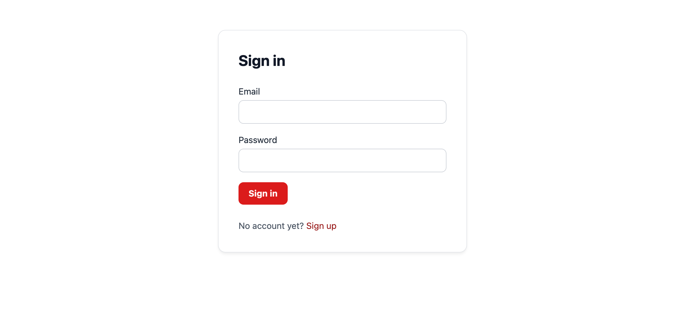

# 第 5 章: ユーザーとパスワード

ここまではすべて匿名でした。この章でブログにユーザーを追加します。用意するのは、パスワードハッシュを持つテーブル、ハッシュの仕方を知っているモデル、セッションとそれに付いてくる CSRF 保護、そして手で組む登録・ログイン・ログアウトです。そのあとプロフィールページをテストで仕様化してエージェントに委ね、モデルに触れる前にエージェントが `guren context User` から何を受け取るのかを確認します。

Guren はこの一式をコマンド 1 つでインストールできます。それでも一度は自分で組みます。第 6 章でそのコマンドの出力を読んだときに、どの行が何のためにあるかが分かるようにするためです。

**この章で学ぶこと:**

- セッションを有効にすると変わること: cookie、ストア、そしてすべての変更系リクエストへの CSRF 保護
- パスワードの保存のされ方(パスワードそのものは保存しない)と、ハッシュを行う場所
- `this.auth.attempt()`、`login()`、`logout()`、`userOrFail()` の働きと、ガードとは何か
- 第 4 章で書いたテストが壊れる理由と、テストが CSRF トークンを用意する方法
- `guren context User` のエンティティバンドルと、プロジェクト全体の地図との違い

開発サーバーが動いていなければ起動します。

```bash run background
bun run dev
```

## 1. users テーブルを本物にする

雛形には名前、メール、タイムスタンプを持つ `users` テーブルが入っていました。サインインできるユーザーには、あと 2 つ足りません。パスワードハッシュの置き場所と、2 つのアカウントで共有できないメールアドレスです。`db/schema.ts` を置き換えます。

```ts file=db/schema.ts
import { sqliteTable, integer, text } from '@guren/orm/drizzle/sqlite'

export const users = sqliteTable('users', {
  id: integer('id').primaryKey({ autoIncrement: true }),
  name: text('name').notNull(),
  email: text('email').notNull().unique(),
  passwordHash: text('password_hash').notNull(),
  rememberToken: text('remember_token'),
  createdAt: text('created_at').notNull().$defaultFn(() => new Date().toISOString()),
})

export const posts = sqliteTable('posts', {
  id: integer('id').primaryKey({ autoIncrement: true }),
  title: text('title').notNull(),
  body: text('body').notNull(),
  createdAt: text('created_at').notNull().$defaultFn(() => new Date().toISOString()),
})
```

列名は `passwordHash` で、この名前こそが要点です。データベースはパスワードそのものを保持しません。保持するのは、遅くてソルト付きのハッシュ関数にパスワードを通した出力だけです。`rememberToken` は「ログイン状態を保持する」cookie の秘密で、ほとんどのセッションでは使わないので nullable にしてあります。

```bash run
bun run db:make add_passwords_to_users
```

```bash run
bun run db:migrate
```

新しいマイグレーションを開いてみてください。SQLite は既存テーブルに `NOT NULL` 列を足したり制約をその場で変えたりできないので、生成された SQL はテーブルを組み直します。新しい形のテーブルを作り、行をコピーし、古いものを落とし、名前を付け替える、という手順です。`users` テーブルにはまだ行が無いので今回は代償なしで済みますが、第 6 章では中身のあるテーブルで同じ手順を踏みます。

## 2. ハッシュするモデル

`app/Models/User.ts` を作ります。

```ts file=app/Models/User.ts
import { AuthenticatableModel, defineModel } from '@guren/core'
import { users } from '../../db/schema.js'

export type UserRecord = typeof users.$inferSelect

export class User extends defineModel(users, {
  base: AuthenticatableModel,
  // Derived from the plain `password`, so callers never set it directly
  optionalOnCreate: ['passwordHash'],
  requireOnCreate: ['password'],
  // Never serialized by Model.serialize() and stripped from auth.user()
  hidden: ['passwordHash', 'rememberToken'],
}) {
}
```

オプションは 3 つ、それぞれ仕事はひとつです。

- **`base: AuthenticatableModel`** が、これをただの行ではなくユーザーにします。仮想フィールド `password` が足され、`User.create({ name, email, password: 'secret' })` はパスワードをハッシュして結果を `passwordHash` に保存します。この章のコントローラーはどれもハッシュ関数を呼びません。ハッシュはモデルの仕事です。
- **`optionalOnCreate` / `requireOnCreate`** は create のペイロードの型をそれに合わせます。`password` は渡さなければならず、`passwordHash` は渡せません。
- **`hidden`** は、ハッシュと remember トークンをシリアライズの対象から外します。認証コンテキストがページに渡すユーザーオブジェクトも対象です。第 4 章では、リソース層が `passwordHash` をブラウザに届かせないと約束しました。これは同じ扉に付ける 2 つ目の鍵です。

## 3. セッションと、モデルを指名するプロバイダー

セッションは、リクエストが誰のものかをサーバーが覚えておくための仕組みです。id を持つ cookie と、その id が指す中身を持つストアからできています。`createApp` が `auth` オプションを受け取ると、Guren はセッションミドルウェアと、それに伴う CSRF 保護をマウントします。認証システムはさらに、どのモデルがユーザーを保持し、どの列を照合するかを知る必要があります。それを教えるのがアプリ側のプロバイダーです。`app/Providers/AuthProvider.ts` を作ります。

```ts file=app/Providers/AuthProvider.ts
import { ServiceProvider, shareInertiaProps, AUTH_CONTEXT_KEY } from '@guren/core'
import type { AuthContext, AuthManager } from '@guren/core'
import { User } from '../Models/User.js'

export default class AuthProvider extends ServiceProvider {
  register(): void {
    const auth = this.container.make<AuthManager>('auth')
    auth.useModel(User, {
      usernameColumn: 'email',
      passwordColumn: 'passwordHash',
      rememberTokenColumn: 'rememberToken',
      credentialsPasswordField: 'password',
    })
  }

  boot(): void {
    shareInertiaProps(async (ctx) => {
      const auth = ctx.get(AUTH_CONTEXT_KEY) as AuthContext | undefined
      return { auth: { user: await auth?.user() } }
    }, this.container)
  }
}
```

`useModel` は `web` という名前の**ガード**を登録します。ガードは、リクエストを渡されればセッションを読んで「これは誰か」に答え、資格情報を渡されればハッシュを比較して「これは正しいか」に答えます。`shareInertiaProps` はすべてのページの props に `auth.user` を足すので、どのコンポーネントからでも誰かがサインインしているかを確かめられます。ゲストなら `null` で、`hidden` のおかげでハッシュが混ざることはありません。

では有効にします。`src/app.ts` を置き換えます。

```ts file=src/app.ts
// Every zod schema built after this import parses through a compiled fast
// path. Keep it the first import so it runs before any module that defines
// schemas. It honors z.config({ jitless: true }) for CSP-restricted runtimes
// and never throws — unsupported schemas keep the regular parser. One caveat:
// on invalid input, refinements/transforms can run twice (fast path, then
// fallback), so keep .refine()/.transform() free of side effects.
import 'zod/compile'
import { createApp } from '@guren/core'
import DatabaseProvider from '../app/Providers/DatabaseProvider.js'
import AuthProvider from '../app/Providers/AuthProvider.js'
import { registerWebRoutes } from '../routes/web.js'


// The Host header is client-controlled, so production should answer only to the
// host this app is deployed as, which APP_URL carries. Emailed links do not
// depend on this — app/Auth/AppUrl.ts resolves those per request and fails
// closed there.
function hostAuthorization() {
  const exclude = ['/health']

  if (process.env.NODE_ENV !== 'production') {
    return { allowedHosts: ['localhost:*', '127.0.0.1:*'], exclude }
  }

  const appUrl = process.env.APP_URL?.trim()
  // Read at module scope, where not every platform has populated process.env yet
  // (the Cloudflare worker imports this module before wrangler `vars` land), so a
  // missing value warns and leaves the check off rather than throwing and
  // stopping the app from booting at all.
  if (!appUrl) {
    console.warn('[app] APP_URL is not set — host authorization is disabled. Set it to the public base URL of this app.')
    return false
  }

  // `hostname:*` rather than the bare host: the hostname is the security
  // boundary, and a proxy may or may not include the default port in `Host`.
  return { allowedHosts: [`${new URL(appUrl).hostname}:*`], exclude }
}

const app = createApp({
  // Rendered into every server-rendered document. Replace public/favicon.svg
  // with your own artwork, or add more tags here (Open Graph, apple-touch-icon).
  inertia: {
    document: {
      head: '<link rel="icon" type="image/svg+xml" href="/favicon.svg" />',
    },
  },
  routes: registerWebRoutes,
  providers: [DatabaseProvider, AuthProvider],
  // Sessions and CSRF protection: an in-memory session store by default,
  // which chapter 14 replaces with a database-backed one.
  auth: {},
  // Translations live in lang/<locale>/*.json. Add locales to `supported`
  // and the request locale is detected from ?locale=, a locale cookie, or
  // Accept-Language. `guren codegen` types the keys for t()/useTranslation().
  i18n: { supported: ['en'] },
  hostAuthorization: hostAuthorization(),
})

export default app
```

変わった行は 2 つ、`providers` の `AuthProvider` と `auth: {}` です。テストを走らせます。

```bash run expect-fail
bun test
```

## 4. セッションが壊したもの、それが正しい理由

フォームを送信するテストがすべて 403「CSRF token mismatch」で赤になりました。投稿まわりは何も変えていません。変わったのはアプリがセッションを持つようになったことで、セッションを持つアプリはそれを守る必要があります。

クロスサイトリクエストフォージェリは、他のサイトのページがブラウザにこのアプリへフォームを送らせる攻撃です。ブラウザはセッション cookie を付けて送るので、アプリ側では利用者が意図したリクエストと区別が付きません。防御は、アプリが cookie に入れたトークンを、すべての `POST`、`PUT`、`PATCH`、`DELETE` でヘッダーかフォームフィールドとして返させることです。他のサイトはその cookie を読めないので、トークンを用意できません。Inertia のフォームはこれを自動で行います。`form.post()` が `XSRF-TOKEN` cookie を `X-XSRF-TOKEN` ヘッダーに写すので、ブラウザ側では何も起きていないように見えていたわけです。

テストはブラウザではないので、こちらは気づきます。`TestApp` にはそのための `withCsrf()` があります。`GET` を 1 回行い、渡された cookie とトークンを保持し、以降のすべてのリクエストにそれらを付けて送るクライアントを返します。`tests/PostController.test.ts` を置き換えます。変更点は、変更系リクエストが `csrf` を経由することだけです。

```ts file=tests/PostController.test.ts
import { beforeAll, beforeEach, describe, expect, it } from 'bun:test'
import { TestApp } from '@guren/testing'
import app from '../src/app.js'
import { resetDatabase } from '../config/database.js'
import { Post } from '../app/Models/Post.js'

describe('PostController', () => {
  let http: TestApp
  let csrf: TestApp

  beforeAll(async () => {
    http = await TestApp.fromApp(app)
    csrf = await http.withCsrf()
  })

  beforeEach(async () => {
    await resetDatabase()
  })

  it('lists posts, newest first', async () => {
    await Post.create({ title: 'First post', body: 'Hello' })
    await Post.create({ title: 'Second post', body: 'Again' })

    const response = await http.get('/posts').assertOk()
    const html = await response.text()
    const first = html.indexOf('First post')
    const second = html.indexOf('Second post')
    if (first === -1 || second === -1 || second > first) {
      throw new Error('expected the newer post to be listed before the older one')
    }
  })

  it('paginates ten posts per page', async () => {
    for (let i = 1; i <= 11; i++) {
      await Post.create({ title: `Post ${String(i).padStart(2, '0')}`, body: `Body number ${i}` })
    }

    const firstPage = await http.get('/posts').assertOk()
    await firstPage.assertBodyContains('Post 11')
    await firstPage.assertBodyContains('Post 02')
    expect(await firstPage.text()).not.toContain('Post 01')

    const secondPage = await http.get('/posts?page=2').assertOk()
    await secondPage.assertBodyContains('Post 01')
    expect(await secondPage.text()).not.toContain('Post 02')
  })

  it('shows one post', async () => {
    const post = await Post.create({ title: 'Read me', body: 'The whole body' })

    const response = await http.get(`/posts/${post.id}`).assertOk()
    await response.assertBodyContains('The whole body')
  })

  it('answers 404 for a post that does not exist', async () => {
    await http.get('/posts/999').assertNotFound()
  })

  it('serves the form for a new post', async () => {
    await http.get('/posts/create').assertOk()
  })

  it('stores a post and redirects to it', async () => {
    await csrf.post('/posts', { title: 'Written in a test', body: 'By a test' }).assertRedirect()

    const post = await Post.where('title', 'Written in a test').first()
    expect(post).not.toBeNull()
    expect(post?.body).toBe('By a test')
  })

  it('rejects an empty post with a message per field', async () => {
    await csrf
      .post('/posts', { title: '', body: '' })
      .assertStatus(422)
      .assertJsonPath('errors.title.0', 'Title is required')
      .assertJsonPath('errors.body.0', 'Body is required')
  })

  it('serves the edit form with the post in it', async () => {
    const post = await Post.create({ title: 'Before', body: 'The old body' })

    const response = await http.get(`/posts/${post.id}/edit`).assertOk()
    await response.assertBodyContains('The old body')
  })

  it('updates a post and redirects to it', async () => {
    const post = await Post.create({ title: 'Before', body: 'The old body' })

    await csrf.put(`/posts/${post.id}`, { title: 'After', body: 'The new body' }).assertRedirect(`/posts/${post.id}`)

    const updated = await Post.findOrFail(post.id)
    expect(updated.title).toBe('After')
    expect(updated.body).toBe('The new body')
  })

  it('rejects an invalid update with the same messages', async () => {
    const post = await Post.create({ title: 'Before', body: 'The old body' })

    await csrf
      .put(`/posts/${post.id}`, { title: '', body: 'Still here' })
      .assertStatus(422)
      .assertJsonPath('errors.title.0', 'Title is required')
  })

  it('deletes a post and redirects to the list', async () => {
    const post = await Post.create({ title: 'Doomed', body: 'Gone soon' })

    await csrf.delete(`/posts/${post.id}`).assertRedirect('/posts')

    expect(await Post.find(post.id)).toBeNull()
  })
})
```

```bash run
bun test
```

再び緑です。ここをチェックポイントとしてコミットしておきましょう。これ自体がひとつのまとまった変更です。

```bash run
bunx guren gate
```

```bash run
git add -A
git commit -m "feat: add the user model, sessions, and CSRF protection"
```

## 5. 登録とログインを仕様化する

コントローラーは 2 つです。作る前に仕様化します。まずは登録から。

```ts file=tests/RegisterController.test.ts
import { beforeAll, beforeEach, describe, expect, it } from 'bun:test'
import { TestApp } from '@guren/testing'
import app from '../src/app.js'
import { resetDatabase } from '../config/database.js'
import { User } from '../app/Models/User.js'

describe('RegisterController', () => {
  let http: TestApp

  beforeAll(async () => {
    http = await TestApp.fromApp(app)
  })

  beforeEach(async () => {
    await resetDatabase()
  })

  it('serves the registration form', async () => {
    await http.get('/register').assertOk()
  })

  it('creates the user, stores a hash rather than the password, and redirects', async () => {
    const csrf = await http.withCsrf('/register')
    await csrf
      .post('/register', {
        name: 'Ada',
        email: 'ada@example.com',
        password: 'correct horse battery',
        passwordConfirmation: 'correct horse battery',
      })
      .assertRedirect('/')

    const user = await User.where('email', 'ada@example.com').first()
    expect(user).not.toBeNull()
    expect(user?.passwordHash).not.toBe('correct horse battery')
    expect(user?.passwordHash.length).toBeGreaterThan(20)
  })

  it('rejects a short password with a message', async () => {
    const csrf = await http.withCsrf('/register')
    await csrf
      .post('/register', { name: 'Ada', email: 'ada@example.com', password: 'short', passwordConfirmation: 'short' })
      .assertStatus(422)
      .assertJsonPath('errors.password.0', 'Password must be at least 8 characters.')
  })
})
```

そしてログインとログアウトです。

```ts file=tests/LoginController.test.ts
import { beforeAll, beforeEach, describe, it } from 'bun:test'
import { TestApp } from '@guren/testing'
import app from '../src/app.js'
import { resetDatabase } from '../config/database.js'
import { User } from '../app/Models/User.js'

describe('LoginController', () => {
  let http: TestApp

  beforeAll(async () => {
    http = await TestApp.fromApp(app)
  })

  beforeEach(async () => {
    await resetDatabase()
    await User.create({ name: 'Ada', email: 'ada@example.com', password: 'correct horse battery' })
  })

  it('serves the login form', async () => {
    await http.get('/login').assertOk()
  })

  it('signs in with the right password and redirects', async () => {
    const csrf = await http.withCsrf('/login')
    await csrf.post('/login', { email: 'ada@example.com', password: 'correct horse battery' }).assertRedirect('/')
  })

  it('rejects the wrong password with a message', async () => {
    const csrf = await http.withCsrf('/login')
    await csrf
      .post('/login', { email: 'ada@example.com', password: 'wrong' })
      .assertStatus(422)
      .assertJsonPath('errors.message.0', 'Invalid credentials.')
  })

  it('signs out and redirects home', async () => {
    const user = await User.where('email', 'ada@example.com').first()
    const csrf = await http.actingAs(user).withCsrf()
    await csrf.post('/logout').assertRedirect('/')
  })
})
```

登録のテストが何を検査しているかに注目してください。パスワードが保存されたことではなく、保存され*なかった*こと、そして代わりに長い何かが保存されたことです。この章でテストに守ってほしい性質をひとつ挙げるなら、これです。最後のテストの `actingAs(user)` はサインイン済みセッションの代わりで、第 6 章と第 7 章でよく使います。

```bash run expect-fail
bun test
```

赤が 7 つ、すべて 404 です。

## 6. 登録とログインを、手で

まずバリデーターです。メールは検査と保存の前に小文字化されるので、`Ada@Example.com` と `ada@example.com` はひとつのアカウントになります。

```ts file=app/Http/Validators/RegisterValidator.ts
import { z } from 'zod'

export const RegisterSchema = z
  .object({
    name: z.string().trim().min(1, 'Name is required.').max(120, 'Name must be 120 characters or fewer.'),
    email: z.string().trim().min(1, 'Email is required.').toLowerCase().pipe(z.email('The email address is badly formatted.')),
    password: z.string().min(8, 'Password must be at least 8 characters.'),
    passwordConfirmation: z.string().min(1, 'Please confirm your password.'),
  })
  .refine((data) => data.password === data.passwordConfirmation, {
    message: 'Passwords do not match.',
    path: ['passwordConfirmation'],
  })

export type RegisterInput = z.infer<typeof RegisterSchema>
```

```ts file=app/Http/Validators/LoginValidator.ts
import { z } from 'zod'

export const LoginSchema = z.object({
  email: z.string().trim().min(1, 'Email is required.').toLowerCase().pipe(z.email('The email address is badly formatted.')),
  password: z.string().min(1, 'Password is required.'),
})

export type LoginInput = z.infer<typeof LoginSchema>
```

登録コントローラーです。目を引くのは書かれていない部分で、ここにハッシュ処理はありません。モデルが行うからです。

```ts file=app/Http/Controllers/Auth/RegisterController.ts
import { Controller } from '@guren/core'
import { pages } from '@/.guren/pages.gen'
import { User } from '../../../Models/User.js'
import { RegisterSchema } from '../../Validators/RegisterValidator.js'

export default class RegisterController extends Controller {
  async show(): Promise<Response> {
    return this.inertia(pages.auth.Register, {})
  }

  async store(): Promise<Response> {
    const { name, email, password } = await this.validateBody(RegisterSchema)
    const user = await User.create({ name, email, password })

    await this.auth.login(user)
    return this.redirect('/')
  }
}
```

`this.auth.login(user)` はユーザーの id をセッションに書き、セッション id を回転させます。サインイン前に存在したセッションをサインイン後に再利用できないようにするためです。このリクエスト以降、その cookie を持つどのリクエストでも `this.auth.user()` は Ada を返します。

ログインコントローラーです。

```ts file=app/Http/Controllers/Auth/LoginController.ts
import { Controller, ValidationException } from '@guren/core'
import { pages } from '@/.guren/pages.gen'
import { LoginSchema } from '../../Validators/LoginValidator.js'

export default class LoginController extends Controller {
  async show(): Promise<Response> {
    return this.inertia(pages.auth.Login, {})
  }

  async store(): Promise<Response> {
    const { email, password } = await this.validateBody(LoginSchema)

    const authenticated = await this.auth.attempt({ email, password })
    if (!authenticated) {
      throw ValidationException.withMessages({ message: 'Invalid credentials.' })
    }

    return this.redirect('/')
  }

  async destroy(): Promise<Response> {
    await this.auth.logout()
    this.auth.session()?.invalidate()
    return this.redirect('/')
  }
}
```

`attempt()` はメールでユーザーを探し、保存されたハッシュと照らしてパスワードを検証し、成功すれば `login()` と同じことをします。失敗したときは、メールが存在したかどうかに関わらず同じ時間をかけるので、攻撃者は所要時間から両者を区別できません。失敗は「パスワードが違う」とも「そんなユーザーはいない」とも言わず、ひとつのメッセージのバリデーションエラーとして報告されます。理由は同じです。`logout()` はユーザーを忘れ、`invalidate()` はセッションそのものを捨てます。

ページは 2 つです。フォームが拒否されたときに Guren が埋める `errors` prop を使います。「Invalid credentials.」を運ぶのがこの prop です。

```tsx file=resources/js/pages/auth/Register.tsx
import { Head, Link, useForm } from '@inertiajs/react'
import type { ValidationErrors } from '@guren/core'

interface Props {
  errors?: ValidationErrors<'name' | 'email' | 'password' | 'passwordConfirmation'>
}

interface RegisterForm {
  name: string
  email: string
  password: string
  passwordConfirmation: string
}

const inputClass =
  'mt-1 w-full rounded-g-ctl border border-g-line-strong bg-g-panel px-3 py-2 text-g-text transition outline-none placeholder:text-g-muted focus:border-transparent focus:outline-2 focus:-outline-offset-1 focus:outline-g-accent'

export default function Register({ errors = {} }: Props) {
  const form = useForm<RegisterForm>({ name: '', email: '', password: '', passwordConfirmation: '' })

  return (
    <>
      <Head title="Sign up" />
      <main className="min-h-screen bg-g-page font-sans text-g-text">
        <div className="mx-auto max-w-md px-6 py-12">
          <section className="rounded-g-card border border-g-line bg-g-panel p-8 shadow-g-card">
            <h1 className="text-2xl font-bold text-g-heading">Create an account</h1>
            {errors.message && <p className="mt-4 text-sm text-g-danger">{errors.message}</p>}
            <form
              className="mt-6 space-y-4"
              onSubmit={(event) => {
                event.preventDefault()
                form.post('/register')
              }}
            >
              <label className="block text-sm">
                Name
                <input type="text" value={form.data.name} onChange={(event) => form.setData('name', event.target.value)} className={inputClass} />
                {errors.name && <p className="mt-1 text-sm text-g-danger">{errors.name}</p>}
              </label>
              <label className="block text-sm">
                Email
                <input type="email" value={form.data.email} onChange={(event) => form.setData('email', event.target.value)} className={inputClass} />
                {errors.email && <p className="mt-1 text-sm text-g-danger">{errors.email}</p>}
              </label>
              <label className="block text-sm">
                Password
                <input type="password" value={form.data.password} onChange={(event) => form.setData('password', event.target.value)} className={inputClass} />
                {errors.password && <p className="mt-1 text-sm text-g-danger">{errors.password}</p>}
              </label>
              <label className="block text-sm">
                Confirm password
                <input type="password" value={form.data.passwordConfirmation} onChange={(event) => form.setData('passwordConfirmation', event.target.value)} className={inputClass} />
                {errors.passwordConfirmation && <p className="mt-1 text-sm text-g-danger">{errors.passwordConfirmation}</p>}
              </label>
              <button type="submit" disabled={form.processing} className="rounded-g-ctl bg-g-accent px-4 py-2 text-sm font-bold text-g-on-accent transition hover:bg-g-accent-down">
                Sign up
              </button>
            </form>
            <p className="mt-6 text-sm text-g-text-2">
              Already have an account?{' '}
              <Link href="/login" className="text-g-accent-text hover:underline">Sign in</Link>
            </p>
          </section>
        </div>
      </main>
    </>
  )
}
```

```tsx file=resources/js/pages/auth/Login.tsx
import { Head, Link, useForm } from '@inertiajs/react'
import type { ValidationErrors } from '@guren/core'

interface Props {
  errors?: ValidationErrors<'email' | 'password'>
}

interface LoginForm {
  email: string
  password: string
}

const inputClass =
  'mt-1 w-full rounded-g-ctl border border-g-line-strong bg-g-panel px-3 py-2 text-g-text transition outline-none placeholder:text-g-muted focus:border-transparent focus:outline-2 focus:-outline-offset-1 focus:outline-g-accent'

export default function Login({ errors = {} }: Props) {
  const form = useForm<LoginForm>({ email: '', password: '' })

  return (
    <>
      <Head title="Sign in" />
      <main className="min-h-screen bg-g-page font-sans text-g-text">
        <div className="mx-auto max-w-md px-6 py-12">
          <section className="rounded-g-card border border-g-line bg-g-panel p-8 shadow-g-card">
            <h1 className="text-2xl font-bold text-g-heading">Sign in</h1>
            {errors.message && <p className="mt-4 text-sm text-g-danger">{errors.message}</p>}
            <form
              className="mt-6 space-y-4"
              onSubmit={(event) => {
                event.preventDefault()
                form.post('/login')
              }}
            >
              <label className="block text-sm">
                Email
                <input type="email" value={form.data.email} onChange={(event) => form.setData('email', event.target.value)} className={inputClass} />
                {errors.email && <p className="mt-1 text-sm text-g-danger">{errors.email}</p>}
              </label>
              <label className="block text-sm">
                Password
                <input type="password" value={form.data.password} onChange={(event) => form.setData('password', event.target.value)} className={inputClass} />
                {errors.password && <p className="mt-1 text-sm text-g-danger">{errors.password}</p>}
              </label>
              <button type="submit" disabled={form.processing} className="rounded-g-ctl bg-g-accent px-4 py-2 text-sm font-bold text-g-on-accent transition hover:bg-g-accent-down">
                Sign in
              </button>
            </form>
            <p className="mt-6 text-sm text-g-text-2">
              No account yet?{' '}
              <Link href="/register" className="text-g-accent-text hover:underline">Sign up</Link>
            </p>
          </section>
        </div>
      </main>
    </>
  )
}
```

そしてルートです。`/logout` は意図的に `POST` です。状態を変える `GET` は、誰かにクリックさせられるリンクになってしまいます。

```ts file=routes/web.ts
import { Router } from '@guren/core'
import HomeController from '../app/Http/Controllers/HomeController.js'
import AboutController from '../app/Http/Controllers/AboutController.js'
import ContactController from '../app/Http/Controllers/ContactController.js'
import PostController from '../app/Http/Controllers/PostController.js'
import RegisterController from '../app/Http/Controllers/Auth/RegisterController.js'
import LoginController from '../app/Http/Controllers/Auth/LoginController.js'
import { Post } from '../app/Models/Post.js'
import { PostPayloadSchema } from '../app/Http/Validators/PostValidator.js'
import { RegisterSchema } from '../app/Http/Validators/RegisterValidator.js'
import { LoginSchema } from '../app/Http/Validators/LoginValidator.js'

export function registerWebRoutes(router: Router): void {
  router.get('/', [HomeController, 'index'])
  router.get('/about', [AboutController, 'index']).name('about')
  router.get('/contact', [ContactController, 'index']).name('contact')

  router.get('/register', [RegisterController, 'show']).name('register')
  router.post('/register', { name: 'register.store', body: RegisterSchema }, [RegisterController, 'store'])
  router.get('/login', [LoginController, 'show']).name('login')
  router.post('/login', { name: 'login.store', body: LoginSchema }, [LoginController, 'store'])
  router.post('/logout', [LoginController, 'destroy']).name('logout')

  router.group('/posts', (posts) => {
    posts.get('/', [PostController, 'index']).name('posts.index')
    posts.get('/create', [PostController, 'create']).name('posts.create')
    posts.get('/:id', { bind: { id: Post }, name: 'posts.show' }, [PostController, 'show'])
    posts.get('/:id/edit', { bind: { id: Post }, name: 'posts.edit' }, [PostController, 'edit'])
    posts.post('/', { name: 'posts.store', body: PostPayloadSchema }, [PostController, 'store'])
    posts.put('/:id', { bind: { id: Post }, name: 'posts.update', body: PostPayloadSchema }, [PostController, 'update'])
    posts.delete('/:id', { bind: { id: Post }, name: 'posts.destroy' }, [PostController, 'destroy'])
  })

  // Health check endpoint for load balancers and uptime monitors
  router.get('/health', (c) => c.json({ status: 'ok' }))
}
```

```bash run
bun run codegen
```

```bash run
bun test
```



緑です。**チェックポイント:** [http://localhost:3333/register](http://localhost:3333/register) を開いてアカウントを作ると、サインイン済みの状態でホームページに着きます。まだそれを示す表示は何もありませんが。`/login` で間違ったパスワードを試すと「Invalid credentials.」です。ここで、自分では組んでいないものが 2 つ動いています。セッション cookie と、フォームが送った CSRF トークンです。どちらも `auth: {}` に付いてきました。

```bash run
bunx guren gate
```

```bash run
git add -A
git commit -m "feat: add registration, login, and logout"
```

## 7. プロフィールページを仕様化する

サインイン済みユーザーが見るものと、出口です。仕様は次のとおりです。

```ts file=tests/ProfileController.test.ts
import { beforeAll, beforeEach, describe, it } from 'bun:test'
import { TestApp } from '@guren/testing'
import app from '../src/app.js'
import { resetDatabase } from '../config/database.js'
import { User } from '../app/Models/User.js'

describe('ProfileController', () => {
  let http: TestApp

  beforeAll(async () => {
    http = await TestApp.fromApp(app)
  })

  beforeEach(async () => {
    await resetDatabase()
  })

  it('shows the signed-in user their name and email', async () => {
    const user = await User.create({ name: 'Ada', email: 'ada@example.com', password: 'correct horse battery' })

    const response = await http.actingAs(user).get('/profile').assertOk()
    await response.assertBodyContains('ada@example.com')
  })

  it('answers 401 to a guest', async () => {
    await http.get('/profile').assertUnauthorized()
  })
})
```

```bash run expect-fail
bun test
```

赤が 2 つです。2 つ目のテストは、`/profile` を求めるゲストにはリダイレクトではなく 401 を返す、という決定を固定しています。第 6 章では保護領域全体でログインページへのリダイレクトに変えますが、ページ 1 枚ならコントローラーが自分で拒否できます。

## 8. 委ねる

エージェントに頼みます。

> Add a `/profile` page named `profile` for the signed-in user. `ProfileController.show` gets the user with `this.auth.userOrFail()`, which answers 401 to a guest, and sends the name and email to `resources/js/pages/profile/Show.tsx` through a `UserResource` (id, name, email; never the password hash). The page shows both and has a "Log out" button that posts to `/logout` through an Inertia `Link` with `method="post"`. `tests/ProfileController.test.ts` describes it; make it pass.

この章のハーネス要素は **`guren context User`** です。第 1 章では、セッション開始時にエージェントが受け取るプロジェクト全体の地図を見ました。ひとつのエンティティに触れる前には、地図の代わりにそのエンティティのバンドルを取り寄せます。

```bash run
bunx guren context User
```

モデル、列、それに触れるすべてのルートとページ、それを統べる docs が 1 画面に収まります。雛形の rule はエンティティに手を付ける前にこれを実行するようエージェントへ指示しているので、トランスクリプトの中で探してみてください。バンドルを読んだエージェントは、リソースを書く前から `passwordHash` が hidden であること、`User` が `AuthenticatableModel` であることを知っています。

**手元にエージェントが無い場合は、** 4 ファイルです。

```ts file=app/Http/Resources/UserResource.ts fallback
import { Resource } from '@guren/core'
import type { UserRecord } from '../../Models/User.js'

export interface UserResourceData extends Record<string, unknown> {
  id: number
  name: string
  email: string
}

export class UserResource extends Resource<UserRecord, UserResourceData> {
  toArray(): UserResourceData {
    return {
      id: this.resource.id,
      name: this.resource.name,
      email: this.resource.email,
    }
  }
}
```

```ts file=app/Http/Controllers/ProfileController.ts fallback
import { Controller } from '@guren/core'
import { pages } from '@/.guren/pages.gen'
import type { UserRecord } from '../../Models/User.js'
import { UserResource } from '../Resources/UserResource.js'

export default class ProfileController extends Controller {
  async show(): Promise<Response> {
    const user = await this.auth.userOrFail<UserRecord>()

    return this.inertia(pages.profile.Show, {
      user: new UserResource(user).toJSON(),
    })
  }
}
```

```tsx file=resources/js/pages/profile/Show.tsx fallback
import { Head, Link } from '@inertiajs/react'
import type { UserResourceData } from '@/app/Http/Resources/UserResource'

interface Props {
  user: UserResourceData
}

export default function ProfileShow({ user }: Props) {
  return (
    <>
      <Head title="Your profile" />
      <main className="min-h-screen bg-g-page font-sans text-g-text">
        <div className="mx-auto max-w-3xl space-y-6 px-6 py-12">
          <h1 className="text-3xl font-bold text-g-heading">{user.name}</h1>
          <p className="text-g-text-2">{user.email}</p>
          <Link
            href="/logout"
            method="post"
            as="button"
            className="rounded-g-ctl border border-g-line-strong px-3 py-1 text-sm text-g-text transition hover:border-g-muted"
          >
            Log out
          </Link>
        </div>
      </main>
    </>
  )
}
```

```ts file=routes/web.ts fallback
import { Router } from '@guren/core'
import HomeController from '../app/Http/Controllers/HomeController.js'
import AboutController from '../app/Http/Controllers/AboutController.js'
import ContactController from '../app/Http/Controllers/ContactController.js'
import PostController from '../app/Http/Controllers/PostController.js'
import RegisterController from '../app/Http/Controllers/Auth/RegisterController.js'
import LoginController from '../app/Http/Controllers/Auth/LoginController.js'
import ProfileController from '../app/Http/Controllers/ProfileController.js'
import { Post } from '../app/Models/Post.js'
import { PostPayloadSchema } from '../app/Http/Validators/PostValidator.js'
import { RegisterSchema } from '../app/Http/Validators/RegisterValidator.js'
import { LoginSchema } from '../app/Http/Validators/LoginValidator.js'

export function registerWebRoutes(router: Router): void {
  router.get('/', [HomeController, 'index'])
  router.get('/about', [AboutController, 'index']).name('about')
  router.get('/contact', [ContactController, 'index']).name('contact')

  router.get('/register', [RegisterController, 'show']).name('register')
  router.post('/register', { name: 'register.store', body: RegisterSchema }, [RegisterController, 'store'])
  router.get('/login', [LoginController, 'show']).name('login')
  router.post('/login', { name: 'login.store', body: LoginSchema }, [LoginController, 'store'])
  router.post('/logout', [LoginController, 'destroy']).name('logout')
  router.get('/profile', [ProfileController, 'show']).name('profile')

  router.group('/posts', (posts) => {
    posts.get('/', [PostController, 'index']).name('posts.index')
    posts.get('/create', [PostController, 'create']).name('posts.create')
    posts.get('/:id', { bind: { id: Post }, name: 'posts.show' }, [PostController, 'show'])
    posts.get('/:id/edit', { bind: { id: Post }, name: 'posts.edit' }, [PostController, 'edit'])
    posts.post('/', { name: 'posts.store', body: PostPayloadSchema }, [PostController, 'store'])
    posts.put('/:id', { bind: { id: Post }, name: 'posts.update', body: PostPayloadSchema }, [PostController, 'update'])
    posts.delete('/:id', { bind: { id: Post }, name: 'posts.destroy' }, [PostController, 'destroy'])
  })

  // Health check endpoint for load balancers and uptime monitors
  router.get('/health', (c) => c.json({ status: 'ok' }))
}
```

```bash run
bun run codegen
```

```bash run
bun test
```

rubric は次のとおりです。

- コントローラーは `this.auth.userOrFail()` を使っている。`this.auth.user()` と手動の null チェックではない。`guren audit` は前者を認証チェックとして認識し、後者は認識しない。
- ページは `UserResource` を受け取り、リソースに `passwordHash` は無い。すでに 2 つの層がそれを隠しているので、rubric で問うのは、エージェントがその層を迂回しなかったかどうか。
- 「Log out」は `POST` で、CSRF トークンが一緒に運ばれるよう Inertia の `Link` 経由で送られる。素の `<form method="post">` なら 403 で拒否される。
- 2 つのテストが緑で、それ以前のすべてのテストも緑のまま。

**チェックポイント:** サインインした状態で [http://localhost:3333/profile](http://localhost:3333/profile) を開き、ログアウトします。`/profile` をリロードすると 401 です。

```bash run
bunx guren gate
```

```bash run
bunx guren audit
```

audit は以前より静かです。`POST /register`、`/login`、`/logout` はゲスト向けのフローとして認識され、認証は要求されません。投稿ルートの警告 3 件は残っていて、これは第 6 章で消します。

```bash run
git add -A
git commit -m "feat: add the profile page"
```

## いまいる場所

- ハッシュと一意なメールを持つ `users` テーブル。テーブルの組み直しでマイグレーション済み。
- 作成時にハッシュし、出ていくときにハッシュを隠すモデル。
- インメモリストアのセッション、すべての変更系リクエストへの CSRF 保護、トークンの用意の仕方を知っているテスト。
- 手で組んだ登録・ログイン・ログアウトと、重要な性質ひとつを固定するテスト。
- 自分で仕様化し、エージェントが作ったプロフィールページ。

## よくあるつまずき

- **`auth: {}` を足したらすべてのフォームのテストが 403 で失敗する。** それが第 4 節の話です。変更系リクエストには CSRF トークンが要るようになりました。`withCsrf()` で用意し、返されたクライアント経由で送ってください。
- **`withCsrf()` が「did not set an XSRF-TOKEN cookie」で throw する。** `createApp` に `auth` が無いか、用意のための GET パスがアプリで配信されていません。ページを返すパスを渡してください。
- **同じメールで 2 回登録すると 500 になる。** 一意制約が仕事をしていて、その上で先に検査するものが無い状態です。第 6 章でチェックを足します。それまではデータベースエラーですが、アカウントが 2 つできるよりはましです。
- **`this.auth` が「requires the auth middleware」で throw する。** `AuthProvider` が `providers` に無いか、`auth: {}` が抜けています。両方必要です。片方がセッションをマウントし、もう片方がモデルを指名します。
- **サインインしていたのに、いつのまにかログアウトしている。** `bun run dev` はサーバーを `bun --hot` で動かしますが、`auth: {}` が用意するセッションはメモリ上にあるので、ホットリロードのたびに消えます。サインインし直してください。第 14 章でセッションをデータベースに移すまでは、これが正常な挙動です。
- **ログインのテストで `actingAs()` が常に成功する。** `attempt()` を含む認証コンテキスト全体をスタブに置き換えるからです。ユーザー*として振る舞う*ために使うものなので、サインインそのもののテストには使わないでください。

## 演習

1. パスワードのハッシュ化は意図的に遅くしてあります。時間を測ってみてください。

```ts
import { Hash } from '@guren/core'

const started = performance.now()
await Hash.make('correct horse battery')
console.log(performance.now() - started, 'ms')
```

   そのうえで、1 回の試行にこれだけかかるのに、なぜログインのルートに第 14 章のレート制限が必要なのかを答えてください。
2. `actingAs()` はログインの流れを飛ばすので、流れ自体はテストできません。`/login` に間違ったパスワードを送り、訪問者が見るメッセージを検証するテストを書いてください。そのメッセージはどこから来ていますか。そしてなぜ、パスワード違いと未登録のメールアドレスで同じ文言なのですか。

## 次へ

[第 6 章: ルートを保護する](./06-protecting-routes.md) では、`requireAuthenticated` で投稿の変更をログインの壁の内側に置き、実データを壊さないマイグレーションですべての投稿に著者を与え、あなたが組んだものと `bunx guren add auth` が生成するものを比較します。
