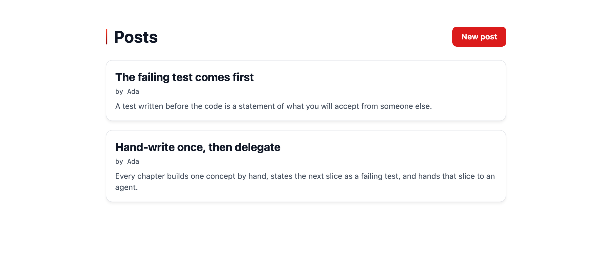

# 第 6 章: ルートを保護する

ブログにユーザーはできましたが、サインインしているかどうかを確かめている箇所はまだありません。ゲストでも投稿を書き、編集し、削除できてしまい、`guren audit` も第 3 章からずっとそれを指摘しています。この章では、投稿の変更操作をログインの壁で囲ってサインインしたユーザーだけが行えるようにし、既存の行を失わないマイグレーションですべての投稿に著者を設定します。そのあとマイグレーションを 1 つエージェントに任せ、`db-manage` スキルがどのように安全を保つかを確認します。最後に、いまなら読めるようになった `bunx guren add auth` の出力を見ていきます。

**この章で学ぶこと:**

- `requireAuthenticated` と `requireGuest` の働きと、ミドルウェアのエイリアスとグループでルートを読みやすく保つ方法
- `guren audit` が `requireAuthenticated` は信頼し、名前に「auth」を含む自作のミドルウェアは信頼しない理由
- 行が入っているテーブルに必須列を追加する手順: nullable で追加し、値を埋めてから not null にする
- `forceCreate` と `forceUpdate` の用途と、`authorId` を fillable にしない理由
- スキルを置くと、エージェントによるデータベースの扱い方がどう変わるか

開発サーバーを起動していなければ、起動しておきます。

```bash run background
bun run dev
```

## 1. ログインの壁のテストを先に書く

ルートを変える前に、テストファイルを 3 つ書き換えます。まずは投稿のテストです。変更系のリクエストはすべて Ada としてサインインした状態で送り、ゲストのときに何が返るかは新しく追加する 2 つのテストで確かめます。

```ts file=tests/PostController.test.ts
import { beforeAll, beforeEach, describe, expect, it } from 'bun:test'
import { TestApp } from '@guren/testing'
import app from '../src/app.js'
import { resetDatabase } from '../config/database.js'
import { Post } from '../app/Models/Post.js'
import { User, type UserRecord } from '../app/Models/User.js'

describe('PostController', () => {
  let http: TestApp
  let ada: UserRecord
  let asAda: TestApp

  beforeAll(async () => {
    http = await TestApp.fromApp(app)
  })

  beforeEach(async () => {
    await resetDatabase()
    ada = await User.create({ name: 'Ada', email: 'ada@example.com', password: 'correct horse battery' })
    asAda = await http.actingAs(ada).withCsrf()
  })

  it('lists posts, newest first', async () => {
    await Post.create({ title: 'First post', body: 'Hello' })
    await Post.create({ title: 'Second post', body: 'Again' })

    const response = await http.get('/posts').assertOk()
    const html = await response.text()
    const first = html.indexOf('First post')
    const second = html.indexOf('Second post')
    if (first === -1 || second === -1 || second > first) {
      throw new Error('expected the newer post to be listed before the older one')
    }
  })

  it('paginates ten posts per page', async () => {
    for (let i = 1; i <= 11; i++) {
      await Post.create({ title: `Post ${String(i).padStart(2, '0')}`, body: `Body number ${i}` })
    }

    const firstPage = await http.get('/posts').assertOk()
    await firstPage.assertBodyContains('Post 11')
    await firstPage.assertBodyContains('Post 02')
    expect(await firstPage.text()).not.toContain('Post 01')

    const secondPage = await http.get('/posts?page=2').assertOk()
    await secondPage.assertBodyContains('Post 01')
    expect(await secondPage.text()).not.toContain('Post 02')
  })

  it('shows one post', async () => {
    const post = await Post.create({ title: 'Read me', body: 'The whole body' })

    const response = await http.get(`/posts/${post.id}`).assertOk()
    await response.assertBodyContains('The whole body')
  })

  it('answers 404 for a post that does not exist', async () => {
    await http.get('/posts/999').assertNotFound()
  })

  it('sends a guest to the login page instead of the form', async () => {
    await http.get('/posts/create').assertRedirect('/login')
  })

  it('sends a guest to the login page instead of storing', async () => {
    const guest = await http.withCsrf()
    await guest.post('/posts', { title: 'Sneaky', body: 'No account' }).assertRedirect('/login')
    expect(await Post.where('title', 'Sneaky').first()).toBeNull()
  })

  it('serves the form for a new post to a signed-in user', async () => {
    await asAda.get('/posts/create').assertOk()
  })

  it('stores a post with the signed-in user as its author and redirects to it', async () => {
    await asAda.post('/posts', { title: 'Written in a test', body: 'By a test' }).assertRedirect()

    const post = await Post.where('title', 'Written in a test').first()
    expect(post).not.toBeNull()
    expect(post?.body).toBe('By a test')
    expect(post?.authorId).toBe(ada.id)
  })

  it('rejects an empty post with a message per field', async () => {
    await asAda
      .post('/posts', { title: '', body: '' })
      .assertStatus(422)
      .assertJsonPath('errors.title.0', 'Title is required')
      .assertJsonPath('errors.body.0', 'Body is required')
  })

  it('serves the edit form with the post in it', async () => {
    const post = await Post.create({ title: 'Before', body: 'The old body' })

    const response = await asAda.get(`/posts/${post.id}/edit`).assertOk()
    await response.assertBodyContains('The old body')
  })

  it('updates a post and redirects to it', async () => {
    const post = await Post.create({ title: 'Before', body: 'The old body' })

    await asAda.put(`/posts/${post.id}`, { title: 'After', body: 'The new body' }).assertRedirect(`/posts/${post.id}`)

    const updated = await Post.findOrFail(post.id)
    expect(updated.title).toBe('After')
    expect(updated.body).toBe('The new body')
  })

  it('rejects an invalid update with the same messages', async () => {
    const post = await Post.create({ title: 'Before', body: 'The old body' })

    await asAda
      .put(`/posts/${post.id}`, { title: '', body: 'Still here' })
      .assertStatus(422)
      .assertJsonPath('errors.title.0', 'Title is required')
  })

  it('deletes a post and redirects to the list', async () => {
    const post = await Post.create({ title: 'Doomed', body: 'Gone soon' })

    await asAda.delete(`/posts/${post.id}`).assertRedirect('/posts')

    expect(await Post.find(post.id)).toBeNull()
  })
})
```

プロフィールページは 401 を返す代わりに、ほかのページと同じく壁の内側に入れます。

```ts file=tests/ProfileController.test.ts
import { beforeAll, beforeEach, describe, it } from 'bun:test'
import { TestApp } from '@guren/testing'
import app from '../src/app.js'
import { resetDatabase } from '../config/database.js'
import { User } from '../app/Models/User.js'

describe('ProfileController', () => {
  let http: TestApp

  beforeAll(async () => {
    http = await TestApp.fromApp(app)
  })

  beforeEach(async () => {
    await resetDatabase()
  })

  it('shows the signed-in user their name and email', async () => {
    const user = await User.create({ name: 'Ada', email: 'ada@example.com', password: 'correct horse battery' })

    const response = await http.actingAs(user).get('/profile').assertOk()
    await response.assertBodyContains('ada@example.com')
  })

  it('sends a guest to the login page', async () => {
    await http.get('/profile').assertRedirect('/login')
  })
})
```

ログインページには逆向きのルールを加えます。サインイン済みのユーザーがこのページを開く必要はないからです。

```ts file=tests/LoginController.test.ts
import { beforeAll, beforeEach, describe, it } from 'bun:test'
import { TestApp } from '@guren/testing'
import app from '../src/app.js'
import { resetDatabase } from '../config/database.js'
import { User } from '../app/Models/User.js'

describe('LoginController', () => {
  let http: TestApp

  beforeAll(async () => {
    http = await TestApp.fromApp(app)
  })

  beforeEach(async () => {
    await resetDatabase()
    await User.create({ name: 'Ada', email: 'ada@example.com', password: 'correct horse battery' })
  })

  it('serves the login form', async () => {
    await http.get('/login').assertOk()
  })

  it('sends a signed-in user home instead of the login form', async () => {
    const user = await User.where('email', 'ada@example.com').first()
    await http.actingAs(user).get('/login').assertRedirect('/')
  })

  it('signs in with the right password and redirects', async () => {
    const csrf = await http.withCsrf('/login')
    await csrf.post('/login', { email: 'ada@example.com', password: 'correct horse battery' }).assertRedirect('/')
  })

  it('rejects the wrong password with a message', async () => {
    const csrf = await http.withCsrf('/login')
    await csrf
      .post('/login', { email: 'ada@example.com', password: 'wrong' })
      .assertStatus(422)
      .assertJsonPath('errors.message.0', 'Invalid credentials.')
  })

  it('signs out and redirects home', async () => {
    const user = await User.where('email', 'ada@example.com').first()
    const csrf = await http.actingAs(user).withCsrf()
    await csrf.post('/logout').assertRedirect('/')
  })
})
```

```bash run expect-fail
bun test
```

5 つのテストが失敗します。ゲストのリダイレクト、サインイン済みユーザーを `/login` からリダイレクトするテスト、そして保存した投稿の著者(まだ存在しません)を確かめるテストです。`POST /posts` に対するゲストのテストの書き方に注目してください。CSRF は認証より先に検査されるので、ほかのテストと同じように CSRF トークンを用意し、そのうえで何も保存されなかったことを assert しています。リダイレクトされたことを確かめるだけでは、壁が破られていないことの証明にならないからです。

## 2. 2 つのエイリアスと 2 つのグループ

`routes/web.ts` を次の内容に置き換えます。

```ts file=routes/web.ts
import { Router, requireAuthenticated, requireGuest } from '@guren/core'
import HomeController from '../app/Http/Controllers/HomeController.js'
import AboutController from '../app/Http/Controllers/AboutController.js'
import ContactController from '../app/Http/Controllers/ContactController.js'
import PostController from '../app/Http/Controllers/PostController.js'
import RegisterController from '../app/Http/Controllers/Auth/RegisterController.js'
import LoginController from '../app/Http/Controllers/Auth/LoginController.js'
import ProfileController from '../app/Http/Controllers/ProfileController.js'
import { Post } from '../app/Models/Post.js'
import { PostPayloadSchema } from '../app/Http/Validators/PostValidator.js'
import { RegisterSchema } from '../app/Http/Validators/RegisterValidator.js'
import { LoginSchema } from '../app/Http/Validators/LoginValidator.js'

export function registerWebRoutes(baseRouter: Router): void {
  // aliasMiddleware() returns a Router carrying the alias name in its type;
  // capture it, or `.middleware('auth')` below will not compile.
  const router = baseRouter
    .aliasMiddleware('auth', requireAuthenticated({ redirectTo: '/login' }))
    .aliasMiddleware('guest', requireGuest({ redirectTo: '/' }))

  router.get('/', [HomeController, 'index'])
  router.get('/about', [AboutController, 'index']).name('about')
  router.get('/contact', [ContactController, 'index']).name('contact')

  router.middleware('guest').group((guest) => {
    guest.get('/register', [RegisterController, 'show']).name('register')
    guest.post('/register', { name: 'register.store', body: RegisterSchema }, [RegisterController, 'store'])
    guest.get('/login', [LoginController, 'show']).name('login')
    guest.post('/login', { name: 'login.store', body: LoginSchema }, [LoginController, 'store'])
  })

  router.middleware('auth').group((auth) => {
    auth.post('/logout', [LoginController, 'destroy']).name('logout')
    auth.get('/profile', [ProfileController, 'show']).name('profile')
    auth.get('/posts/create', [PostController, 'create']).name('posts.create')
    auth.get('/posts/:id/edit', { bind: { id: Post }, name: 'posts.edit' }, [PostController, 'edit'])
    auth.post('/posts', { name: 'posts.store', body: PostPayloadSchema }, [PostController, 'store'])
    auth.put('/posts/:id', { bind: { id: Post }, name: 'posts.update', body: PostPayloadSchema }, [PostController, 'update'])
    auth.delete('/posts/:id', { bind: { id: Post }, name: 'posts.destroy' }, [PostController, 'destroy'])
  })

  router.get('/posts', [PostController, 'index']).name('posts.index')
  router.get('/posts/:id', { bind: { id: Post }, name: 'posts.show' }, [PostController, 'show'])

  // Health check endpoint for load balancers and uptime monitors
  router.get('/health', (c) => c.json({ status: 'ok' }))
}
```

- `requireAuthenticated({ redirectTo: '/login' })` は、セッションにユーザーがいるかどうかをガードに問い合わせ、いなければリダイレクトします。`redirectTo` を省くと 401 を返します。API ではこちらが適していて、第 5 章のプロフィールページもこの形でした。
- `requireGuest({ redirectTo: '/' })` はその逆で、サインアウトした状態でしか意味の無いページに使います。
- `aliasMiddleware` でそれぞれに名前を付け、`router.middleware('auth').group(...)` でグループ内のすべてのルートに適用します。ファイルを上から読んでいくと、公開、ゲスト専用、サインイン専用、また公開、という壁の配置がそのまま見えます。ルートの順序について守るべきルールは第 3 章から変わらず、`/posts/create` を `/posts/:id` より前に置くことだけです。

次は著者です。まずスキーマを置き換えます。`authorId` は `users` を参照する列で、いまはあえて **nullable** にしています。

```ts file=db/schema.ts
import { sqliteTable, integer, text } from '@guren/orm/drizzle/sqlite'

export const users = sqliteTable('users', {
  id: integer('id').primaryKey({ autoIncrement: true }),
  name: text('name').notNull(),
  email: text('email').notNull().unique(),
  passwordHash: text('password_hash').notNull(),
  rememberToken: text('remember_token'),
  createdAt: text('created_at').notNull().$defaultFn(() => new Date().toISOString()),
})

export const posts = sqliteTable('posts', {
  id: integer('id').primaryKey({ autoIncrement: true }),
  title: text('title').notNull(),
  body: text('body').notNull(),
  authorId: integer('author_id').references(() => users.id),
  createdAt: text('created_at').notNull().$defaultFn(() => new Date().toISOString()),
})
```

```bash run
bun run db:make add_author_to_posts
```

```bash run
bun run db:migrate
```

続いて、`store` で投稿の著者を記録するようにします。

```ts file=app/Http/Controllers/PostController.ts
import { Controller, paginate, type PaginatedPageProps } from '@guren/core'
import { pages } from '@/.guren/pages.gen'
import { Post } from '../../Models/Post.js'
import type { UserRecord } from '../../Models/User.js'
import { PostResource, type PostResourceData } from '../Resources/PostResource.js'
import { ListPostsQuerySchema, PostPayloadSchema } from '../Validators/PostValidator.js'

type PostsIndexProps = PaginatedPageProps<PostResourceData>

export default class PostController extends Controller {
  async index(): Promise<Response> {
    const { page } = this.validateQuery(ListPostsQuerySchema)
    const result = await Post.paginate({ page, perPage: 10, orderBy: ['id', 'desc'] })
    const paginator = paginate(result, { path: this.request.path ?? '/posts' })

    return this.inertia(pages.posts.Index, {
      data: result.data.map((post) => new PostResource(post).toJSON()),
      pagination: {
        meta: paginator.meta(),
        links: paginator.links(),
      },
    } satisfies PostsIndexProps)
  }

  async show(): Promise<Response> {
    const post = this.model(Post)

    return this.inertia(pages.posts.Show, {
      post: new PostResource(post).toJSON(),
    })
  }

  async create(): Promise<Response> {
    return this.inertia(pages.posts.New, {})
  }

  async store(): Promise<Response> {
    const author = await this.auth.userOrFail<UserRecord>()
    const data = await this.validateBody(PostPayloadSchema)
    const post = await Post.forceCreate({ ...data, authorId: author.id })
    return this.redirect(`/posts/${post.id}`)
  }

  async edit(): Promise<Response> {
    const post = this.model(Post)

    return this.inertia(pages.posts.Edit, {
      post: new PostResource(post).toJSON(),
    })
  }

  async update(): Promise<Response> {
    const post = this.model(Post)
    const data = await this.validateBody(PostPayloadSchema)
    await Post.update({ id: post.id }, data)
    return this.redirect(`/posts/${post.id}`)
  }

  async destroy(): Promise<Response> {
    const post = this.model(Post)
    await Post.delete({ id: post.id })
    return this.redirect('/posts')
  }
}
```

ここで `forceCreate` を使っているのは意図的な選択なので、少し詳しく見ておきます。モデルの `fillable` には `title` と `body` だけがあり、`authorId` は含まれていません。投稿の著者をリクエスト側から指定できてはいけないからです。そのため `Post.create({ ...data, authorId: author.id })` と書くと、`authorId` を名指しした `MassAssignmentException` が投げられます。`forceCreate` はこのフィルターを迂回しますが、ここでは問題ありません。渡すオブジェクトには、リクエストから検査を経ずに来た値が 1 つも含まれていないからです。`data` はバリデーターを通過したもので、`author.id` はセッションから取り出したものです。`forceCreate` そのものを避ける必要はなく、サーバーが決めた値にだけ使えばよい、と覚えておいてください。

```bash run
bun test
```

テストが通りました。続いて audit の結果を見てみます。

```bash run
bunx guren audit
```

認証に関する 3 つの警告が消えました。レポートには対応が必要なものしか出ないので、代わりにどう判定されたかは `bunx guren audit --json` で確かめます。どのルートも「Protected by an authentication guard (verified via middleware capabilities)」として合格しています。括弧内の言い回しに意味があります。`requireAuthenticated` にはフレームワークが付けたマーカーがあり、`audit` は名前ではなくこのマーカーを見て判定します。自作の `requireLogin` ミドルウェアに `auth` というエイリアスを付けた場合、audit は、ガード*のような名前*ではあるものの認識できるガードではないと判断し、警告を出し続けます。この判断は正しいものです。人間でも機械でも、レビュアーは名前だけを見て、その関数が本当に何かを検査しているかを見分けられません。

警告が 1 つ残っていますが、これは誤りではありません。`[warn] [API3] PostController.store force write` は、ボディをバリデートしたうえで `forceCreate` を呼んでいるメソッドに出る警告です。この形のアクションには、この章でもこれ以降の章でも必ずこの警告が出ます。

この警告は判定ではなく、レビューを促すためのものです。`audit` に分かるのは、バリデート済みの入力が `forceCreate` に渡っていることまでです。データの流れを追って、そのバリデーターが `fillable` の代わりに許可リストの役割を果たしているかまでは確かめられません。そこは上の説明で読者自身が判断したところで、その判断はいまも成り立っています。したがって、この警告が出るのは正しく、それを受け入れるのも正しい対応です。同じ理由で、この警告が失敗扱いになることはなく、下の `guren gate` もこの警告を残したまま通ります。警告が出たら、消す方法を探すのではなく、内容を読んで判断してください。次に出る force write の警告は、本当に生のボディをそのまま渡してしまったものかもしれません。

```bash run
bunx guren gate
```

```bash run
git add -A
git commit -m "feat: protect post mutations and record each post's author"
```

## 3. 著者のいない既存の行

`authorId` は nullable で、開発用データベースには第 3 章と第 4 章で書いた、著者のいない投稿が残っています。この状態で列を必須にすると、それらの行でマイグレーションが失敗します。よくある回避策はデータベースを削除して最初からやり直すことですが、データが失われるので、アプリを一度デプロイしたあとには使えません。実データを残したままマイグレーションするには、列を nullable で追加し(これは済んでいます)、値を埋めてから必須にする、という 3 段階で進めます。

値を埋める作業(バックフィル)は、マイグレーションではなくスクリプトで行います。著者のいない投稿を誰のものにするかは、マイグレーションが勝手に決めてよいことではないからです。ここでは、誰もサインインできない「Legacy author」というアカウントに割り当てます。

```ts file=scripts/backfill-post-authors.ts
import app from '../src/app.js'
import { Post } from '../app/Models/Post.js'
import { User } from '../app/Models/User.js'

await app.boot()

const orphans = (await Post.all()).filter((post) => post.authorId === null)
if (orphans.length === 0) {
  console.log('Every post has an author; nothing to do.')
  process.exit(0)
}

const legacy =
  (await User.where('email', 'legacy@guren-blog.test').first()) ??
  (await User.create({ name: 'Legacy author', email: 'legacy@guren-blog.test', password: crypto.randomUUID() }))

for (const post of orphans) {
  await Post.forceUpdate({ id: post.id }, { authorId: legacy.id })
}

console.log(`Assigned ${orphans.length} post(s) to ${legacy.name} (#${legacy.id}).`)
```

```bash run
bun scripts/backfill-post-authors.ts
```

`forceUpdate` を使う理由は `forceCreate` と同じで、`authorId` は fillable ではなく、値はこのスクリプトが決めたものだからです。パスワードにはランダムな UUID を使っているので、このアカウントは有効なハッシュを持ちながら、そのパスワードを誰も知りません。

列を必須にする作業は、このあとエージェントに任せます。

## 4. 著者の制約と表示のテストを先に書く

ブログの読者には、まだ 2 つのことが見えていません。すべての投稿に著者がいることと、その著者が誰かです。投稿のテストファイルを次の内容に置き換えます。テストで作る投稿にはすべて著者を指定し、新しいテストを 3 つ追加しています。スキーマで `authorId` が not null と宣言されていることを確かめるテストと、一覧ページと投稿ページに著者名が表示されることを確かめるテストです。

```ts file=tests/PostController.test.ts
import { beforeAll, beforeEach, describe, expect, it } from 'bun:test'
import { TestApp } from '@guren/testing'
import app from '../src/app.js'
import { resetDatabase } from '../config/database.js'
import { posts } from '../db/schema.js'
import { Post } from '../app/Models/Post.js'
import { User, type UserRecord } from '../app/Models/User.js'

describe('PostController', () => {
  let http: TestApp
  let ada: UserRecord
  let asAda: TestApp

  beforeAll(async () => {
    http = await TestApp.fromApp(app)
  })

  beforeEach(async () => {
    await resetDatabase()
    ada = await User.create({ name: 'Ada', email: 'ada@example.com', password: 'correct horse battery' })
    asAda = await http.actingAs(ada).withCsrf()
  })

  it('requires an author at the schema level', () => {
    expect(posts.authorId.notNull).toBe(true)
  })

  it('lists posts, newest first, each with its author', async () => {
    const grace = await User.create({ name: 'Grace', email: 'grace@example.com', password: 'correct horse battery' })
    await Post.forceCreate({ title: 'First post', body: 'Hello', authorId: ada.id })
    await Post.forceCreate({ title: 'Second post', body: 'Again', authorId: grace.id })

    const response = await http.get('/posts').assertOk()
    const html = await response.text()
    const first = html.indexOf('First post')
    const second = html.indexOf('Second post')
    if (first === -1 || second === -1 || second > first) {
      throw new Error('expected the newer post to be listed before the older one')
    }
    await response.assertBodyContains('Ada')
    await response.assertBodyContains('Grace')
  })

  it('paginates ten posts per page', async () => {
    for (let i = 1; i <= 11; i++) {
      await Post.forceCreate({ title: `Post ${String(i).padStart(2, '0')}`, body: `Body number ${i}`, authorId: ada.id })
    }

    const firstPage = await http.get('/posts').assertOk()
    await firstPage.assertBodyContains('Post 11')
    await firstPage.assertBodyContains('Post 02')
    expect(await firstPage.text()).not.toContain('Post 01')

    const secondPage = await http.get('/posts?page=2').assertOk()
    await secondPage.assertBodyContains('Post 01')
    expect(await secondPage.text()).not.toContain('Post 02')
  })

  it('shows one post with its author', async () => {
    const post = await Post.forceCreate({ title: 'Read me', body: 'The whole body', authorId: ada.id })

    const response = await http.get(`/posts/${post.id}`).assertOk()
    await response.assertBodyContains('The whole body')
    await response.assertBodyContains('Ada')
  })

  it('answers 404 for a post that does not exist', async () => {
    await http.get('/posts/999').assertNotFound()
  })

  it('sends a guest to the login page instead of the form', async () => {
    await http.get('/posts/create').assertRedirect('/login')
  })

  it('sends a guest to the login page instead of storing', async () => {
    const guest = await http.withCsrf()
    await guest.post('/posts', { title: 'Sneaky', body: 'No account' }).assertRedirect('/login')
    expect(await Post.where('title', 'Sneaky').first()).toBeNull()
  })

  it('serves the form for a new post to a signed-in user', async () => {
    await asAda.get('/posts/create').assertOk()
  })

  it('stores a post with the signed-in user as its author and redirects to it', async () => {
    await asAda.post('/posts', { title: 'Written in a test', body: 'By a test' }).assertRedirect()

    const post = await Post.where('title', 'Written in a test').first()
    expect(post).not.toBeNull()
    expect(post?.body).toBe('By a test')
    expect(post?.authorId).toBe(ada.id)
  })

  it('rejects an empty post with a message per field', async () => {
    await asAda
      .post('/posts', { title: '', body: '' })
      .assertStatus(422)
      .assertJsonPath('errors.title.0', 'Title is required')
      .assertJsonPath('errors.body.0', 'Body is required')
  })

  it('serves the edit form with the post in it', async () => {
    const post = await Post.forceCreate({ title: 'Before', body: 'The old body', authorId: ada.id })

    const response = await asAda.get(`/posts/${post.id}/edit`).assertOk()
    await response.assertBodyContains('The old body')
  })

  it('updates a post and redirects to it', async () => {
    const post = await Post.forceCreate({ title: 'Before', body: 'The old body', authorId: ada.id })

    await asAda.put(`/posts/${post.id}`, { title: 'After', body: 'The new body' }).assertRedirect(`/posts/${post.id}`)

    const updated = await Post.findOrFail(post.id)
    expect(updated.title).toBe('After')
    expect(updated.body).toBe('The new body')
  })

  it('rejects an invalid update with the same messages', async () => {
    const post = await Post.forceCreate({ title: 'Before', body: 'The old body', authorId: ada.id })

    await asAda
      .put(`/posts/${post.id}`, { title: '', body: 'Still here' })
      .assertStatus(422)
      .assertJsonPath('errors.title.0', 'Title is required')
  })

  it('deletes a post and redirects to the list', async () => {
    const post = await Post.forceCreate({ title: 'Doomed', body: 'Gone soon', authorId: ada.id })

    await asAda.delete(`/posts/${post.id}`).assertRedirect('/posts')

    expect(await Post.find(post.id)).toBeNull()
  })
})
```

```bash run expect-fail
bun test
```

3 つのテストが失敗します。1 つ目の `posts.authorId.notNull` は、スキーマそのものを検査するテストです。Drizzle の列オブジェクトは自身の制約を保持しているので、「投稿には必ず著者がいる」という決定を、データベースを使わずにテストで固定できます。

## 5. エージェントに任せる

エージェントに次のプロンプトを送ります。

```text
Every post now has an author (`scripts/backfill-post-authors.ts` has run). Make `authorId` on the `posts` table NOT NULL with a new migration, and show each post's author name on the posts list and the post page. Load the authors for a page of posts in one query, not one per post, and keep `PostResource` the one place a post's shape is defined. `tests/PostController.test.ts` describes all of it; make it pass.
```

エージェントがデータベースを扱うのは、これが初めてです。この章で紹介するハーネスの仕組みは `.claude/skills/db-manage/` にある **`db-manage` スキル**なので、エージェントより先に読んでおいてください。このスキルには、このアプリでのマイグレーションの生成・適用・確認の方法(`make:migration`、`db:migrate`、`db:status`)と、マイグレーションが前進専用であることが書かれています。安全のためのルールもあり、破壊的な操作(`db:reset`、`db:fresh`)は、影響範囲を示してデータが失われることを警告し、利用者に確認を取ってからでなければ実行しないと定めています。エージェントがマイグレーションを生成して適用するのか、それともリセットしてよいかを尋ねてくるのかを見ていてください。どちらになるかをモデルの気まぐれに任せないために、このスキルがあります。

**手元にエージェントが無い場合は、** まずスキーマに 1 語追加し、次にマイグレーションを作り、最後にコードを書きます。

```ts file=db/schema.ts fallback
import { sqliteTable, integer, text } from '@guren/orm/drizzle/sqlite'

export const users = sqliteTable('users', {
  id: integer('id').primaryKey({ autoIncrement: true }),
  name: text('name').notNull(),
  email: text('email').notNull().unique(),
  passwordHash: text('password_hash').notNull(),
  rememberToken: text('remember_token'),
  createdAt: text('created_at').notNull().$defaultFn(() => new Date().toISOString()),
})

export const posts = sqliteTable('posts', {
  id: integer('id').primaryKey({ autoIncrement: true }),
  title: text('title').notNull(),
  body: text('body').notNull(),
  authorId: integer('author_id').notNull().references(() => users.id),
  createdAt: text('created_at').notNull().$defaultFn(() => new Date().toISOString()),
})
```

```bash run fallback
bun run db:make require_post_authors
```

```bash run fallback
bun run db:migrate
```

リソースで著者を扱えるようにします。著者のレコードが付いているかもしれない投稿を受け取り、著者については id と名前だけを出力します。

```ts file=app/Http/Resources/PostResource.ts fallback
import { Resource } from '@guren/core'
import type { PostRecord } from '../../Models/Post.js'
import type { UserRecord } from '../../Models/User.js'

export type PostWithAuthor = PostRecord & { author?: UserRecord | null }

export interface PostResourceData extends Record<string, unknown> {
  id: number
  title: string
  body: string
  createdAt: string
  author: { id: number; name: string } | null
}

export class PostResource extends Resource<PostWithAuthor, PostResourceData> {
  toArray(): PostResourceData {
    const author = this.resource.author
    return {
      id: this.resource.id,
      title: this.resource.title,
      body: this.resource.body,
      createdAt: this.resource.createdAt,
      author: author ? { id: author.id, name: author.name } : null,
    }
  }
}
```

```ts file=app/Http/Controllers/PostController.ts fallback
import { Controller, paginate, type PaginatedPageProps } from '@guren/core'
import { pages } from '@/.guren/pages.gen'
import { Post, type PostRecord } from '../../Models/Post.js'
import { User, type UserRecord } from '../../Models/User.js'
import { PostResource, type PostResourceData } from '../Resources/PostResource.js'
import { ListPostsQuerySchema, PostPayloadSchema } from '../Validators/PostValidator.js'

type PostsIndexProps = PaginatedPageProps<PostResourceData>

async function authorsOf(posts: PostRecord[]): Promise<Map<number, UserRecord>> {
  const ids = [...new Set(posts.map((post) => post.authorId))]
  const authors = ids.length === 0 ? [] : await User.where({ id: ids }).get()
  return new Map(authors.map((author) => [author.id, author]))
}

export default class PostController extends Controller {
  async index(): Promise<Response> {
    const { page } = this.validateQuery(ListPostsQuerySchema)
    const result = await Post.paginate({ page, perPage: 10, orderBy: ['id', 'desc'] })
    const paginator = paginate(result, { path: this.request.path ?? '/posts' })
    const authors = await authorsOf(result.data)

    return this.inertia(pages.posts.Index, {
      data: result.data.map((post) => new PostResource({ ...post, author: authors.get(post.authorId) ?? null }).toJSON()),
      pagination: {
        meta: paginator.meta(),
        links: paginator.links(),
      },
    } satisfies PostsIndexProps)
  }

  async show(): Promise<Response> {
    const post = this.model(Post)
    const author = await User.find(post.authorId)

    return this.inertia(pages.posts.Show, {
      post: new PostResource({ ...post, author }).toJSON(),
    })
  }

  async create(): Promise<Response> {
    return this.inertia(pages.posts.New, {})
  }

  async store(): Promise<Response> {
    const author = await this.auth.userOrFail<UserRecord>()
    const data = await this.validateBody(PostPayloadSchema)
    const post = await Post.forceCreate({ ...data, authorId: author.id })
    return this.redirect(`/posts/${post.id}`)
  }

  async edit(): Promise<Response> {
    const post = this.model(Post)

    return this.inertia(pages.posts.Edit, {
      post: new PostResource(post).toJSON(),
    })
  }

  async update(): Promise<Response> {
    const post = this.model(Post)
    const data = await this.validateBody(PostPayloadSchema)
    await Post.update({ id: post.id }, data)
    return this.redirect(`/posts/${post.id}`)
  }

  async destroy(): Promise<Response> {
    const post = this.model(Post)
    await Post.delete({ id: post.id })
    return this.redirect('/posts')
  }
}
```

`User.where({ id: ids })` に配列を渡すと `IN` クエリになります。著者が何人いても、1 ページ分の投稿に対してデータベースとの往復は 1 回で済みます。第 9 章では `authorsOf` をリレーションシップと `with('author')` に置き換え、より少ないコードで同じことを実現します。そのとき実行されるクエリも、これと同じです。

2 つのページで著者名を表示します。

```tsx file=resources/js/pages/posts/Index.tsx fallback
import { Head, Link } from '@inertiajs/react'
import type { PaginatedPageProps } from '@guren/core'
import type { PostResourceData } from '@/app/Http/Resources/PostResource'
import { route } from '@/.guren/routes.gen'

interface Props extends PaginatedPageProps<PostResourceData> {}

export default function PostsIndex({ data, pagination }: Props) {
  return (
    <>
      <Head title="Posts" />
      <main className="min-h-screen bg-g-page font-sans text-g-text">
        <div className="mx-auto max-w-3xl space-y-6 px-6 py-12">
          <div className="flex items-center justify-between">
            <h1 className="flex items-center gap-3 text-3xl font-bold text-g-heading">
              <span aria-hidden className="h-7 w-[3px] shrink-0 rounded-full bg-[image:var(--g-tick)]" />
              Posts
            </h1>
            <Link href={route('posts.create')} className="rounded-g-ctl bg-g-accent px-4 py-2 text-sm font-bold text-g-on-accent transition hover:bg-g-accent-down">
              New post
            </Link>
          </div>
          {data.length === 0 && <p className="text-g-text-2">No posts yet.</p>}
          <div className="space-y-4">
            {data.map((post) => (
              <article key={post.id} className="rounded-g-card border border-g-line bg-g-panel p-4 shadow-g-card">
                <Link href={route('posts.show', { id: post.id })} className="text-xl font-bold text-g-heading transition hover:text-g-accent-text">
                  {post.title}
                </Link>
                <p className="mt-1 font-mono text-xs text-g-text-2">by {post.author?.name ?? 'unknown'}</p>
                <p className="mt-2 text-sm text-g-text-2">{post.body}</p>
              </article>
            ))}
          </div>
          {pagination?.links?.pages && pagination.links.pages.length > 1 && (
            <nav className="flex gap-2 font-mono text-sm">
              {pagination.links.pages.map((page) => (
                <Link key={page.page} href={page.url ?? '#'} className="rounded-g-ctl border border-g-line px-3 py-1 text-g-text-2 transition hover:border-g-line-strong hover:text-g-heading">
                  {page.page}
                </Link>
              ))}
            </nav>
          )}
        </div>
      </main>
    </>
  )
}
```

```tsx file=resources/js/pages/posts/Show.tsx fallback
import { Head, Link } from '@inertiajs/react'
import type { PostResourceData } from '@/app/Http/Resources/PostResource'
import { route } from '@/.guren/routes.gen'

interface Props {
  post: PostResourceData
}

export default function PostShow({ post }: Props) {
  return (
    <>
      <Head title={post.title} />
      <main className="min-h-screen bg-g-page font-sans text-g-text">
        <div className="mx-auto max-w-3xl space-y-6 px-6 py-12">
          <Link href={route('posts.index')} className="text-sm text-g-accent-text transition hover:underline">
            All posts
          </Link>
          <h1 className="text-3xl font-bold text-g-heading">{post.title}</h1>
          <p className="font-mono text-xs text-g-text-2">
            by {post.author?.name ?? 'unknown'} · {post.createdAt}
          </p>
          <p className="whitespace-pre-wrap text-lg">{post.body}</p>
          <div className="flex items-center gap-4">
            <Link href={route('posts.edit', { id: post.id })} className="text-g-accent-text transition hover:underline">
              Edit
            </Link>
            <Link
              href={route('posts.destroy', { id: post.id })}
              method="delete"
              as="button"
              onBefore={() => window.confirm('Delete this post?')}
              className="rounded-g-ctl border border-g-danger-chip px-3 py-1 text-sm font-bold text-g-danger transition hover:bg-g-danger-tint"
            >
              Delete
            </Link>
          </div>
        </div>
      </main>
    </>
  )
}
```

```bash run
bun run codegen
```

```bash run
bun test
```

確認項目は次のとおりです。

- `db/migrations/` の下に新しいマイグレーションのフォルダがあり、`bun run db:status` で適用済みと表示される。トランスクリプトに `db:reset` も `db:fresh` も無い。エージェントがどちらかを提案していたなら、実行前に確認を求めてきたはずで(スキルが機能している証拠)、その答えは「いいえ」だった。
- `authorId` がスキーマで `notNull()` になっていて、`fillable` には含まれていないまま。
- 一覧は著者を 1 回の `IN` クエリで読み込んでいる。map の中で `User.find` を呼んでいない。
- 投稿の形を書いている場所は相変わらず `PostResource` だけで、出力する著者は id と名前だけ(ユーザーレコードそのものではない)。
- 14 件のテストがすべて通る。

**チェックポイント:** [http://localhost:3333/posts](http://localhost:3333/posts) の投稿一覧で、この章より前に書いた投稿には「by Legacy author」、これから書く投稿には自分の名前が表示されます。



```bash run
bunx guren gate
```

```bash run
git add -A
git commit -m "feat: require an author on every post and show it"
```

## `add auth` を使っていたら生成されたもの

セッション、ガード、ハッシュ、CSRF トークン、ログインの壁は、どれも自分で組み立てたので、それぞれが何をするものか分かっているはずです。ジェネレーターの出力を見るには、ちょうどよい時期です。まず `bun run dev` を実行しているターミナルで Ctrl-C を押してサーバーを止め、あとで捨てるブランチの上で試します。

```bash manual
git switch -c scratch/add-auth
bunx guren add auth --force
git status --short
git switch main
git reset --hard
git clean -fdn
git clean -fd
git branch -D scratch/add-auth
bun run db:status
```

サーバーを先に止めるのには理由があります。`add auth` は `src/app.ts` を書き換えるので、dev サーバーが動いていると、その変更をきっかけにリロードが走ります。リロードでアプリが起動すると、`add auth` が書いたばかりのマイグレーションが適用され、デモユーザーのシーダーも実行されます。差分を読む前にそこまで進んでしまい、データベースに入ったものは git のコマンドでは取り消せません。

`reset` と `clean` も、単なる後片付けではありません。`git switch main` と `git branch -D` は参照を動かすだけで、コミットしていない作業はどちらを使っても元に戻りません。この 2 つを省くと、`add auth` が書いたファイルが `db/migrations/` の下のマイグレーションフォルダも含めて `main` の作業ツリーに残り、次の起動時に適用されてしまいます。8 章先の第 14 章では `sessions` テーブルを自分で作るので、そのときのマイグレーションが、すでに存在するテーブルにぶつかって失敗します。

`git clean` を実行しても、`.env` だけは意図どおり残ります。`.env` は git の管理対象外で、`add auth` はその末尾に 2 つのブロックを追記しています。メールの送信方法についてのコメントで始まり `MAIL_MAILER` と `SMTP_*` を設定するブロックと、`config/session.ts` についてのコメントで始まり `SESSION_DRIVER` を設定するブロックです。どちらも削除してください。そのあと `db:status` で、すべてのマイグレーションが `applied`(適用済み)と表示され、`orphaned`(孤立)が 1 つも無ければ元どおりです。`orphaned` が出た場合は、サーバーを止める前にリロードが走っています。`bun run db:reset` を実行すると手元のマイグレーションからデータベースを作り直せますが、行はすべて消えます。最後に `bun run dev` をもう一度起動します。

`add auth` は既存のファイルを変更するだけでなく、新しいファイルも作ります。`main` との `git diff` には未追跡の新しいファイルが表示されないので、`git status` を使います。一覧の大半は、モデル、プロバイダー、2 つのコントローラー、バリデーターといった、自分で書いたものと同じ形のファイルです。残りは自分では書かなかったもので、パスワードを忘れたときのページとリセット用のページ、その 2 つをつなぐメール、「ログイン状態を保持する」トークン、デモユーザーのシーダー、ダッシュボードがあります。メールアドレスの確認機能は含まれておらず、それを追加するジェネレーターは `bunx guren make:auth --verify` です。これ以降、このコースでこれらの機能が必要になったときはジェネレーターを使います。生成されたコードも、いまなら読めるはずです。

## ここまでの状態

- 投稿の変更、プロフィール、ログアウトは `requireAuthenticated` で、ログインと登録のページは `requireGuest` で守られています。
- audit の結果を読めるようになりました。認証の警告には対応し、force write の警告は意図して受け入れています。audit が名前ではなくフレームワークのガードを信頼する理由も分かっています。
- nullable で追加し、値を埋め、必須にするという手順で、行を 1 つも失わずにすべての投稿に著者を設定しました。
- エージェントの最初のマイグレーションを、`db-manage` スキルのルールに沿って実行しました。

## よくあるつまずき

- **`.middleware('auth')` がコンパイルできない。** `aliasMiddleware()` はその名前を知っている新しいルーター型を返しますが、その戻り値を受け取っていません。上のファイルのように、チェーンして変数に代入してください。
- **サインイン済みのテストが `/login` にリダイレクトされる。** `actingAs()` は `withCsrf()` より前に呼ぶ必要があります。トークンを用意するリクエストも認証済みでなければならないからです。どちらも新しいクライアントを返すので、戻り値を代入し直してください。
- **`db:migrate` が「NOT NULL constraint failed」で失敗する。** 著者のいない投稿がまだ残っています。先に `bun scripts/backfill-post-authors.ts` を実行してください。第 3 節の手順は、この順序で進めることに意味があります。
- **`store` が `MassAssignmentException` で 500 を返す。** `store` が `Post.create` に `authorId` を渡していますが、`fillable` には含まれていません。サーバーが決めた値には `forceCreate` を使ってください。
- **一覧の著者がすべて「unknown」になる。** `IN` クエリに渡した id の型が違うか、map のキーがユーザーの id になっていません。`authors` を一度ログに出してみてください。著者ごとに 1 件ずつ入っているはずです。

## 演習

1. `/posts/create` を開いたゲストは `/login` にリダイレクトされます。では、`/posts` に POST したゲストはどうなるでしょうか。推測する前にテストを書いて確かめ、そのうえで、その挙動が望ましいものかどうかを考えてください。
2. 埋め戻しのスクリプトで、`authorId` が空だった行に値を入れました。ブランチを切って列を nullable に戻し、適用はせずに `bun run db:make` を実行してください。生成された SQL を読み、SQLite が列の変更ではなくテーブルの作り直しを選ぶ理由を考えてください。終わったら `git branch -D` だけで済ませず、`git reset --hard` と `git clean -fd` で元に戻してください。

<details>
<summary>演習 1: ヒントと答えの例</summary>

第 1 節の `tests/PostController.test.ts` には、すでに「sends a guest to the login page instead of storing」があります。`routes/web.ts` の `requireAuthenticated({ redirectTo: '/login' })` と並べて読んでください。

ゲストはフォームを開いたときと同じく `/login` にリダイレクトされ、何も保存されません。ミドルウェアはメソッドにかかわらず、アクションより先に応答するからです。CSRF の検査は認証より先に実行されるので、トークンを持たないゲストの POST は、ログインの壁に届く前に 403 で拒否されます。テストが `withCsrf()` でトークンを用意しているのはこのためです。このリダイレクトが望ましいかどうかは、呼び出し元によって変わります。ブラウザを使う人にとっては妥当ですが、入力したフォームの内容は失われ、ログインしたあとは `LoginController` が常に `/` へ送ります。JSON のクライアントなら 401 のほうが扱いやすく、`redirectTo` を付けない `requireAuthenticated()` はそう応答します。ほかの答えもあり得ます。

</details>

<details>
<summary>演習 2: ヒントと答えの例</summary>

生成された SQL を、第 5 章第 1 節の `users` のマイグレーションの説明と比べてください。そのうえで、SQLite の `ALTER TABLE` で何を変えられるかを考えます。

SQL は `posts` を作り直しています。外部キーの検査を止め、`author_id` を nullable にした `__new_posts` を作り、`INSERT … SELECT` ですべての行をコピーし、`posts` を削除し、`__new_posts` を `posts` に名前を変えてから、外部キーの検査を戻します。SQLite の `ALTER TABLE` でできるのは、テーブル名の変更と、列の追加、名前の変更、削除です。既存の列の定義は変えられず、`NOT NULL` はその定義の一部です。変えるには新しい形でテーブルを作り直して行をコピーするしかなく、行が失われないのはこのコピーのおかげです。第 14 章でアプリを移す Postgres では、`ALTER COLUMN … DROP NOT NULL` でその場で変更できます。

</details>

## 次へ

[第 7 章: 認可と、ゲートが見逃すもの](./07-authorization.md) では、ポリシーを使って投稿の編集と削除を著者だけに許可します。そのあと認可には触れずにエージェントへ機能を頼み、用意してきた安全装置のうちどれがそれに気づくかを確かめます。
