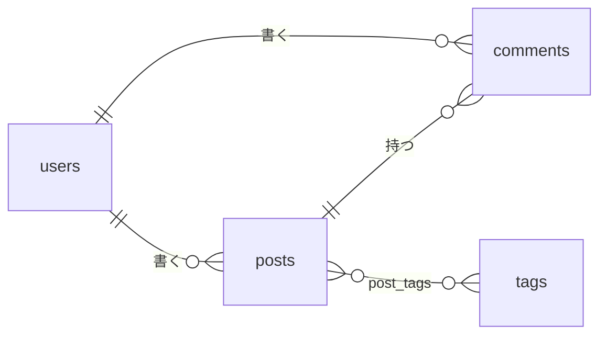

# 第 9 章: リレーションシップ

第 6 章では、著者の id を集めて `IN` クエリを 1 本実行するヘルパー `authorsOf` を作りました。これでも動きますし、リレーションシップが内部でしていることもこれと同じです。この章では、このヘルパーを本来の仕組みに置き換えます。モデルに一度だけ宣言し、`with()` で読み込む `belongsTo` と `hasMany` です。続いて、ほかの 2 つのテーブルを参照する最初のテーブルとしてコメントを追加します。最後に、まだ一度も作っていない形である、中間テーブルを通した多対多のタグ付けをエージェントに任せます。

この章を終えると、ブログには互いに参照し合う 4 つのテーブルがそろいます。



**この章で学ぶこと:**

- リレーションシップをモデルに宣言し、型を付け、読み込む方法と、読み込んだレコードの形
- `findOrFail` と `paginate` とは別に、`findWithOrFail` と `withPaginate` がある理由
- ほかの 2 つのテーブルを参照するテーブル(コメント)を、両側からモデリングする方法
- 中間テーブルとは何か、そして Guren に `attach()` がない理由(中間テーブルもほかと同じ 1 つのモデルです)
- `orm-models.md` のルールと API ダイジェストが、存在しないクエリメソッドをエージェントに書かせない仕組み

開発サーバーが動いていなければ起動します。

```bash run background
bun run dev
```

## 1. 著者をリレーションシップにする

この節では、外から見える変化は何もありません。`authorsOf` がなくなっても、投稿のテスト 20 件はすべて通ったままです。まず `Post` にリレーションを宣言します。

```ts file=app/Models/Post.ts
import { defineModel, type BelongsToRecord } from '@guren/core'
import { posts } from '../../db/schema.js'
import type { UserRecord } from './User.js'

export type PostRecord = typeof posts.$inferSelect
export type NewPostRecord = typeof posts.$inferInsert

export class Post extends defineModel(posts, { fillable: ['title', 'body'] }) {
  static override relationTypes: {
    author: BelongsToRecord<UserRecord>
  } = { author: null }
}

Post.belongsTo('author', () => import('./User.js').then((m) => m.User), 'authorId', 'id')
```

宣言は 2 つの部分に分かれています。`relationTypes` は型の側で、読み込んだ `author` が `UserRecord` か `null` になることを表します。プレースホルダーの値(to-one なら `null`、to-many なら `[]`)も、この型に合わせる必要があります。クラスの後ろにある `Post.belongsTo(...)` はランタイムの側で、リレーションの名前、相手のモデル、このテーブルの外部キー、その外部キーが指すキーを順に渡します。相手のモデルを関数の中で遅延 import しているのは、このあと `User` からも `Post` を参照するからです。2 つのモジュールが読み込み時に互いを import し合うことはできません。

逆向きのリレーションは `User` に書きます。

```ts file=app/Models/User.ts
import { AuthenticatableModel, defineModel, type HasManyRecord } from '@guren/core'
import { users } from '../../db/schema.js'
import type { PostRecord } from './Post.js'

export type UserRecord = typeof users.$inferSelect

export class User extends defineModel(users, {
  base: AuthenticatableModel,
  // Derived from the plain `password`, so callers never set it directly
  optionalOnCreate: ['passwordHash'],
  requireOnCreate: ['password'],
  // Never serialized by Model.serialize() and stripped from auth.user()
  hidden: ['passwordHash', 'rememberToken'],
}) {
  static override relationTypes: {
    posts: HasManyRecord<PostRecord>
  } = { posts: [] }
}

User.hasMany('posts', () => import('./Post.js').then((m) => m.Post), 'authorId', 'id')
```

次は読み込む側です。コントローラーで自前のマップを組み立てるのをやめます。

```ts file=app/Http/Validators/PostValidator.ts
import { z } from 'zod'

export const PostIdParamSchema = z.object({
  id: z.coerce.number().int().positive(),
})

export const PostPayloadSchema = z.object({
  title: z.string().trim().min(1, 'Title is required').max(120, 'Title must be 120 characters or fewer'),
  body: z.string().trim().min(1, 'Body is required'),
})

export type PostPayload = z.infer<typeof PostPayloadSchema>

export const ListPostsQuerySchema = z.object({
  page: z.coerce.number().int().min(1).default(1),
})
```

```ts file=app/Http/Controllers/PostController.ts
import { Controller, paginate, type PaginatedPageProps } from '@guren/core'
import { pages } from '@/.guren/pages.gen'
import { Post } from '../../Models/Post.js'
import type { UserRecord } from '../../Models/User.js'
import { PostResource, type PostResourceData } from '../Resources/PostResource.js'
import { ListPostsQuerySchema, PostIdParamSchema, PostPayloadSchema } from '../Validators/PostValidator.js'

type PostsIndexProps = PaginatedPageProps<PostResourceData>

export default class PostController extends Controller {
  async index(): Promise<Response> {
    const { page } = this.validateQuery(ListPostsQuerySchema)
    const result = await Post.withPaginate('author', { page, perPage: 10, orderBy: ['id', 'desc'] })
    const paginator = paginate(result, { path: this.request.path ?? '/posts' })

    return this.inertia(pages.posts.Index, {
      data: result.data.map((post) => new PostResource(post).toJSON()),
      pagination: {
        meta: paginator.meta(),
        links: paginator.links(),
      },
    } satisfies PostsIndexProps)
  }

  async show(): Promise<Response> {
    const { id } = this.validateParams(PostIdParamSchema)
    const post = await Post.findWithOrFail(id, 'author')

    return this.inertia(pages.posts.Show, {
      post: new PostResource(post).toJSON(),
      canManage: await this.can('update', [Post, post]),
    })
  }

  async create(): Promise<Response> {
    return this.inertia(pages.posts.New, {})
  }

  async store(): Promise<Response> {
    const author = await this.auth.userOrFail<UserRecord>()
    const data = await this.validateBody(PostPayloadSchema)
    const post = await Post.forceCreate({ ...data, authorId: author.id })
    return this.redirect(`/posts/${post.id}`)
  }

  async edit(): Promise<Response> {
    const post = this.model(Post)
    await this.authorize('update', [Post, post])

    return this.inertia(pages.posts.Edit, {
      post: new PostResource(post).toJSON(),
    })
  }

  async update(): Promise<Response> {
    const post = this.model(Post)
    await this.authorize('update', [Post, post])
    const data = await this.validateBody(PostPayloadSchema)
    await Post.update({ id: post.id }, data)
    return this.redirect(`/posts/${post.id}`)
  }

  async destroy(): Promise<Response> {
    const post = this.model(Post)
    await this.authorize('delete', [Post, post])
    await Post.delete({ id: post.id })
    return this.redirect('/posts')
  }

  async publish(): Promise<Response> {
    const post = this.model(Post)
    await this.authorize('publish', [Post, post])
    await Post.forceUpdate({ id: post.id }, { publishedAt: new Date().toISOString() })
    return this.redirect(`/posts/${post.id}`)
  }

  async unpublish(): Promise<Response> {
    const post = this.model(Post)
    await this.authorize('publish', [Post, post])
    await Post.forceUpdate({ id: post.id }, { publishedAt: null })
    return this.redirect(`/posts/${post.id}`)
  }
}
```

- `Post.withPaginate('author', options)` は、リレーションも読み込む `paginate` です。投稿を 1 ページ分取得するクエリと、その著者をまとめて取得する `IN` クエリの 2 本を実行します。`authorsOf` が実行していたのと同じ 2 本です。`result.data` のどのレコードにも、`relationTypes` で型の付いた `author` プロパティがあります。
- `Post.findWithOrFail(id, 'author')` は、リレーションも読み込む `findOrFail` です。検索と 404 を 1 回の呼び出しで済ませるので、`show` ではルートモデルバインディングを使わず、`PostIdParamSchema` で自分で id を取り出すようにしました。ほかのアクションは `bind` のままです。ポリシーに渡す素のレコードがあれば足り、著者のためにクエリをもう 1 本実行するのは無駄だからです。
- `PostResource` は変更しません。もともと著者付きの投稿も受け取れるようになっていて、これからは常に著者付きで渡されるというだけです。

`show` ルートからは `bind` を外します。

```ts file=routes/web.ts
import { Router, requireAuthenticated, requireGuest } from '@guren/core'
import HomeController from '../app/Http/Controllers/HomeController.js'
import AboutController from '../app/Http/Controllers/AboutController.js'
import ContactController from '../app/Http/Controllers/ContactController.js'
import PostController from '../app/Http/Controllers/PostController.js'
import LinkController from '../app/Http/Controllers/LinkController.js'
import RegisterController from '../app/Http/Controllers/Auth/RegisterController.js'
import LoginController from '../app/Http/Controllers/Auth/LoginController.js'
import ProfileController from '../app/Http/Controllers/ProfileController.js'
import { Post } from '../app/Models/Post.js'
import { Link } from '../app/Models/Link.js'
import { PostIdParamSchema, PostPayloadSchema } from '../app/Http/Validators/PostValidator.js'
import { LinkPayloadSchema } from '../app/Http/Validators/LinkValidator.js'
import { RegisterSchema } from '../app/Http/Validators/RegisterValidator.js'
import { LoginSchema } from '../app/Http/Validators/LoginValidator.js'

export function registerWebRoutes(baseRouter: Router): void {
  // aliasMiddleware() returns a Router carrying the alias name in its type;
  // capture it, or `.middleware('auth')` below will not compile.
  const router = baseRouter
    .aliasMiddleware('auth', requireAuthenticated({ redirectTo: '/login' }))
    .aliasMiddleware('guest', requireGuest({ redirectTo: '/' }))

  router.get('/', [HomeController, 'index'])
  router.get('/about', [AboutController, 'index']).name('about')
  router.get('/contact', [ContactController, 'index']).name('contact')

  router.middleware('guest').group((guest) => {
    guest.get('/register', [RegisterController, 'show']).name('register')
    guest.post('/register', { name: 'register.store', body: RegisterSchema }, [RegisterController, 'store'])
    guest.get('/login', [LoginController, 'show']).name('login')
    guest.post('/login', { name: 'login.store', body: LoginSchema }, [LoginController, 'store'])
  })

  router.middleware('auth').group((auth) => {
    auth.post('/logout', [LoginController, 'destroy']).name('logout')
    auth.get('/profile', [ProfileController, 'show']).name('profile')
    auth.get('/posts/create', [PostController, 'create']).name('posts.create')
    auth.get('/posts/:id/edit', { bind: { id: Post }, name: 'posts.edit' }, [PostController, 'edit'])
    auth.post('/posts', { name: 'posts.store', body: PostPayloadSchema }, [PostController, 'store'])
    auth.put('/posts/:id', { bind: { id: Post }, name: 'posts.update', body: PostPayloadSchema }, [PostController, 'update'])
    auth.delete('/posts/:id', { bind: { id: Post }, name: 'posts.destroy' }, [PostController, 'destroy'])
    auth.post('/posts/:id/publish', { bind: { id: Post }, name: 'posts.publish' }, [PostController, 'publish'])
    auth.post('/posts/:id/unpublish', { bind: { id: Post }, name: 'posts.unpublish' }, [PostController, 'unpublish'])
    auth.get('/links/create', [LinkController, 'create']).name('links.create')
    auth.get('/links/:id/edit', { bind: { id: Link }, name: 'links.edit' }, [LinkController, 'edit'])
    auth.post('/links', { name: 'links.store', body: LinkPayloadSchema }, [LinkController, 'store'])
    auth.put('/links/:id', { bind: { id: Link }, name: 'links.update', body: LinkPayloadSchema }, [LinkController, 'update'])
    auth.delete('/links/:id', { bind: { id: Link }, name: 'links.destroy' }, [LinkController, 'destroy'])
  })

  router.get('/posts', [PostController, 'index']).name('posts.index')
  router.get('/posts/:id', { name: 'posts.show', params: PostIdParamSchema }, [PostController, 'show'])
  router.get('/links', [LinkController, 'index']).name('links.index')
  router.get('/links/:id', { bind: { id: Link }, name: 'links.show' }, [LinkController, 'show'])

  // Health check endpoint for load balancers and uptime monitors
  router.get('/health', (c) => c.json({ status: 'ok' }))
}
```

```bash run
bun test
```

以前と同じ投稿のテスト 20 件がすべて通ります。リレーションを使っても、振る舞いを変えない以上はただのリファクタリングです。

ただ、テストでは確かめられない変化が 1 つあります。いま `bunx guren spec:generate` を実行すると、`User ||--o{ Post` が描かれるようになっています。このコマンドが出力する ER 図とドメイン図は、リレーションを `Post.belongsTo(...)` や `User.hasMany(...)` の呼び出しから、相手のモデルを `relationTypes` から読み取ります。リレーションには狭い別名ではなくレコード型(`BelongsToRecord<UserRecord>`)で型を付けたほうがよい理由が、これでもう 1 つ増えました。第 13 章では、これらの図を生成してドキュメントからリンクし、ゲートで検査するようにします。それまでは生成しないでおいてください。誰も再生成しない図をコミットしておくと、ゲートがそこで失敗します。

```bash run
bunx guren gate
```

```bash run
git add -A
git commit -m "refactor: load post authors through a belongsTo relation"
```

## 2. コメントのテストを先に書く

コメントは投稿とユーザーの両方に属し、1 つの投稿は複数のコメントを持ちます。仕様はコメント用のファイルに分けて書きます。

```ts file=tests/CommentController.test.ts
import { beforeAll, beforeEach, describe, expect, it } from 'bun:test'
import { TestApp } from '@guren/testing'
import app from '../src/app.js'
import { resetDatabase } from '../config/database.js'
import { Post, type PostRecord } from '../app/Models/Post.js'
import { Comment } from '../app/Models/Comment.js'
import { User, type UserRecord } from '../app/Models/User.js'

describe('CommentController', () => {
  let http: TestApp
  let ada: UserRecord
  let grace: UserRecord
  let asAda: TestApp
  let asGrace: TestApp
  let post: PostRecord

  beforeAll(async () => {
    http = await TestApp.fromApp(app)
  })

  beforeEach(async () => {
    await resetDatabase()
    ada = await User.create({ name: 'Ada', email: 'ada@example.com', password: 'correct horse battery' })
    grace = await User.create({ name: 'Grace', email: 'grace@example.com', password: 'correct horse battery' })
    asAda = await http.actingAs(ada).withCsrf()
    asGrace = await http.actingAs(grace).withCsrf()
    post = await Post.forceCreate({ title: 'Discuss', body: 'Thoughts?', authorId: ada.id })
  })

  it('shows comments with their authors on the post page', async () => {
    await Comment.forceCreate({ body: 'First!', postId: post.id, authorId: grace.id })

    const response = await http.get(`/posts/${post.id}`).assertOk()
    await response.assertBodyContains('First!')
    await response.assertBodyContains('Grace')
  })

  it('loads a post with its comments through the relation', async () => {
    await Comment.forceCreate({ body: 'One', postId: post.id, authorId: grace.id })
    await Comment.forceCreate({ body: 'Two', postId: post.id, authorId: ada.id })

    const loaded = await Post.findWithOrFail(post.id, 'comments')
    expect(loaded.comments).toHaveLength(2)
  })

  it('lets a signed-in user comment', async () => {
    await asGrace.post(`/posts/${post.id}/comments`, { body: 'Well put.' }).assertRedirect(`/posts/${post.id}`)

    const comment = await Comment.where('postId', post.id).first()
    expect(comment?.body).toBe('Well put.')
    expect(comment?.authorId).toBe(grace.id)
  })

  it('rejects an empty comment with a message', async () => {
    await asGrace
      .post(`/posts/${post.id}/comments`, { body: '   ' })
      .assertStatus(422)
      .assertJsonPath('errors.body.0', 'Say something')
  })

  it('sends a guest to the login page instead of commenting', async () => {
    const guest = await http.withCsrf()
    await guest.post(`/posts/${post.id}/comments`, { body: 'Anon' }).assertRedirect('/login')
    expect(await Comment.where('postId', post.id).first()).toBeNull()
  })

  it('lets the comment author delete it, and nobody else', async () => {
    const comment = await Comment.forceCreate({ body: 'Mine', postId: post.id, authorId: grace.id })

    await asAda.delete(`/comments/${comment.id}`).assertForbidden()
    expect(await Comment.find(comment.id)).not.toBeNull()

    await asGrace.delete(`/comments/${comment.id}`).assertRedirect(`/posts/${post.id}`)
    expect(await Comment.find(comment.id)).toBeNull()
  })
})
```

最後のテストを見てください。Ada は投稿を書いた本人ですが、それでも Grace のコメントは削除できません。所有者はコメントごとに決まるからです。第 8 章の所有権のルールは、投稿やリンクと同じようにコメントにも当てはまります。

```bash run expect-fail
bun test
```

`Comment` モデルがないので、ファイル全体が読み込めずに失敗します。

## 3. コメントを手で書く

このテーブルはほかの 2 つのテーブルを参照します。投稿側に付けた `onDelete: 'cascade'` は、投稿が削除されたらそのコメントも残らないことを表しています。

```ts file=db/schema.ts
import { sqliteTable, integer, text } from '@guren/orm/drizzle/sqlite'

export const users = sqliteTable('users', {
  id: integer('id').primaryKey({ autoIncrement: true }),
  name: text('name').notNull(),
  email: text('email').notNull().unique(),
  passwordHash: text('password_hash').notNull(),
  rememberToken: text('remember_token'),
  createdAt: text('created_at').notNull().$defaultFn(() => new Date().toISOString()),
})

export const posts = sqliteTable('posts', {
  id: integer('id').primaryKey({ autoIncrement: true }),
  title: text('title').notNull(),
  body: text('body').notNull(),
  authorId: integer('author_id').notNull().references(() => users.id),
  publishedAt: text('published_at'),
  createdAt: text('created_at').notNull().$defaultFn(() => new Date().toISOString()),
})

export const comments = sqliteTable('comments', {
  id: integer('id').primaryKey({ autoIncrement: true }),
  body: text('body').notNull(),
  postId: integer('post_id').notNull().references(() => posts.id, { onDelete: 'cascade' }),
  authorId: integer('author_id').notNull().references(() => users.id),
  createdAt: text('created_at').notNull().$defaultFn(() => new Date().toISOString()),
})

export const links = sqliteTable('links', {
  id: integer('id').primaryKey({ autoIncrement: true }),
  title: text('title').notNull(),
  url: text('url').notNull(),
  userId: integer('user_id').notNull().references(() => users.id),
  createdAt: text('created_at').notNull().$defaultFn(() => new Date().toISOString()),
})
```

```bash run
bun run db:make create_comments
```

```bash run
bun run db:migrate
```

モデルには `belongsTo` を 2 つ宣言します。

```ts file=app/Models/Comment.ts
import { defineModel, type BelongsToRecord } from '@guren/core'
import { comments } from '../../db/schema.js'
import type { PostRecord } from './Post.js'
import type { UserRecord } from './User.js'

export type CommentRecord = typeof comments.$inferSelect

export class Comment extends defineModel(comments, { fillable: ['body'] }) {
  static override relationTypes: {
    post: BelongsToRecord<PostRecord>
    author: BelongsToRecord<UserRecord>
  } = { post: null, author: null }
}

Comment.belongsTo('post', () => import('./Post.js').then((m) => m.Post), 'postId', 'id')
Comment.belongsTo('author', () => import('./User.js').then((m) => m.User), 'authorId', 'id')
```

fillable にするのは `body` だけです。2 つの外部キーはどちらもサーバー側で設定し、投稿は URL から、著者はセッションから決めます。

`Post` には `hasMany` の側を追加します。

```ts file=app/Models/Post.ts
import { defineModel, type BelongsToRecord, type HasManyRecord } from '@guren/core'
import { posts } from '../../db/schema.js'
import type { UserRecord } from './User.js'
import type { CommentRecord } from './Comment.js'

export type PostRecord = typeof posts.$inferSelect
export type NewPostRecord = typeof posts.$inferInsert

export class Post extends defineModel(posts, { fillable: ['title', 'body'] }) {
  static override relationTypes: {
    author: BelongsToRecord<UserRecord>
    comments: HasManyRecord<CommentRecord>
  } = { author: null, comments: [] }
}

Post.belongsTo('author', () => import('./User.js').then((m) => m.User), 'authorId', 'id')
Post.hasMany('comments', () => import('./Comment.js').then((m) => m.Comment), 'postId', 'id')
```

第 8 章のルールでは、所有者のいるレコードには何よりも先にポリシーを用意することになっています。ポリシーを生成して、中身を書き換えます。

```bash run
bunx guren make:policy Comment
```

```ts file=app/Policies/CommentPolicy.ts
import { Policy, type AuthUser } from '@guren/core'
import type { CommentRecord } from '../Models/Comment.js'

export class CommentPolicy extends Policy {
  create(user: AuthUser | null): boolean {
    return user !== null
  }

  delete(user: AuthUser | null, comment: CommentRecord): boolean {
    return user !== null && user.id === comment.authorId
  }
}
```

```ts file=app/Providers/AuthProvider.ts
import { ServiceProvider, shareInertiaProps, AUTH_CONTEXT_KEY } from '@guren/core'
import type { AuthContext, AuthManager } from '@guren/core'
import { User } from '../Models/User.js'
import { Post } from '../Models/Post.js'
import { Link } from '../Models/Link.js'
import { Comment } from '../Models/Comment.js'
import { PostPolicy } from '../Policies/PostPolicy.js'
import { LinkPolicy } from '../Policies/LinkPolicy.js'
import { CommentPolicy } from '../Policies/CommentPolicy.js'

export default class AuthProvider extends ServiceProvider {
  register(): void {
    const auth = this.container.make<AuthManager>('auth')
    auth.useModel(User, {
      usernameColumn: 'email',
      passwordColumn: 'passwordHash',
      rememberTokenColumn: 'rememberToken',
      credentialsPasswordField: 'password',
    })
  }

  boot(): void {
    const gate = this.container.make('gate')
    gate.policy(Post, PostPolicy)
    gate.policy(Link, LinkPolicy)
    gate.policy(Comment, CommentPolicy)

    shareInertiaProps(async (ctx) => {
      const auth = ctx.get(AUTH_CONTEXT_KEY) as AuthContext | undefined
      return { auth: { user: await auth?.user() } }
    }, this.container)
  }
}
```

続いて、バリデーター、リソース、コントローラーを書きます。

```ts file=app/Http/Validators/CommentValidator.ts
import { z } from 'zod'

export const CommentPayloadSchema = z.object({
  body: z.string().trim().min(1, 'Say something').max(2000, 'Comments are limited to 2000 characters'),
})

export type CommentPayload = z.infer<typeof CommentPayloadSchema>
```

```ts file=app/Http/Resources/CommentResource.ts
import { Resource } from '@guren/core'
import type { CommentRecord } from '../../Models/Comment.js'
import type { UserRecord } from '../../Models/User.js'

export type CommentWithAuthor = CommentRecord & { author?: UserRecord | null }

export interface CommentResourceData extends Record<string, unknown> {
  id: number
  body: string
  createdAt: string
  author: { id: number; name: string } | null
}

export class CommentResource extends Resource<CommentWithAuthor, CommentResourceData> {
  toArray(): CommentResourceData {
    const author = this.resource.author
    return {
      id: this.resource.id,
      body: this.resource.body,
      createdAt: this.resource.createdAt,
      author: author ? { id: author.id, name: author.name } : null,
    }
  }
}
```

```ts file=app/Http/Controllers/CommentController.ts
import { Controller } from '@guren/core'
import { Post } from '../../Models/Post.js'
import { Comment } from '../../Models/Comment.js'
import type { UserRecord } from '../../Models/User.js'
import { CommentPayloadSchema } from '../Validators/CommentValidator.js'

export default class CommentController extends Controller {
  async store(): Promise<Response> {
    const post = this.model(Post)
    await this.authorize('create', Comment)
    const author = await this.auth.userOrFail<UserRecord>()
    const data = await this.validateBody(CommentPayloadSchema)
    await Comment.forceCreate({ ...data, postId: post.id, authorId: author.id })
    return this.redirect(`/posts/${post.id}`)
  }

  async destroy(): Promise<Response> {
    const comment = this.model(Comment)
    await this.authorize('delete', [Comment, comment])
    await Comment.delete({ id: comment.id })
    return this.redirect(`/posts/${comment.postId}`)
  }
}
```

`this.authorize('create', Comment)` にはクラスだけを渡します。まだレコードがないので、ポリシーの `create` はユーザーだけを見て判断します。投稿ページでは、コメントとその著者をリレーションのクエリでまとめて読み込み、コメントごとにポリシーに問い合わせます。こうすると、押して実際に削除できるコメントにだけ削除ボタンを出せます。

```ts file=app/Http/Controllers/PostController.ts
import { Controller, paginate, type PaginatedPageProps } from '@guren/core'
import { pages } from '@/.guren/pages.gen'
import { Post } from '../../Models/Post.js'
import { Comment } from '../../Models/Comment.js'
import type { UserRecord } from '../../Models/User.js'
import { PostResource, type PostResourceData } from '../Resources/PostResource.js'
import { CommentResource } from '../Resources/CommentResource.js'
import { ListPostsQuerySchema, PostIdParamSchema, PostPayloadSchema } from '../Validators/PostValidator.js'

type PostsIndexProps = PaginatedPageProps<PostResourceData>

export default class PostController extends Controller {
  async index(): Promise<Response> {
    const { page } = this.validateQuery(ListPostsQuerySchema)
    const result = await Post.withPaginate('author', { page, perPage: 10, orderBy: ['id', 'desc'] })
    const paginator = paginate(result, { path: this.request.path ?? '/posts' })

    return this.inertia(pages.posts.Index, {
      data: result.data.map((post) => new PostResource(post).toJSON()),
      pagination: {
        meta: paginator.meta(),
        links: paginator.links(),
      },
    } satisfies PostsIndexProps)
  }

  async show(): Promise<Response> {
    const { id } = this.validateParams(PostIdParamSchema)
    const post = await Post.findWithOrFail(id, 'author')
    const comments = await Comment.where('postId', post.id).with('author').orderBy('id', 'asc').get()

    return this.inertia(pages.posts.Show, {
      post: new PostResource(post).toJSON(),
      canManage: await this.can('update', [Post, post]),
      comments: await Promise.all(
        comments.map(async (comment) => ({
          ...new CommentResource(comment).toJSON(),
          canDelete: await this.can('delete', [Comment, comment]),
        })),
      ),
    })
  }

  async create(): Promise<Response> {
    return this.inertia(pages.posts.New, {})
  }

  async store(): Promise<Response> {
    const author = await this.auth.userOrFail<UserRecord>()
    const data = await this.validateBody(PostPayloadSchema)
    const post = await Post.forceCreate({ ...data, authorId: author.id })
    return this.redirect(`/posts/${post.id}`)
  }

  async edit(): Promise<Response> {
    const post = this.model(Post)
    await this.authorize('update', [Post, post])

    return this.inertia(pages.posts.Edit, {
      post: new PostResource(post).toJSON(),
    })
  }

  async update(): Promise<Response> {
    const post = this.model(Post)
    await this.authorize('update', [Post, post])
    const data = await this.validateBody(PostPayloadSchema)
    await Post.update({ id: post.id }, data)
    return this.redirect(`/posts/${post.id}`)
  }

  async destroy(): Promise<Response> {
    const post = this.model(Post)
    await this.authorize('delete', [Post, post])
    await Post.delete({ id: post.id })
    return this.redirect('/posts')
  }

  async publish(): Promise<Response> {
    const post = this.model(Post)
    await this.authorize('publish', [Post, post])
    await Post.forceUpdate({ id: post.id }, { publishedAt: new Date().toISOString() })
    return this.redirect(`/posts/${post.id}`)
  }

  async unpublish(): Promise<Response> {
    const post = this.model(Post)
    await this.authorize('publish', [Post, post])
    await Post.forceUpdate({ id: post.id }, { publishedAt: null })
    return this.redirect(`/posts/${post.id}`)
  }
}
```

`Comment.where('postId', post.id).with('author').orderBy('id', 'asc').get()` はクエリビルダーを使った書き方で、絞り込み、結果へのリレーションの読み込み、並べ替えを順に行います。コメントが何件あっても、コメントに 1 本、著者に 1 本のクエリで済みます。2 つ目のテストで使っている `Post.findWithOrFail(id, 'comments')` と比べてみてください。こちらは同じコメントを `hasMany` 経由で読み込みます。まず投稿を取得し、その子をプロパティとして受け取りたいときは `findWithOrFail` が向いています。子そのものを一覧にしたくて、並べ方まで指定したいときはクエリビルダーを使います。

ルートは 2 本で、どちらもサインインしたユーザーだけが使えます。

```ts file=routes/web.ts
import { Router, requireAuthenticated, requireGuest } from '@guren/core'
import HomeController from '../app/Http/Controllers/HomeController.js'
import AboutController from '../app/Http/Controllers/AboutController.js'
import ContactController from '../app/Http/Controllers/ContactController.js'
import PostController from '../app/Http/Controllers/PostController.js'
import CommentController from '../app/Http/Controllers/CommentController.js'
import LinkController from '../app/Http/Controllers/LinkController.js'
import RegisterController from '../app/Http/Controllers/Auth/RegisterController.js'
import LoginController from '../app/Http/Controllers/Auth/LoginController.js'
import ProfileController from '../app/Http/Controllers/ProfileController.js'
import { Post } from '../app/Models/Post.js'
import { Comment } from '../app/Models/Comment.js'
import { Link } from '../app/Models/Link.js'
import { PostIdParamSchema, PostPayloadSchema } from '../app/Http/Validators/PostValidator.js'
import { CommentPayloadSchema } from '../app/Http/Validators/CommentValidator.js'
import { LinkPayloadSchema } from '../app/Http/Validators/LinkValidator.js'
import { RegisterSchema } from '../app/Http/Validators/RegisterValidator.js'
import { LoginSchema } from '../app/Http/Validators/LoginValidator.js'

export function registerWebRoutes(baseRouter: Router): void {
  // aliasMiddleware() returns a Router carrying the alias name in its type;
  // capture it, or `.middleware('auth')` below will not compile.
  const router = baseRouter
    .aliasMiddleware('auth', requireAuthenticated({ redirectTo: '/login' }))
    .aliasMiddleware('guest', requireGuest({ redirectTo: '/' }))

  router.get('/', [HomeController, 'index'])
  router.get('/about', [AboutController, 'index']).name('about')
  router.get('/contact', [ContactController, 'index']).name('contact')

  router.middleware('guest').group((guest) => {
    guest.get('/register', [RegisterController, 'show']).name('register')
    guest.post('/register', { name: 'register.store', body: RegisterSchema }, [RegisterController, 'store'])
    guest.get('/login', [LoginController, 'show']).name('login')
    guest.post('/login', { name: 'login.store', body: LoginSchema }, [LoginController, 'store'])
  })

  router.middleware('auth').group((auth) => {
    auth.post('/logout', [LoginController, 'destroy']).name('logout')
    auth.get('/profile', [ProfileController, 'show']).name('profile')
    auth.get('/posts/create', [PostController, 'create']).name('posts.create')
    auth.get('/posts/:id/edit', { bind: { id: Post }, name: 'posts.edit' }, [PostController, 'edit'])
    auth.post('/posts', { name: 'posts.store', body: PostPayloadSchema }, [PostController, 'store'])
    auth.put('/posts/:id', { bind: { id: Post }, name: 'posts.update', body: PostPayloadSchema }, [PostController, 'update'])
    auth.delete('/posts/:id', { bind: { id: Post }, name: 'posts.destroy' }, [PostController, 'destroy'])
    auth.post('/posts/:id/publish', { bind: { id: Post }, name: 'posts.publish' }, [PostController, 'publish'])
    auth.post('/posts/:id/unpublish', { bind: { id: Post }, name: 'posts.unpublish' }, [PostController, 'unpublish'])
    auth.post('/posts/:id/comments', { bind: { id: Post }, name: 'comments.store', body: CommentPayloadSchema }, [CommentController, 'store'])
    auth.delete('/comments/:id', { bind: { id: Comment }, name: 'comments.destroy' }, [CommentController, 'destroy'])
    auth.get('/links/create', [LinkController, 'create']).name('links.create')
    auth.get('/links/:id/edit', { bind: { id: Link }, name: 'links.edit' }, [LinkController, 'edit'])
    auth.post('/links', { name: 'links.store', body: LinkPayloadSchema }, [LinkController, 'store'])
    auth.put('/links/:id', { bind: { id: Link }, name: 'links.update', body: LinkPayloadSchema }, [LinkController, 'update'])
    auth.delete('/links/:id', { bind: { id: Link }, name: 'links.destroy' }, [LinkController, 'destroy'])
  })

  router.get('/posts', [PostController, 'index']).name('posts.index')
  router.get('/posts/:id', { name: 'posts.show', params: PostIdParamSchema }, [PostController, 'show'])
  router.get('/links', [LinkController, 'index']).name('links.index')
  router.get('/links/:id', { bind: { id: Link }, name: 'links.show' }, [LinkController, 'show'])

  // Health check endpoint for load balancers and uptime monitors
  router.get('/health', (c) => c.json({ status: 'ok' }))
}
```

最後にページを書きます。コメントの一覧、サインインしている人向けの投稿フォーム、ポリシーが許す場合にだけ出す削除ボタンを置きます。

```tsx file=resources/js/pages/posts/Show.tsx
import { Head, Link, useForm, usePage } from '@inertiajs/react'
import type { ApiRoutes } from '@/.guren/api-client.gen'
import type { RouteBody } from '@guren/inertia-client/typed-forms'
import type { PostResourceData } from '@/app/Http/Resources/PostResource'
import type { CommentResourceData } from '@/app/Http/Resources/CommentResource'
import { route } from '@/.guren/routes.gen'

type CommentForm = RouteBody<ApiRoutes, 'comments.store'>

interface Props {
  post: PostResourceData
  canManage: boolean
  comments: (CommentResourceData & { canDelete: boolean })[]
}

export default function PostShow({ post, canManage, comments }: Props) {
  const { props } = usePage<{ auth?: { user?: { name?: string } | null } }>()
  const signedIn = Boolean(props.auth?.user)
  const form = useForm<CommentForm>({ body: '' })

  return (
    <>
      <Head title={post.title} />
      <main className="min-h-screen bg-g-page font-sans text-g-text">
        <div className="mx-auto max-w-3xl space-y-6 px-6 py-12">
          <Link href={route('posts.index')} className="text-sm text-g-accent-text transition hover:underline">
            All posts
          </Link>
          <h1 className="text-3xl font-bold text-g-heading">{post.title}</h1>
          <p className="font-mono text-xs text-g-text-2">
            by {post.author?.name ?? 'unknown'} · {post.publishedAt ? `Published ${post.publishedAt}` : 'Draft'}
          </p>
          <p className="whitespace-pre-wrap text-lg">{post.body}</p>
          {canManage && (
            <div className="flex items-center gap-4">
              <Link href={route('posts.edit', { id: post.id })} className="text-g-accent-text transition hover:underline">
                Edit
              </Link>
              {post.publishedAt ? (
                <Link href={route('posts.unpublish', { id: post.id })} method="post" as="button" className="rounded-g-ctl border border-g-line-strong px-3 py-1 text-sm text-g-text transition hover:border-g-muted">
                  Unpublish
                </Link>
              ) : (
                <Link href={route('posts.publish', { id: post.id })} method="post" as="button" className="rounded-g-ctl bg-g-accent px-3 py-1 text-sm font-bold text-g-on-accent transition hover:bg-g-accent-down">
                  Publish
                </Link>
              )}
              <Link
                href={route('posts.destroy', { id: post.id })}
                method="delete"
                as="button"
                onBefore={() => window.confirm('Delete this post?')}
                className="rounded-g-ctl border border-g-danger-chip px-3 py-1 text-sm font-bold text-g-danger transition hover:bg-g-danger-tint"
              >
                Delete
              </Link>
            </div>
          )}

          <section className="space-y-4 border-t border-g-line pt-6">
            <h2 className="text-xl font-bold text-g-heading">Comments</h2>
            {comments.length === 0 && <p className="text-g-text-2">No comments yet.</p>}
            {comments.map((comment) => (
              <article key={comment.id} className="rounded-g-card border border-g-line bg-g-panel p-4">
                <p className="whitespace-pre-wrap">{comment.body}</p>
                <p className="mt-2 flex items-center gap-3 font-mono text-xs text-g-text-2">
                  <span>{comment.author?.name ?? 'unknown'} · {comment.createdAt}</span>
                  {comment.canDelete && (
                    <Link href={route('comments.destroy', { id: comment.id })} method="delete" as="button" className="text-g-danger hover:underline">
                      Delete
                    </Link>
                  )}
                </p>
              </article>
            ))}
            {signedIn ? (
              <form
                className="space-y-2"
                onSubmit={(event) => {
                  event.preventDefault()
                  form.post(route('comments.store', { id: post.id }), { onSuccess: () => form.reset() })
                }}
              >
                <textarea
                  value={form.data.body}
                  onChange={(event) => form.setData('body', event.target.value)}
                  placeholder="Add a comment"
                  rows={3}
                  className="w-full rounded-g-ctl border border-g-line-strong bg-g-panel px-3 py-2 text-g-text transition outline-none placeholder:text-g-muted focus:border-transparent focus:outline-2 focus:-outline-offset-1 focus:outline-g-accent"
                />
                {form.errors.body && <p className="text-sm text-g-danger">{form.errors.body}</p>}
                <button type="submit" disabled={form.processing} className="rounded-g-ctl bg-g-accent px-4 py-2 text-sm font-bold text-g-on-accent transition hover:bg-g-accent-down">
                  Comment
                </button>
              </form>
            ) : (
              <p className="text-sm text-g-text-2">
                <Link href={route('login')} className="text-g-accent-text hover:underline">Sign in</Link> to comment.
              </p>
            )}
          </section>
        </div>
      </main>
    </>
  )
}
```

`usePage()` で、第 5 章で設定した共有 props を読んでいます。`auth.user` を見れば、コントローラーから渡さなくても、どのページでも誰かがサインインしているかどうかが分かります。

```bash run
bun run codegen
```

```bash run
bun test
```

テストがすべて通ります。**チェックポイント:** 投稿を開いてコメントし、プライベートウィンドウで別のユーザーとしてサインインして、もう一度コメントしてください。削除ボタンが出るのは自分のコメントだけです。もう一方のコメントの URL に DELETE リクエストを送っても、403 が返ってきます。

```bash run
bunx guren gate
```

```bash run
git add -A
git commit -m "feat: add comments with a hasMany and two belongsTo relations"
```

## 4. タグのテストを先に書く

1 つの投稿には複数のタグが付き、1 つのタグは複数の投稿に付きます。これは多対多の関係で、間にテーブルが必要です。投稿のテストに 2 件追加します。どちらのテストも、これからエージェントが宣言するリレーションを読みます。

```ts file=tests/PostController.test.ts
import { beforeAll, beforeEach, describe, expect, it } from 'bun:test'
import { TestApp } from '@guren/testing'
import app from '../src/app.js'
import { resetDatabase } from '../config/database.js'
import { posts } from '../db/schema.js'
import { Post } from '../app/Models/Post.js'
import { User, type UserRecord } from '../app/Models/User.js'

describe('PostController', () => {
  let http: TestApp
  let ada: UserRecord
  let grace: UserRecord
  let asAda: TestApp
  let asGrace: TestApp

  beforeAll(async () => {
    http = await TestApp.fromApp(app)
  })

  beforeEach(async () => {
    await resetDatabase()
    ada = await User.create({ name: 'Ada', email: 'ada@example.com', password: 'correct horse battery' })
    grace = await User.create({ name: 'Grace', email: 'grace@example.com', password: 'correct horse battery' })
    asAda = await http.actingAs(ada).withCsrf()
    asGrace = await http.actingAs(grace).withCsrf()
  })

  it('requires an author at the schema level', () => {
    expect(posts.authorId.notNull).toBe(true)
  })

  it('lists posts, newest first, each with its author', async () => {
    await Post.forceCreate({ title: 'First post', body: 'Hello', authorId: ada.id })
    await Post.forceCreate({ title: 'Second post', body: 'Again', authorId: grace.id })

    const response = await http.get('/posts').assertOk()
    const html = await response.text()
    const first = html.indexOf('First post')
    const second = html.indexOf('Second post')
    if (first === -1 || second === -1 || second > first) {
      throw new Error('expected the newer post to be listed before the older one')
    }
    await response.assertBodyContains('Ada')
    await response.assertBodyContains('Grace')
  })

  it('paginates ten posts per page', async () => {
    for (let i = 1; i <= 11; i++) {
      await Post.forceCreate({ title: `Post ${String(i).padStart(2, '0')}`, body: `Body number ${i}`, authorId: ada.id })
    }

    const firstPage = await http.get('/posts').assertOk()
    await firstPage.assertBodyContains('Post 11')
    await firstPage.assertBodyContains('Post 02')
    expect(await firstPage.text()).not.toContain('Post 01')

    const secondPage = await http.get('/posts?page=2').assertOk()
    await secondPage.assertBodyContains('Post 01')
    expect(await secondPage.text()).not.toContain('Post 02')
  })

  it('shows one post with its author', async () => {
    const post = await Post.forceCreate({ title: 'Read me', body: 'The whole body', authorId: ada.id })

    const response = await http.get(`/posts/${post.id}`).assertOk()
    await response.assertBodyContains('The whole body')
    await response.assertBodyContains('Ada')
  })

  it('answers 404 for a post that does not exist', async () => {
    await http.get('/posts/999').assertNotFound()
  })

  it('sends a guest to the login page instead of the form', async () => {
    await http.get('/posts/create').assertRedirect('/login')
  })

  it('sends a guest to the login page instead of storing', async () => {
    const guest = await http.withCsrf()
    await guest.post('/posts', { title: 'Sneaky', body: 'No account' }).assertRedirect('/login')
    expect(await Post.where('title', 'Sneaky').first()).toBeNull()
  })

  it('serves the form for a new post to a signed-in user', async () => {
    await asAda.get('/posts/create').assertOk()
  })

  it('stores a post with the signed-in user as its author and redirects to it', async () => {
    await asAda.post('/posts', { title: 'Written in a test', body: 'By a test' }).assertRedirect()

    const post = await Post.where('title', 'Written in a test').first()
    expect(post).not.toBeNull()
    expect(post?.body).toBe('By a test')
    expect(post?.authorId).toBe(ada.id)
  })

  it('rejects an empty post with a message per field', async () => {
    await asAda
      .post('/posts', { title: '', body: '' })
      .assertStatus(422)
      .assertJsonPath('errors.title.0', 'Title is required')
      .assertJsonPath('errors.body.0', 'Body is required')
  })

  it('serves the edit form to the author', async () => {
    const post = await Post.forceCreate({ title: 'Before', body: 'The old body', authorId: ada.id })

    const response = await asAda.get(`/posts/${post.id}/edit`).assertOk()
    await response.assertBodyContains('The old body')
  })

  it('refuses the edit form to anyone else', async () => {
    const post = await Post.forceCreate({ title: 'Before', body: 'The old body', authorId: ada.id })

    await asGrace.get(`/posts/${post.id}/edit`).assertForbidden()
  })

  it('updates a post for its author and redirects to it', async () => {
    const post = await Post.forceCreate({ title: 'Before', body: 'The old body', authorId: ada.id })

    await asAda.put(`/posts/${post.id}`, { title: 'After', body: 'The new body' }).assertRedirect(`/posts/${post.id}`)

    const updated = await Post.findOrFail(post.id)
    expect(updated.title).toBe('After')
    expect(updated.body).toBe('The new body')
  })

  it('refuses to update a post for anyone else', async () => {
    const post = await Post.forceCreate({ title: 'Before', body: 'The old body', authorId: ada.id })

    await asGrace.put(`/posts/${post.id}`, { title: 'Hijacked', body: 'By Grace' }).assertForbidden()

    expect((await Post.findOrFail(post.id)).title).toBe('Before')
  })

  it('rejects an invalid update with the same messages', async () => {
    const post = await Post.forceCreate({ title: 'Before', body: 'The old body', authorId: ada.id })

    await asAda
      .put(`/posts/${post.id}`, { title: '', body: 'Still here' })
      .assertStatus(422)
      .assertJsonPath('errors.title.0', 'Title is required')
  })

  it('deletes a post for its author and redirects to the list', async () => {
    const post = await Post.forceCreate({ title: 'Doomed', body: 'Gone soon', authorId: ada.id })

    await asAda.delete(`/posts/${post.id}`).assertRedirect('/posts')

    expect(await Post.find(post.id)).toBeNull()
  })

  it('refuses to delete a post for anyone else', async () => {
    const post = await Post.forceCreate({ title: 'Doomed', body: 'Gone soon', authorId: ada.id })

    await asGrace.delete(`/posts/${post.id}`).assertForbidden()

    expect(await Post.find(post.id)).not.toBeNull()
  })

  it('lets the author publish and unpublish a post', async () => {
    const post = await Post.forceCreate({ title: 'Draft', body: 'Not yet', authorId: ada.id })

    await asAda.post(`/posts/${post.id}/publish`).assertRedirect(`/posts/${post.id}`)
    expect((await Post.findOrFail(post.id)).publishedAt).not.toBeNull()

    await asAda.post(`/posts/${post.id}/unpublish`).assertRedirect(`/posts/${post.id}`)
    expect((await Post.findOrFail(post.id)).publishedAt).toBeNull()
  })

  it('refuses to let anyone else publish a post', async () => {
    const post = await Post.forceCreate({ title: 'Draft', body: 'Not yet', authorId: ada.id })

    await asGrace.post(`/posts/${post.id}/publish`).assertForbidden()

    expect((await Post.findOrFail(post.id)).publishedAt).toBeNull()
  })

  it('sends a guest to the login page instead of publishing', async () => {
    const post = await Post.forceCreate({ title: 'Draft', body: 'Not yet', authorId: ada.id })
    const guest = await http.withCsrf()

    await guest.post(`/posts/${post.id}/publish`).assertRedirect('/login')
  })

  it('stores tags with a post and shows them on its page', async () => {
    await asAda.post('/posts', { title: 'Tagged', body: 'With tags', tags: 'Guren, bun, guren' }).assertRedirect()

    const post = await Post.where('title', 'Tagged').first()
    const loaded = await Post.findWithOrFail(post!.id, 'tags')
    expect(loaded.tags.map((tag) => tag.name).sort()).toEqual(['bun', 'guren'])

    const response = await http.get(`/posts/${post!.id}`).assertOk()
    await response.assertBodyContains('guren')
  })

  it('replaces the tags of a post on update', async () => {
    await asAda.post('/posts', { title: 'Retagged', body: 'Body', tags: 'old' }).assertRedirect()
    const post = await Post.where('title', 'Retagged').first()

    await asAda.put(`/posts/${post!.id}`, { title: 'Retagged', body: 'Body', tags: 'new, newer' }).assertRedirect()

    const loaded = await Post.findWithOrFail(post!.id, 'tags')
    expect(loaded.tags.map((tag) => tag.name).sort()).toEqual(['new', 'newer'])
  })
})
```

```bash run expect-fail
bun test
```

2 件のテストが失敗します。`Post` に `tags` というリレーションがないので、`findWithOrFail` が例外を投げるからです。最初のテストをもう一度読んでみてください。`Guren, bun, guren` を送り、`bun` と `guren` が返ることを期待しています。カンマで区切り、小文字にそろえ、重複を取り除くこと。フォームに求める約束はこれで全部です。

## 5. エージェントに任せる

エージェントに次のプロンプトを送ります。

```text
Add tags to posts as a many-to-many. Tables `tags` (unique `name`) and `post_tags` (`postId`, `tagId`, composite primary key, cascade on delete) with a migration; models `Tag` and `PostTag`; a `tags` relation on `Post` declared with `belongsToMany` through the `postTags` table and typed in `relationTypes`. The post forms get a `tags` text field: a comma-separated list, lower-cased, trimmed, de-duplicated, empty allowed. `store` and `update` replace the post's tags with the list, creating tag rows that do not exist yet; the post page shows the tag names; `PostResource` carries `tags` as names. `tests/PostController.test.ts` describes it; make it pass.
```

ここで効いてくるハーネスの仕組みは、**`orm-models.md` のルール**と、セッション開始時に `guren context` がエージェントに渡す API ダイジェストです。どちらにも、Guren には `attach()`、`detach()`、`sync()` がないことがはっきり書かれています。中間テーブルはモデルの 1 つで、ほかのモデルと同じく `create` と `delete` で書き込みます。ほかの ORM を扱ったことのあるエージェントはこれらのメソッドを覚えているので、ためらわずに `post.tags().sync(ids)` と書いてしまいがちです。エージェントがそうせずに `PostTag` モデルを使うかどうかを見てください。`PostTag` を使ったなら、ルールとダイジェストが効いています。

**手元にエージェントがない場合は、** まずスキーマを書きます。`primaryKey` は `sqliteTable` と同じモジュールから import します。

```ts file=db/schema.ts fallback
import { sqliteTable, integer, text, primaryKey } from '@guren/orm/drizzle/sqlite'

export const users = sqliteTable('users', {
  id: integer('id').primaryKey({ autoIncrement: true }),
  name: text('name').notNull(),
  email: text('email').notNull().unique(),
  passwordHash: text('password_hash').notNull(),
  rememberToken: text('remember_token'),
  createdAt: text('created_at').notNull().$defaultFn(() => new Date().toISOString()),
})

export const posts = sqliteTable('posts', {
  id: integer('id').primaryKey({ autoIncrement: true }),
  title: text('title').notNull(),
  body: text('body').notNull(),
  authorId: integer('author_id').notNull().references(() => users.id),
  publishedAt: text('published_at'),
  createdAt: text('created_at').notNull().$defaultFn(() => new Date().toISOString()),
})

export const comments = sqliteTable('comments', {
  id: integer('id').primaryKey({ autoIncrement: true }),
  body: text('body').notNull(),
  postId: integer('post_id').notNull().references(() => posts.id, { onDelete: 'cascade' }),
  authorId: integer('author_id').notNull().references(() => users.id),
  createdAt: text('created_at').notNull().$defaultFn(() => new Date().toISOString()),
})

export const tags = sqliteTable('tags', {
  id: integer('id').primaryKey({ autoIncrement: true }),
  name: text('name').notNull().unique(),
})

export const postTags = sqliteTable(
  'post_tags',
  {
    postId: integer('post_id').notNull().references(() => posts.id, { onDelete: 'cascade' }),
    tagId: integer('tag_id').notNull().references(() => tags.id, { onDelete: 'cascade' }),
  },
  (table) => [primaryKey({ columns: [table.postId, table.tagId] })],
)

export const links = sqliteTable('links', {
  id: integer('id').primaryKey({ autoIncrement: true }),
  title: text('title').notNull(),
  url: text('url').notNull(),
  userId: integer('user_id').notNull().references(() => users.id),
  createdAt: text('created_at').notNull().$defaultFn(() => new Date().toISOString()),
})
```

```bash run fallback
bun run db:make create_tags
```

```bash run fallback
bun run db:migrate
```

モデルは 2 つです。中間テーブルのモデルにも、特別な書き方は何も要りません。

```ts file=app/Models/Tag.ts fallback
import { defineModel } from '@guren/core'
import { tags } from '../../db/schema.js'

export type TagRecord = typeof tags.$inferSelect

export class Tag extends defineModel(tags, { fillable: ['name'] }) {
}
```

```ts file=app/Models/PostTag.ts fallback
import { defineModel } from '@guren/core'
import { postTags } from '../../db/schema.js'

export type PostTagRecord = typeof postTags.$inferSelect

export class PostTag extends defineModel(postTags) {
}
```

```ts file=app/Models/Post.ts fallback
import { defineModel, type BelongsToRecord, type BelongsToManyRecord, type HasManyRecord } from '@guren/core'
import { posts, postTags } from '../../db/schema.js'
import type { UserRecord } from './User.js'
import type { CommentRecord } from './Comment.js'
import type { TagRecord } from './Tag.js'

export type PostRecord = typeof posts.$inferSelect
export type NewPostRecord = typeof posts.$inferInsert

export class Post extends defineModel(posts, { fillable: ['title', 'body'] }) {
  static override relationTypes: {
    author: BelongsToRecord<UserRecord>
    comments: HasManyRecord<CommentRecord>
    tags: BelongsToManyRecord<TagRecord>
  } = { author: null, comments: [], tags: [] }
}

Post.belongsTo('author', () => import('./User.js').then((m) => m.User), 'authorId', 'id')
Post.hasMany('comments', () => import('./Comment.js').then((m) => m.Comment), 'postId', 'id')
Post.belongsToMany('tags', () => import('./Tag.js').then((m) => m.Tag), postTags, 'postId', 'tagId')
```

`belongsToMany` には、中間テーブルのオブジェクトと、そのテーブルの 2 つの列を渡します。`post.tags` を読むと、1 本目のクエリで中間テーブルを引き、2 本目でタグを取得します。

バリデーターでこのフィールドを受け取り、正規化します。

```ts file=app/Http/Validators/PostValidator.ts fallback
import { z } from 'zod'

export const PostIdParamSchema = z.object({
  id: z.coerce.number().int().positive(),
})

export const PostPayloadSchema = z.object({
  title: z.string().trim().min(1, 'Title is required').max(120, 'Title must be 120 characters or fewer'),
  body: z.string().trim().min(1, 'Body is required'),
  tags: z
    .string()
    .default('')
    .transform((value) => [...new Set(value.split(',').map((tag) => tag.trim().toLowerCase()).filter((tag) => tag.length > 0))]),
})

export type PostPayload = z.infer<typeof PostPayloadSchema>

export const ListPostsQuerySchema = z.object({
  page: z.coerce.number().int().min(1).default(1),
})
```

コントローラーでは中間テーブルに直接書き込みます。その投稿の行をすべて削除してから、タグ名ごとに 1 行ずつ作ります。「sync」がしていることはこれだけで、4 行で書けます。

```ts file=app/Http/Controllers/PostController.ts fallback
import { Controller, paginate, type PaginatedPageProps } from '@guren/core'
import { pages } from '@/.guren/pages.gen'
import { Post } from '../../Models/Post.js'
import { Comment } from '../../Models/Comment.js'
import { Tag } from '../../Models/Tag.js'
import { PostTag } from '../../Models/PostTag.js'
import type { UserRecord } from '../../Models/User.js'
import { PostResource, type PostResourceData } from '../Resources/PostResource.js'
import { CommentResource } from '../Resources/CommentResource.js'
import { ListPostsQuerySchema, PostIdParamSchema, PostPayloadSchema } from '../Validators/PostValidator.js'

type PostsIndexProps = PaginatedPageProps<PostResourceData>

async function syncTags(postId: number, names: string[]): Promise<void> {
  await PostTag.delete({ postId })
  for (const name of names) {
    const tag = (await Tag.first({ name })) ?? (await Tag.create({ name }))
    await PostTag.forceCreate({ postId, tagId: tag.id })
  }
}

export default class PostController extends Controller {
  async index(): Promise<Response> {
    const { page } = this.validateQuery(ListPostsQuerySchema)
    const result = await Post.withPaginate('author', { page, perPage: 10, orderBy: ['id', 'desc'] })
    const paginator = paginate(result, { path: this.request.path ?? '/posts' })

    return this.inertia(pages.posts.Index, {
      data: result.data.map((post) => new PostResource(post).toJSON()),
      pagination: {
        meta: paginator.meta(),
        links: paginator.links(),
      },
    } satisfies PostsIndexProps)
  }

  async show(): Promise<Response> {
    const { id } = this.validateParams(PostIdParamSchema)
    const post = await Post.findWithOrFail(id, ['author', 'tags'])
    const comments = await Comment.where('postId', post.id).with('author').orderBy('id', 'asc').get()

    return this.inertia(pages.posts.Show, {
      post: new PostResource(post).toJSON(),
      canManage: await this.can('update', [Post, post]),
      comments: await Promise.all(
        comments.map(async (comment) => ({
          ...new CommentResource(comment).toJSON(),
          canDelete: await this.can('delete', [Comment, comment]),
        })),
      ),
    })
  }

  async create(): Promise<Response> {
    return this.inertia(pages.posts.New, {})
  }

  async store(): Promise<Response> {
    const author = await this.auth.userOrFail<UserRecord>()
    const { tags, ...data } = await this.validateBody(PostPayloadSchema)
    const post = await Post.forceCreate({ ...data, authorId: author.id })
    await syncTags(post.id, tags)
    return this.redirect(`/posts/${post.id}`)
  }

  async edit(): Promise<Response> {
    const post = this.model(Post)
    await this.authorize('update', [Post, post])
    const withTags = await Post.findWithOrFail(post.id, 'tags')

    return this.inertia(pages.posts.Edit, {
      post: new PostResource(withTags).toJSON(),
    })
  }

  async update(): Promise<Response> {
    const post = this.model(Post)
    await this.authorize('update', [Post, post])
    const { tags, ...data } = await this.validateBody(PostPayloadSchema)
    await Post.update({ id: post.id }, data)
    await syncTags(post.id, tags)
    return this.redirect(`/posts/${post.id}`)
  }

  async destroy(): Promise<Response> {
    const post = this.model(Post)
    await this.authorize('delete', [Post, post])
    await Post.delete({ id: post.id })
    return this.redirect('/posts')
  }

  async publish(): Promise<Response> {
    const post = this.model(Post)
    await this.authorize('publish', [Post, post])
    await Post.forceUpdate({ id: post.id }, { publishedAt: new Date().toISOString() })
    return this.redirect(`/posts/${post.id}`)
  }

  async unpublish(): Promise<Response> {
    const post = this.model(Post)
    await this.authorize('publish', [Post, post])
    await Post.forceUpdate({ id: post.id }, { publishedAt: null })
    return this.redirect(`/posts/${post.id}`)
  }
}
```

```ts file=app/Http/Resources/PostResource.ts fallback
import { Resource } from '@guren/core'
import type { PostRecord } from '../../Models/Post.js'
import type { UserRecord } from '../../Models/User.js'
import type { TagRecord } from '../../Models/Tag.js'

export type PostWithRelations = PostRecord & { author?: UserRecord | null; tags?: TagRecord[] }

export interface PostResourceData extends Record<string, unknown> {
  id: number
  title: string
  body: string
  createdAt: string
  publishedAt: string | null
  author: { id: number; name: string } | null
  tags: string[]
}

export class PostResource extends Resource<PostWithRelations, PostResourceData> {
  toArray(): PostResourceData {
    const author = this.resource.author
    return {
      id: this.resource.id,
      title: this.resource.title,
      body: this.resource.body,
      createdAt: this.resource.createdAt,
      publishedAt: this.resource.publishedAt,
      author: author ? { id: author.id, name: author.name } : null,
      tags: (this.resource.tags ?? []).map((tag) => tag.name),
    }
  }
}
```

2 つのフォームにフィールドを 1 つずつ追加します。`RouteBody<ApiRoutes, 'posts.store'>` はスキーマから `tags` を拾います。transform はサーバー側で実行されるので、フォームから見ればただの文字列です。

```tsx file=resources/js/pages/posts/New.tsx fallback
import { Head, useForm } from '@inertiajs/react'
import type { ApiRoutes } from '@/.guren/api-client.gen'
import type { RouteBody } from '@guren/inertia-client/typed-forms'
import { route } from '@/.guren/routes.gen'

type PostForm = RouteBody<ApiRoutes, 'posts.store'>

const inputClass =
  'w-full rounded-g-ctl border border-g-line-strong bg-g-panel px-3 py-2 text-g-text transition outline-none placeholder:text-g-muted focus:border-transparent focus:outline-2 focus:-outline-offset-1 focus:outline-g-accent'

export default function NewPost() {
  const form = useForm<PostForm>({ title: '', body: '', tags: '' })

  return (
    <>
      <Head title="New post" />
      <main className="min-h-screen bg-g-page font-sans text-g-text">
        <div className="mx-auto max-w-3xl space-y-6 px-6 py-12">
          <h1 className="text-3xl font-bold text-g-heading">New post</h1>
          <form
            className="space-y-4"
            onSubmit={(event) => {
              event.preventDefault()
              form.post(route('posts.store'))
            }}
          >
            <div>
              <input value={form.data.title} onChange={(event) => form.setData('title', event.target.value)} placeholder="Title" className={inputClass} />
              {form.errors.title && <p className="mt-1 text-sm text-g-danger">{form.errors.title}</p>}
            </div>
            <div>
              <textarea value={form.data.body} onChange={(event) => form.setData('body', event.target.value)} placeholder="Body" rows={8} className={inputClass} />
              {form.errors.body && <p className="mt-1 text-sm text-g-danger">{form.errors.body}</p>}
            </div>
            <div>
              <input value={form.data.tags} onChange={(event) => form.setData('tags', event.target.value)} placeholder="Tags, comma-separated" className={inputClass} />
              {form.errors.tags && <p className="mt-1 text-sm text-g-danger">{form.errors.tags}</p>}
            </div>
            <button type="submit" className="rounded-g-ctl bg-g-accent px-4 py-2 text-sm font-bold text-g-on-accent transition hover:bg-g-accent-down">
              Publish
            </button>
          </form>
        </div>
      </main>
    </>
  )
}
```

```tsx file=resources/js/pages/posts/Edit.tsx fallback
import { Head, useForm } from '@inertiajs/react'
import type { ApiRoutes } from '@/.guren/api-client.gen'
import type { RouteBody } from '@guren/inertia-client/typed-forms'
import type { PostResourceData } from '@/app/Http/Resources/PostResource'
import { route } from '@/.guren/routes.gen'

type PostForm = RouteBody<ApiRoutes, 'posts.update'>

interface Props {
  post: PostResourceData
}

const inputClass =
  'w-full rounded-g-ctl border border-g-line-strong bg-g-panel px-3 py-2 text-g-text transition outline-none placeholder:text-g-muted focus:border-transparent focus:outline-2 focus:-outline-offset-1 focus:outline-g-accent'

export default function EditPost({ post }: Props) {
  const form = useForm<PostForm>({ title: post.title, body: post.body, tags: post.tags.join(', ') })

  return (
    <>
      <Head title={`Edit: ${post.title}`} />
      <main className="min-h-screen bg-g-page font-sans text-g-text">
        <div className="mx-auto max-w-3xl space-y-6 px-6 py-12">
          <h1 className="text-3xl font-bold text-g-heading">Edit post</h1>
          <form
            className="space-y-4"
            onSubmit={(event) => {
              event.preventDefault()
              form.put(route('posts.update', { id: post.id }))
            }}
          >
            <div>
              <input value={form.data.title} onChange={(event) => form.setData('title', event.target.value)} placeholder="Title" className={inputClass} />
              {form.errors.title && <p className="mt-1 text-sm text-g-danger">{form.errors.title}</p>}
            </div>
            <div>
              <textarea value={form.data.body} onChange={(event) => form.setData('body', event.target.value)} placeholder="Body" rows={8} className={inputClass} />
              {form.errors.body && <p className="mt-1 text-sm text-g-danger">{form.errors.body}</p>}
            </div>
            <div>
              <input value={form.data.tags} onChange={(event) => form.setData('tags', event.target.value)} placeholder="Tags, comma-separated" className={inputClass} />
              {form.errors.tags && <p className="mt-1 text-sm text-g-danger">{form.errors.tags}</p>}
            </div>
            <button type="submit" className="rounded-g-ctl bg-g-accent px-4 py-2 text-sm font-bold text-g-on-accent transition hover:bg-g-accent-down">
              Save
            </button>
          </form>
        </div>
      </main>
    </>
  )
}
```

投稿ページにタグを表示します。

```tsx file=resources/js/pages/posts/Show.tsx fallback
import { Head, Link, useForm, usePage } from '@inertiajs/react'
import type { ApiRoutes } from '@/.guren/api-client.gen'
import type { RouteBody } from '@guren/inertia-client/typed-forms'
import type { PostResourceData } from '@/app/Http/Resources/PostResource'
import type { CommentResourceData } from '@/app/Http/Resources/CommentResource'
import { route } from '@/.guren/routes.gen'

type CommentForm = RouteBody<ApiRoutes, 'comments.store'>

interface Props {
  post: PostResourceData
  canManage: boolean
  comments: (CommentResourceData & { canDelete: boolean })[]
}

export default function PostShow({ post, canManage, comments }: Props) {
  const { props } = usePage<{ auth?: { user?: { name?: string } | null } }>()
  const signedIn = Boolean(props.auth?.user)
  const form = useForm<CommentForm>({ body: '' })

  return (
    <>
      <Head title={post.title} />
      <main className="min-h-screen bg-g-page font-sans text-g-text">
        <div className="mx-auto max-w-3xl space-y-6 px-6 py-12">
          <Link href={route('posts.index')} className="text-sm text-g-accent-text transition hover:underline">
            All posts
          </Link>
          <h1 className="text-3xl font-bold text-g-heading">{post.title}</h1>
          <p className="font-mono text-xs text-g-text-2">
            by {post.author?.name ?? 'unknown'} · {post.publishedAt ? `Published ${post.publishedAt}` : 'Draft'}
          </p>
          {post.tags.length > 0 && (
            <p className="flex flex-wrap gap-2">
              {post.tags.map((tag) => (
                <span key={tag} className="rounded-g-ctl border border-g-line px-2 py-0.5 font-mono text-xs text-g-text-2">
                  #{tag}
                </span>
              ))}
            </p>
          )}
          <p className="whitespace-pre-wrap text-lg">{post.body}</p>
          {canManage && (
            <div className="flex items-center gap-4">
              <Link href={route('posts.edit', { id: post.id })} className="text-g-accent-text transition hover:underline">
                Edit
              </Link>
              {post.publishedAt ? (
                <Link href={route('posts.unpublish', { id: post.id })} method="post" as="button" className="rounded-g-ctl border border-g-line-strong px-3 py-1 text-sm text-g-text transition hover:border-g-muted">
                  Unpublish
                </Link>
              ) : (
                <Link href={route('posts.publish', { id: post.id })} method="post" as="button" className="rounded-g-ctl bg-g-accent px-3 py-1 text-sm font-bold text-g-on-accent transition hover:bg-g-accent-down">
                  Publish
                </Link>
              )}
              <Link
                href={route('posts.destroy', { id: post.id })}
                method="delete"
                as="button"
                onBefore={() => window.confirm('Delete this post?')}
                className="rounded-g-ctl border border-g-danger-chip px-3 py-1 text-sm font-bold text-g-danger transition hover:bg-g-danger-tint"
              >
                Delete
              </Link>
            </div>
          )}

          <section className="space-y-4 border-t border-g-line pt-6">
            <h2 className="text-xl font-bold text-g-heading">Comments</h2>
            {comments.length === 0 && <p className="text-g-text-2">No comments yet.</p>}
            {comments.map((comment) => (
              <article key={comment.id} className="rounded-g-card border border-g-line bg-g-panel p-4">
                <p className="whitespace-pre-wrap">{comment.body}</p>
                <p className="mt-2 flex items-center gap-3 font-mono text-xs text-g-text-2">
                  <span>{comment.author?.name ?? 'unknown'} · {comment.createdAt}</span>
                  {comment.canDelete && (
                    <Link href={route('comments.destroy', { id: comment.id })} method="delete" as="button" className="text-g-danger hover:underline">
                      Delete
                    </Link>
                  )}
                </p>
              </article>
            ))}
            {signedIn ? (
              <form
                className="space-y-2"
                onSubmit={(event) => {
                  event.preventDefault()
                  form.post(route('comments.store', { id: post.id }), { onSuccess: () => form.reset() })
                }}
              >
                <textarea
                  value={form.data.body}
                  onChange={(event) => form.setData('body', event.target.value)}
                  placeholder="Add a comment"
                  rows={3}
                  className="w-full rounded-g-ctl border border-g-line-strong bg-g-panel px-3 py-2 text-g-text transition outline-none placeholder:text-g-muted focus:border-transparent focus:outline-2 focus:-outline-offset-1 focus:outline-g-accent"
                />
                {form.errors.body && <p className="text-sm text-g-danger">{form.errors.body}</p>}
                <button type="submit" disabled={form.processing} className="rounded-g-ctl bg-g-accent px-4 py-2 text-sm font-bold text-g-on-accent transition hover:bg-g-accent-down">
                  Comment
                </button>
              </form>
            ) : (
              <p className="text-sm text-g-text-2">
                <Link href={route('login')} className="text-g-accent-text hover:underline">Sign in</Link> to comment.
              </p>
            )}
          </section>
        </div>
      </main>
    </>
  )
}
```

```bash run
bun run codegen
```

```bash run
bun test
```

確認項目は次のとおりです。

- `post_tags` が複合主キーを持ち、投稿とタグのどちらを削除しても行が連鎖削除(cascade)される。`tags.name` は unique。
- `Post.belongsToMany('tags', ..., postTags, 'postId', 'tagId')` があり、`relationTypes` に `tags: BelongsToManyRecord<TagRecord>` がある。存在しないメソッドは使っておらず、`attach`、`sync`、`detach` はどこにも出てこない。
- 中間テーブルへの書き込みは `PostTag` を通し、削除してから作成する形になっている。タグの行は名前で検索し、なければ作成している。
- 正規化(trim、小文字化、重複排除)はバリデーターで行い、`store` と `update` で結果が食い違わないようになっている。
- 投稿のテスト 22 件とコメントのテスト 6 件がすべて通る。

**チェックポイント:** 投稿を編集し、タグの欄に `Guren, Bun, guren` と入力して保存してください。投稿ページに、小文字のタグが 2 つ並びます。

```bash run
bunx guren gate
```

```bash run
git add -A
git commit -m "feat: tag posts through a pivot table"
```

## ここまでの状態

- `belongsTo`、`hasMany`、`belongsToMany` を宣言し、型を付けて読み込めるようになりました。`authorsOf` はなくなりました。
- 投稿にコメントを付けられるようになりました。コメントは著者が所有し、ポリシーと、ルールが求めるテストもそろっています。
- タグは中間テーブルのモデルを通して付けます。エージェントは存在しない API を作り出すことなく、これを実装しました。
- ER 図とドメイン図にリレーションシップが描かれるようになり、第 13 章でゲートに組み込む準備ができています。

## よくあるつまずき

- **`Post.hasMany('comments', ...)` がコンパイルできない。** `relationTypes` にまだ `comments` のキーがありません。呼び出しはこのキーに対して型検査されるので、型の宣言と呼び出しは必ずセットで追加します。
- **`post.author` が `undefined` になる。** リレーションを読み込まずにレコードを取得しています。読み込んだリレーションは、空なら `null` か `[]` になり、`undefined` にはなりません。`undefined` が出たら、`findWithOrFail` を使うべきところで `findOrFail` を使っています。
- **起動時に循環 import のエラーが出る。** モデルが、別のモデルのクラスをトップレベルで import しています。レコード型には `import type` を使い、リレーションの相手は `() => import(...)` で遅延読み込みしてください。
- **タグの大文字小文字がそろわない、または重複する。** 正規化の処理をコントローラーに移したせいで、どこかの経路で正規化が抜けています。正規化はバリデーターの `transform` に置いたままにしてください。
- **`withCount('tags')` が例外を投げる。** `withCount` が対応しているのは `hasMany`、`hasOne`、`belongsTo` で、`belongsToMany` には対応していません。`tags` を読み込んで `.length` を見てください。

## 演習

1. `Post.belongsToMany('tags', …, postTags, 'postId', 'tagId')` では、中間テーブルの 2 つの列を決まった順番で指定しています。ブランチを切ってこの 2 つを入れ替え、`bun test` を実行して何が壊れるかを読んでください。そのうえで、中間テーブルの指定を間違えるほうが、指定を忘れるよりなぜ厄介なのかを考えてください。
2. コメントの付いた投稿を削除し、`comments` テーブルを確認してください。コメントを削除したのはどの層ですか。外部キーに `onDelete: 'cascade'` がなかったら、アプリは代わりに何をする必要がありますか。

<details>
<summary>演習 1: ヒントと答えの例</summary>

`app/Models/Post.ts` の `belongsToMany` に渡す 2 つの列は、「このモデルを指す中間テーブルの列、次に関連先のモデルを指す列」の順に読みます。入れ替えてもどちらも実在する列名なので、順番を確かめる仕組みはありません。

`'tagId', 'postId'` にすると、`tags` の読み込みは `tag_id` が投稿の id と等しい `post_tags` の行を探し、その行の `post_id` をタグの id として読みます。例外は出ません。タグの 2 つのテストは、返ってきた一覧の中身で失敗します。一覧にどのタグが入るかは id がたまたま一致するかどうかだけで決まるので、小さなテスト用データベースでは空にも、一部だけにも、偶然正しくもなります。中間テーブルの指定を間違えるほうが厄介なのはこのためです。リレーションを忘れた場合は、最初の `findWithOrFail(id, 'tags')` が `tags` を名指しするエラーで止まります。入れ替えた場合はもっともらしいデータが返り、型チェックも通るので、実際の名前を比べるテストしか気付けません。

</details>

<details>
<summary>演習 2: ヒントと答えの例</summary>

`app/Http/Controllers/PostController.ts` の `destroy` と、`db/schema.ts` の `comments` テーブルを見比べてください。

`destroy` が削除するのは投稿だけです。コメントはデータベースで消える設計です。`comments.postId` の `onDelete: 'cascade'` を、`db/migrations/` のマイグレーションが外部キーの `ON DELETE cascade` として書き出しています。ただし SQLite がカスケードを実行するのは `PRAGMA foreign_keys` がオンの接続だけで、既定はオフです。開発サーバーから削除してもコメントが残っていたら、それが原因です。

カスケードがなければ、アプリが親より先に子を削除する必要があります。

```ts
await Comment.delete({ postId: post.id })
await Post.delete({ id: post.id })
```

外部キーが有効でカスケードがない状態で投稿を先に削除すると、制約に引っかかって失敗します。投稿を削除するほかの経路にも同じ 2 行が必要になるので、このルールはスキーマに置いておくほうが安全です。

</details>

## 次へ

[第 10 章: ファイル](./10-files.md) では、attachments レイヤーを使って投稿にカバー画像を付け、署名付きの配信ルートを 1 本用意します。そのあと、ギャラリー機能をエージェントに任せます。
