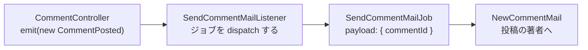

# 第 11 章: イベントとメール

ここまでの処理はすべてリクエストの中で完結していました。検証し、行を 1 つ書き、リダイレクトする。この章で扱うのは、そこに収めてはいけない仕事です。Bob が Ada の投稿にコメントすると Ada にメールが届きます。ただし Bob のブラウザは、ページが表示されるまでメールサーバーの応答を待たされてはいけません。

この一文に名前が 4 つ付きます。この章の大半は、なぜ 4 つに分かれるのかの説明です。

| 部品 | 答えるもの |
|---|---|
| **イベント** | 何かが起きた。コントローラーはそれを告知し、あとは気にしません。 |
| **listener** | 気にする誰か。告知に対して何をするかを決めます。 |
| **ジョブ** | リクエストより長生きする仕事。キューに載るペイロードで、拾った側が実行します。 |
| **メール** | メッセージそのもの。件名、本文、宛先。 |

リクエストは最初の箱で終わります。その先は、読者を待たせずに進む仕事です。



**この章で学ぶこと:**

- 4 つがそれぞれどこで登録されるのかと、誰も代わりに検査してくれない唯一の登録
- ジョブのペイロードがレコードではなく id である理由
- `QUEUE_CONNECTION=sync` が実際にしていることと、sync をやめたときに変わること
- 3 つの異なる継ぎ目に対する 3 つの fake と、そのうちひとつをコンテナのバインディングにできない理由

開発サーバーが動いていなければ起動します。

```bash run background
bun run dev
```

## 1. 3 つのレイヤー、3 つのコマンド

```bash run
bunx guren add events
```

```bash run
bunx guren add queue
```

```bash run
bunx guren add mail
```

どのコマンドも、その種類のサンプルとプロバイダーを 1 つずつ書き、フレームワーク側とアプリ側の両方のサービスプロバイダーを `src/app.ts` に登録しました。開いてみてください。providers の配列は 1 行に書き直され、末尾に 6 つの要素が増えています。コマンドごとに、フレームワークのプロバイダーとアプリのプロバイダーが 1 つずつです。この 1 行化はパッチを当てたコマンドによるもので、どの `add` コマンドも同じ形を残していきます。

この 3 つのプロバイダーは読んでおく価値があります。うち 2 つは、このあと自分で編集するファイルです。

- `app/Providers/EventProvider.ts` はイベントクラスを listener オブジェクトに結び付けます。結び付けているのは規約ではなくコードの 1 行です。`app/Listeners/` を走査して仕事を探すものは何もありません。
- `app/Providers/QueueProvider.ts` はキューマネージャーを構築し、ジョブクラスごとに `registerJob()` を呼びます。ドライバーの行に注目してください。`QUEUE_CONNECTION=sync` は dispatch されたジョブを**インラインで、dispatch したプロセスの中で**実行します。`memory` はワーカーが処理するキューに載せます。`.env` にはすでに `sync` と書かれています。
- `app/Providers/MailProvider.ts` はメールマネージャーを構築します。同じく `.env` にある `MAIL_MAILER=log` は、メールを送る代わりに送信予定の内容をサーバーの出力に印字します。サービスの申し込みは要りませんし、うっかり本当に配送してしまうこともありません。

サンプル(`OrderPlaced`、`SendOrderReceiptListener`、`ProcessWelcomeSequenceJob`、`WelcomeEmailMail`)は、それぞれのファイルの形を確認できるように置かれています。第 3 節でこの 4 つをすべて置き換えます。

## 2. メールを仕様化する

テストは 3 つで、それぞれ意図的に違う形の fake を使っています。アサーションより先にセットアップを読んでください。

```ts file=tests/CommentMail.test.ts
import { beforeAll, beforeEach, describe, it } from 'bun:test'
import { MailManager, getQueueDriver, setQueueDriver } from '@guren/core'
import { TestApp, fakeMail, fakeQueue } from '@guren/testing'
import app from '../src/app.js'
import { resetDatabase } from '../config/database.js'
import { Post, type PostRecord } from '../app/Models/Post.js'
import { User, type UserRecord } from '../app/Models/User.js'
import { SendCommentMailJob, type SendCommentMailPayload } from '../app/Jobs/SendCommentMailJob.js'

const mail = fakeMail()

describe('comment mail', () => {
  let http: TestApp
  let ada: UserRecord
  let bob: UserRecord
  let post: PostRecord
  let asBob: TestApp

  beforeAll(async () => {
    http = await TestApp.fromApp(app)
    // Mail.send() asks the manager for a transport, so the fake goes inside a
    // real manager rather than in place of one.
    const manager = new MailManager({ default: 'fake', from: { email: 'blog@example.com', name: 'Blog' } })
    manager.registerTransport('fake', () => mail.getTransport())
    app.container.fake('mail', manager)
  })

  beforeEach(async () => {
    await resetDatabase()
    mail.clear()
    ada = await User.create({ name: 'Ada', email: 'ada@example.com', password: 'correct horse battery' })
    bob = await User.create({ name: 'Bob', email: 'bob@example.com', password: 'correct horse battery' })
    post = await Post.forceCreate({ title: 'Relativity', body: 'A body', authorId: ada.id })
    asBob = await http.actingAs(bob).withCsrf()
  })

  it('mails the post author when someone else comments', async () => {
    await asBob.post(`/posts/${post.id}/comments`, { body: 'Nice post' }).assertRedirect(`/posts/${post.id}`)

    mail.assertSentTo('ada@example.com')
    mail.assertSentWithSubject('New comment on Relativity')
    mail.assertSentWithBodyContaining('Bob')
  })

  it('does not mail you about your own comment', async () => {
    const asAda = await http.actingAs(ada).withCsrf()

    await asAda.post(`/posts/${post.id}/comments`, { body: 'A note to myself' }).assertRedirect(`/posts/${post.id}`)

    mail.assertNothingSent()
  })

  it('hands the mail to the queue instead of sending it in the request', async () => {
    const queue = fakeQueue()
    // Job.dispatch() reads a module-level driver, not the container, so this
    // seam is a setter and not a container fake. Put the real one back after.
    const real = getQueueDriver()
    setQueueDriver(queue.getDriver())
    try {
      await asBob.post(`/posts/${post.id}/comments`, { body: 'Nice post' }).assertRedirect(`/posts/${post.id}`)

      queue.assertPushed<SendCommentMailPayload>(SendCommentMailJob, (payload) => payload.commentId > 0)
      mail.assertNothingSent()
    } finally {
      if (real) setQueueDriver(real)
    }
  })
})
```

`assertPushed` にはペイロードの型を明示的に渡しています。`Job.dispatch` はジェネリックな static なので、ジョブクラスだけでは TypeScript にペイロードの型が伝わりません。推論結果が `unknown` になると、述語がコンパイルできなくなります。

3 つ目のテストが記述しているのは、機能ではなく設計です。fake のキュードライバーを差し込むとジョブは記録されるだけで実行されないので、メールは 1 通も出ません。このテストが通っていて*かつ*メールが送られているなら、コントローラーが自分で仕事をしています。

```bash run expect-fail
bun test
```

import で赤です。`SendCommentMailJob` がまだありません。

## 3. 4 つの部品を手で書く

イベントは、何が起きたかを特定できる最小のものを運びます。

```ts file=app/Events/CommentPosted.ts
import { Event } from '@guren/core'

export class CommentPosted extends Event {
  static override eventName = 'CommentPosted'

  constructor(public readonly commentId: number) {
    super()
  }
}
```

listener は、それが起きたことの意味を決めます。この listener 自身は何もせず、仕事をキューに渡して戻ります。

```ts file=app/Listeners/SendCommentMailListener.ts
import { Listener } from '@guren/core'
import { CommentPosted } from '../Events/CommentPosted.js'
import { SendCommentMailJob } from '../Jobs/SendCommentMailJob.js'

export class SendCommentMailListener extends Listener<CommentPosted> {
  static override event = CommentPosted

  async handle(event: CommentPosted): Promise<void> {
    await SendCommentMailJob.dispatch({ commentId: event.commentId })
  }
}
```

ジョブは、別のプロセスで、数分後に実行されるかもしれない部品です。

```ts file=app/Jobs/SendCommentMailJob.ts
import { Job } from '@guren/core'
import { Comment } from '../Models/Comment.js'
import { User } from '../Models/User.js'
import { NewCommentMail } from '../Mail/NewCommentMail.js'

/** A queued payload is JSON on its way to another process: ids, never records. */
export interface SendCommentMailPayload {
  commentId: number
}

export class SendCommentMailJob extends Job<SendCommentMailPayload> {
  static override queue = 'default'
  static override maxAttempts = 3

  async handle(payload: SendCommentMailPayload): Promise<void> {
    const comment = await Comment.findWith(payload.commentId, ['post', 'author'])
    if (!comment?.post || !comment.author) return

    const postAuthor = await User.find(comment.post.authorId)
    if (!postAuthor || postAuthor.id === comment.authorId) return

    await new NewCommentMail(this.make('mail'), {
      postTitle: comment.post.title,
      commenter: comment.author.name,
      body: comment.body,
      url: `/posts/${comment.post.id}`,
    })
      .to(postAuthor.email)
      .send()
  }
}
```

このファイルにある 2 つの判断が、この章の本題です。ひとつは、ペイロードがコメントそのものではなく `commentId` であること。実行されるころには行が変わっているかもしれませんし、そもそもレコードはキューにシリアライズできません。もうひとつは、「自分のコメントについて自分にメールを送らない」というルールが、コントローラーではなく送信の隣にあること。コントローラーは何が起きたかを告知するだけで、誰がそのメールを受け取るべきかは決めません。

メールはメッセージそのもので、それ以上のことはしません。

```ts file=app/Mail/NewCommentMail.ts
import { Mail, type MailManager } from '@guren/core'

export interface NewCommentMailData {
  postTitle: string
  commenter: string
  body: string
  url: string
}

export class NewCommentMail extends Mail {
  constructor(
    manager: MailManager,
    private readonly data: NewCommentMailData,
  ) {
    super(manager)
  }

  build(): this {
    return this.subject(`New comment on ${this.data.postTitle}`).text(
      `${this.data.commenter} wrote:\n\n${this.data.body}\n\nRead it: ${this.data.url}`,
    )
  }
}
```

`build()` を自分で呼ぶことはありません。`send()` が一度だけ呼び、それからメッセージに宛先と件名と本文があることを検査して、トランスポートに渡します。

続いて 2 つの登録です。イベントプロバイダーは、クラスを購読に変える場所です。

```ts file=app/Providers/EventProvider.ts
import { ServiceProvider, type EventManager } from '@guren/core'
import { CommentPosted } from '../Events/CommentPosted.js'
import { SendCommentMailListener } from '../Listeners/SendCommentMailListener.js'

export default class EventProvider extends ServiceProvider {
  register(): void {}

  boot(): void {
    const events = this.container.make<EventManager>('events')
    const listener = new SendCommentMailListener()

    events.on(CommentPosted, (event) => listener.handle(event), {
      priority: SendCommentMailListener.priority,
    })
  }
}
```

この配線はよく読んでください。あとで出くわす一群のバグの原因がここにあります。プロバイダーが渡すのは `priority` で、呼ぶのは `handle` です。読んでいるのはそれだけです。`Listener` 基底クラスは `shouldQueue`、`queue`、省略可能な `shouldHandle()` も宣言していますが、この配線はそのどれも見ていません。`shouldQueue = true` を設定してフレームワークがキューに載せてくれると期待した listener は、黙ってインラインで実行されます。クラスの宣言が何であれ、実際の挙動を決めるのはこのファイルの行です。

キュープロバイダーは、ジョブクラスが dispatch 可能になる場所です。

```ts file=app/Providers/QueueProvider.ts
import { ServiceProvider, MemoryDriver, SyncDriver, createQueueManager, registerJob, type QueueManager } from '@guren/core'
import { SendCommentMailJob } from '../Jobs/SendCommentMailJob.js'

export default class QueueProvider extends ServiceProvider {
  register(): void {
    const queue = createQueueManager({
      // QUEUE_CONNECTION=sync executes jobs inline on dispatch (default,
      // no worker process needed); 'memory' queues them for a Worker.
      default: process.env.QUEUE_CONNECTION === 'memory' ? 'memory' : 'sync',
      drivers: {
        sync: () => new SyncDriver(),
        memory: () => new MemoryDriver(),
      },
    })

    this.container.instance('queue', queue)
  }

  boot(): void {
    // A queued message carries the job's name, so the driver can only run a job
    // the registry knows. Nothing in `guren check` looks for a missing one.
    registerJob(SendCommentMailJob)
    const queue = this.container.make<QueueManager>('queue')
    queue.driver()
  }
}
```

最後に、コントローラーが告知します。

```ts file=app/Http/Controllers/CommentController.ts
import { Controller } from '@guren/core'
import { Post } from '../../Models/Post.js'
import { Comment } from '../../Models/Comment.js'
import type { UserRecord } from '../../Models/User.js'
import { CommentPosted } from '../../Events/CommentPosted.js'
import { CommentPayloadSchema } from '../Validators/CommentValidator.js'

export default class CommentController extends Controller {
  async store(): Promise<Response> {
    const post = this.model(Post)
    await this.authorize('create', Comment)
    const author = await this.auth.userOrFail<UserRecord>()
    const data = await this.validateBody(CommentPayloadSchema)
    const comment = await Comment.forceCreate({ ...data, postId: post.id, authorId: author.id })
    await this.make('events').emit(new CommentPosted(comment.id))
    return this.redirect(`/posts/${post.id}`)
  }

  async destroy(): Promise<Response> {
    const comment = this.model(Comment)
    await this.authorize('delete', [Comment, comment])
    await Comment.delete({ id: comment.id })
    return this.redirect(`/posts/${comment.postId}`)
  }
}
```

`emit` は await されており、その中で優先度順にすべての listener が await されます。`sync` のもとでは、ジョブまで含めた連鎖全体がリダイレクトを返す前に終わります。ここは正確に捉えておいてください。`sync` が非同期にするのは仕事そのものではなく、*コード*の形です。ワーカーへ移行しても、コントローラーは変わりません。

ブループリントが置いた 4 つのサンプルは、もう役目を終えました。

```bash run
rm app/Events/OrderPlaced.ts app/Listeners/SendOrderReceiptListener.ts app/Jobs/ProcessWelcomeSequenceJob.ts app/Mail/WelcomeEmailMail.ts
```

```bash run
bun test
```

緑です。

**チェックポイント:** ブラウザで他人の投稿にコメントし、`bun run dev` が動いているターミナルを見てください。

```bash manual
[mail] ------------------------------------------------------------
[mail] To: ada@example.com
[mail] From: noreply@example.com
[mail] Subject: New comment on Relativity
[mail] Bob wrote:
[mail]
[mail] Nice post
[mail]
[mail] Read it: /posts/1
[mail] ------------------------------------------------------------
```

これが `log` トランスポートです。`MAIL_MAILER` を本物のトランスポートに向ければ、同じメッセージがそのまま外へ送られます。

```bash run
bunx guren gate
```

```bash run
git add -A
git commit -m "feat: mail the post author when someone comments"
```

## 4. 誰も検査しない登録

整合性チェックを実行して、そこに*無い*ものを読み取ってください。

```bash run
bunx guren check
```

このコマンドはルート、ページ、スキーマ、attachments については意見を持ちますが、`app/Jobs/` については何も言いません。`registerJob()` に届いていないジョブクラスも完璧に見えます。コンパイルは通り、lint も通り、キューを fake するテストなら通ります。失敗するのは、何かが実際にそれを dispatch した最初のときです。そのときのメッセージは、少なくとも問題のジョブ名は教えてくれます。

```bash manual
SyncDriver: job class "SendCommentMailJob" is not registered. Call registerJob() with the class whose jobName (or class name) is "SendCommentMailJob".
```

これは第 8 章で扱った状況そのものです。フレームワークからは見えない、プロジェクト固有の不変条件です。エージェントが読む場所に書き留めておきましょう。

```md file=.claude/rules/background-work.md
---
description: Events, listeners and jobs — every job is registered, every listener is wired, and the payload is ids
globs:
  - "app/Events/**"
  - "app/Listeners/**"
  - "app/Jobs/**"
  - "app/Mail/**"
  - "app/Providers/EventProvider.ts"
  - "app/Providers/QueueProvider.ts"
---

# Background work

1. **Every `Job` subclass is registered.** Add `registerJob(TheJob)` to `boot()` in `app/Providers/QueueProvider.ts` in the same change that adds the class. A queued message carries the job's name and the driver resolves it through that registry; an unregistered job throws at dispatch time and `guren check` says nothing about it.
2. **Every listener is wired.** A class in `app/Listeners/` runs only because `app/Providers/EventProvider.ts` calls `events.on(TheEvent, (event) => listener.handle(event), …)`. `shouldQueue`, `queue` and `shouldHandle()` on the class are inert unless that wiring reads them, so do not rely on them: to queue work, dispatch a job from `handle`.
3. **A job payload is JSON: ids, never records.** The job may run in another process, after the row has changed. Load what you need inside `handle`, and return early when the record is gone.
4. **Controllers announce, listeners decide.** A controller emits an event and returns. Rules about who gets mail (skip the actor, skip duplicates) live in the job or the listener, not in the action.
5. **Test the seam, not the plumbing.** Mail is faked by registering a `fakeMail()` transport on a real `MailManager` and binding that with `app.container.fake('mail', manager)`. The queue is faked with `setQueueDriver(fakeQueue().getDriver())`, never through the container, because `Job.dispatch()` reads a module-level driver.
```

`PostToolUse` hook は編集のたびに `guren check --arch` を実行しますが、check はこの 5 つのどれについても何も言いません。ここではこの rule 自体がチェックの役目を果たします。

```bash run
git add -A
git commit -m "docs: add a background-work rule for the agent"
```

## 5. 告知を仕様化する

投稿を公開したら、わざわざコメントしてくれた全員に知らせたいところです。使う部品は同じ 4 つですが、形はひとつ難しくなります。重複排除のルールを伴う一斉送信です。

```ts file=tests/PostPublishedMail.test.ts
import { beforeAll, beforeEach, describe, it } from 'bun:test'
import { MailManager } from '@guren/core'
import { TestApp, fakeMail } from '@guren/testing'
import app from '../src/app.js'
import { resetDatabase } from '../config/database.js'
import { Post, type PostRecord } from '../app/Models/Post.js'
import { Comment } from '../app/Models/Comment.js'
import { User, type UserRecord } from '../app/Models/User.js'

const mail = fakeMail()

describe('publishing a post', () => {
  let http: TestApp
  let ada: UserRecord
  let post: PostRecord
  let asAda: TestApp

  beforeAll(async () => {
    http = await TestApp.fromApp(app)
    const manager = new MailManager({ default: 'fake', from: { email: 'blog@example.com', name: 'Blog' } })
    manager.registerTransport('fake', () => mail.getTransport())
    app.container.fake('mail', manager)
  })

  beforeEach(async () => {
    await resetDatabase()
    mail.clear()
    ada = await User.create({ name: 'Ada', email: 'ada@example.com', password: 'correct horse battery' })
    post = await Post.forceCreate({ title: 'Relativity', body: 'A body', authorId: ada.id })
    asAda = await http.actingAs(ada).withCsrf()
  })

  it('mails everyone who commented, once each', async () => {
    const bob = await User.create({ name: 'Bob', email: 'bob@example.com', password: 'correct horse battery' })
    const cleo = await User.create({ name: 'Cleo', email: 'cleo@example.com', password: 'correct horse battery' })
    await Comment.forceCreate({ body: 'First', postId: post.id, authorId: bob.id })
    await Comment.forceCreate({ body: 'Second', postId: post.id, authorId: bob.id })
    await Comment.forceCreate({ body: 'Third', postId: post.id, authorId: cleo.id })

    await asAda.post(`/posts/${post.id}/publish`).assertRedirect(`/posts/${post.id}`)

    mail.assertSentTo('bob@example.com')
    mail.assertSentTo('cleo@example.com')
    mail.assertSentWithSubject('Relativity is published')
    mail.assertSentTimes(2)
  })

  it('does not mail the author their own post', async () => {
    await Comment.forceCreate({ body: 'A note to myself', postId: post.id, authorId: ada.id })

    await asAda.post(`/posts/${post.id}/publish`).assertRedirect(`/posts/${post.id}`)

    mail.assertNothingSent()
  })
})
```

最初のテストの要点は `assertSentTimes(2)` に尽きます。Bob は 2 回コメントしましたが、受け取るメールは 1 通です。

```bash run expect-fail
bun test
```

赤は 1 件です。2 つ目のテストは最初から緑ですが、理由は褒められたものではありません。まだメールを送るものが何も無いので、何もしないアプリでも `assertNothingSent()` は満たされてしまいます。このテストが仕事をしはじめるのは、1 つ目が通ってからです。

## 6. 委ねる

> When a post is published, mail everyone who commented on it. Emit a `PostPublished` event from `publish` in `PostController`, wire a listener in `EventProvider` that dispatches a `NotifyCommentersJob`, and send a `PostPublishedMail` to each distinct commenter, skipping the post's author. `tests/PostPublishedMail.test.ts` describes it; make it pass.

このプロンプトは `registerJob` に触れていませんが、触れる必要もありません。第 4 節で書いた rule は `app/Jobs/**` と `app/Providers/QueueProvider.ts` にスコープされているので、エージェントはそのどちらかを書く前に rule を読みます。この実験の狙いはそこにあります。何よりも先に、diff の中の登録の行を確かめてください。

**手元にエージェントが無い場合は、** イベントが投稿を運びます。

```ts file=app/Events/PostPublished.ts fallback
import { Event } from '@guren/core'

export class PostPublished extends Event {
  static override eventName = 'PostPublished'

  constructor(public readonly postId: number) {
    super()
  }
}
```

```ts file=app/Listeners/NotifyCommentersListener.ts fallback
import { Listener } from '@guren/core'
import { PostPublished } from '../Events/PostPublished.js'
import { NotifyCommentersJob } from '../Jobs/NotifyCommentersJob.js'

export class NotifyCommentersListener extends Listener<PostPublished> {
  static override event = PostPublished

  async handle(event: PostPublished): Promise<void> {
    await NotifyCommentersJob.dispatch({ postId: event.postId })
  }
}
```

```ts file=app/Mail/PostPublishedMail.ts fallback
import { Mail, type MailManager } from '@guren/core'

export interface PostPublishedMailData {
  postTitle: string
  url: string
}

export class PostPublishedMail extends Mail {
  constructor(
    manager: MailManager,
    private readonly data: PostPublishedMailData,
  ) {
    super(manager)
  }

  build(): this {
    return this.subject(`${this.data.postTitle} is published`).text(
      `A post you commented on is now published.\n\nRead it: ${this.data.url}`,
    )
  }
}
```

```ts file=app/Jobs/NotifyCommentersJob.ts fallback
import { Job } from '@guren/core'
import { Post } from '../Models/Post.js'
import { Comment } from '../Models/Comment.js'
import { User } from '../Models/User.js'
import { PostPublishedMail } from '../Mail/PostPublishedMail.js'

export interface NotifyCommentersPayload {
  postId: number
}

export class NotifyCommentersJob extends Job<NotifyCommentersPayload> {
  static override queue = 'default'
  static override maxAttempts = 3

  async handle(payload: NotifyCommentersPayload): Promise<void> {
    const post = await Post.find(payload.postId)
    if (!post) return

    const comments = await Comment.where('postId', post.id).get()
    const recipientIds = [...new Set(comments.map((comment) => comment.authorId))].filter(
      (id) => id !== post.authorId,
    )
    if (recipientIds.length === 0) return

    const recipients = await User.where({ id: recipientIds }).get()
    const manager = this.make('mail')

    for (const recipient of recipients) {
      await new PostPublishedMail(manager, {
        postTitle: post.title,
        url: `/posts/${post.id}`,
      })
        .to(recipient.email)
        .send()
    }
  }
}
```

```ts file=app/Providers/EventProvider.ts fallback
import { ServiceProvider, type EventManager } from '@guren/core'
import { CommentPosted } from '../Events/CommentPosted.js'
import { PostPublished } from '../Events/PostPublished.js'
import { SendCommentMailListener } from '../Listeners/SendCommentMailListener.js'
import { NotifyCommentersListener } from '../Listeners/NotifyCommentersListener.js'

export default class EventProvider extends ServiceProvider {
  register(): void {}

  boot(): void {
    const events = this.container.make<EventManager>('events')
    const commentListener = new SendCommentMailListener()
    const publishListener = new NotifyCommentersListener()

    events.on(CommentPosted, (event) => commentListener.handle(event), {
      priority: SendCommentMailListener.priority,
    })
    events.on(PostPublished, (event) => publishListener.handle(event), {
      priority: NotifyCommentersListener.priority,
    })
  }
}
```

```ts file=app/Providers/QueueProvider.ts fallback
import { ServiceProvider, MemoryDriver, SyncDriver, createQueueManager, registerJob, type QueueManager } from '@guren/core'
import { SendCommentMailJob } from '../Jobs/SendCommentMailJob.js'
import { NotifyCommentersJob } from '../Jobs/NotifyCommentersJob.js'

export default class QueueProvider extends ServiceProvider {
  register(): void {
    const queue = createQueueManager({
      // QUEUE_CONNECTION=sync executes jobs inline on dispatch (default,
      // no worker process needed); 'memory' queues them for a Worker.
      default: process.env.QUEUE_CONNECTION === 'memory' ? 'memory' : 'sync',
      drivers: {
        sync: () => new SyncDriver(),
        memory: () => new MemoryDriver(),
      },
    })

    this.container.instance('queue', queue)
  }

  boot(): void {
    // A queued message carries the job's name, so the driver can only run a job
    // the registry knows. Nothing in `guren check` looks for a missing one.
    registerJob(SendCommentMailJob)
    registerJob(NotifyCommentersJob)
    const queue = this.container.make<QueueManager>('queue')
    queue.driver()
  }
}
```

そして publish アクションが告知します。

```ts file=app/Http/Controllers/PostController.ts fallback
import { Controller, ValidationException, paginate, type PaginatedPageProps } from '@guren/core'
import { pages } from '@/.guren/pages.gen'
import { Post } from '../../Models/Post.js'
import { Comment } from '../../Models/Comment.js'
import { Tag } from '../../Models/Tag.js'
import { PostTag } from '../../Models/PostTag.js'
import type { UserRecord } from '../../Models/User.js'
import { PostPublished } from '../../Events/PostPublished.js'
import { PostResource, type PostResourceData } from '../Resources/PostResource.js'
import { CommentResource } from '../Resources/CommentResource.js'
import { ListPostsQuerySchema, PostIdParamSchema, PostImageParamSchema, PostPayloadSchema } from '../Validators/PostValidator.js'

type PostsIndexProps = PaginatedPageProps<PostResourceData>

async function syncTags(postId: number, names: string[]): Promise<void> {
  await PostTag.delete({ postId })
  for (const name of names) {
    const tag = (await Tag.first({ name })) ?? (await Tag.create({ name }))
    await PostTag.forceCreate({ postId, tagId: tag.id })
  }
}

export default class PostController extends Controller {
  async index(): Promise<Response> {
    const { page } = this.validateQuery(ListPostsQuerySchema)
    const result = await Post.withPaginate('author', { page, perPage: 10, orderBy: ['id', 'desc'] })
    const paginator = paginate(result, { path: this.request.path ?? '/posts' })

    return this.inertia(pages.posts.Index, {
      data: result.data.map((post) => new PostResource(post).toJSON()),
      pagination: {
        meta: paginator.meta(),
        links: paginator.links(),
      },
    } satisfies PostsIndexProps)
  }

  async show(): Promise<Response> {
    const { id } = this.validateParams(PostIdParamSchema)
    const post = await Post.findWithOrFail(id, ['author', 'tags'])
    const [withFiles] = await Post.withAttachments([post], ['cover', 'images'])
    const comments = await Comment.where('postId', post.id).with('author').orderBy('id', 'asc').get()

    return this.inertia(pages.posts.Show, {
      post: new PostResource(withFiles!).toJSON(),
      canManage: await this.can('update', [Post, post]),
      comments: await Promise.all(
        comments.map(async (comment) => ({
          ...new CommentResource(comment).toJSON(),
          canDelete: await this.can('delete', [Comment, comment]),
        })),
      ),
    })
  }

  async create(): Promise<Response> {
    return this.inertia(pages.posts.New, {})
  }

  async store(): Promise<Response> {
    const author = await this.auth.userOrFail<UserRecord>()
    const { tags, ...data } = await this.validateBody(PostPayloadSchema)
    const post = await Post.forceCreate({ ...data, authorId: author.id })
    await syncTags(post.id, tags)
    const cover = await this.file('cover')
    if (cover) {
      await Post.attach(post.id, 'cover', cover)
    }
    for (const file of await this.files('images')) {
      await Post.attach(post.id, 'images', file)
    }
    return this.redirect(`/posts/${post.id}`)
  }

  async edit(): Promise<Response> {
    const post = this.model(Post)
    await this.authorize('update', [Post, post])
    const withTags = await Post.findWithOrFail(post.id, 'tags')

    return this.inertia(pages.posts.Edit, {
      post: new PostResource(withTags).toJSON(),
    })
  }

  async update(): Promise<Response> {
    const post = this.model(Post)
    await this.authorize('update', [Post, post])
    const { tags, ...data } = await this.validateBody(PostPayloadSchema)
    await Post.update({ id: post.id }, data)
    await syncTags(post.id, tags)
    return this.redirect(`/posts/${post.id}`)
  }

  async cover(): Promise<Response> {
    const post = this.model(Post)
    await this.authorize('update', [Post, post])
    const cover = await this.file('cover')
    if (!cover) {
      throw new ValidationException({ cover: ['Choose an image.'] })
    }
    await Post.attach(post.id, 'cover', cover)
    return this.redirect(`/posts/${post.id}`)
  }

  async destroyImage(): Promise<Response> {
    const post = this.model(Post)
    await this.authorize('update', [Post, post])
    const { attachment } = this.validateParams(PostImageParamSchema)
    await Post.detach(post.id, 'images', attachment)
    return this.redirect(`/posts/${post.id}`)
  }

  async destroy(): Promise<Response> {
    const post = this.model(Post)
    await this.authorize('delete', [Post, post])
    await Post.purgeAttachments(post.id)
    await Post.delete({ id: post.id })
    return this.redirect('/posts')
  }

  async publish(): Promise<Response> {
    const post = this.model(Post)
    await this.authorize('publish', [Post, post])
    await Post.forceUpdate({ id: post.id }, { publishedAt: new Date().toISOString() })
    await this.make('events').emit(new PostPublished(post.id))
    return this.redirect(`/posts/${post.id}`)
  }

  async unpublish(): Promise<Response> {
    const post = this.model(Post)
    await this.authorize('publish', [Post, post])
    await Post.forceUpdate({ id: post.id }, { publishedAt: null })
    return this.redirect(`/posts/${post.id}`)
  }
}
```

```bash run
bun test
```

rubric は次のとおりです。

- `registerJob(NotifyCommentersJob)` が `QueueProvider.boot()` にあり、`events.on(PostPublished, …)` が `EventProvider.boot()` にある。この 2 つが揃っていなければ、この機能はコンパイルの通る死んだコードです。
- ペイロードは `{ postId }`。宛先は渡されるのではなく `handle` の中で解決される。
- コメントした人が著者 id で重複排除され、投稿の著者がリストから外れる。しかもジョブの中で。Bob からのコメント 2 件に対して、Bob へのメールは 1 通です。
- `publish` は emit して戻る。コメントを問い合わせもしないし、メールの存在も知らない。
- 新しいテスト 2 件と、第 2 節の 3 件がどちらも緑。

**チェックポイント:** 下書きに 2 つのアカウントからコメントし、それを公開して、`[mail]` のブロックが 2 つ出ることと、自分宛ての 3 つ目が出ないことを確かめてください。

```bash run
bunx guren gate
```

```bash run
git add -A
git commit -m "feat: mail commenters when a post is published"
```

## いまいる場所

- イベント、listener、ジョブ、メール。それぞれが、場所を指し示せる形で登録されている。
- 告知して戻るコントローラーと、送信の隣に置かれた宛先に関する業務ルール。
- テストの継ぎ目 3 つ: 本物のマネージャーの中のメールトランスポート、グローバルに設定されたキュードライバー、そしてその 2 つがつながっていることを示すリクエスト。
- `guren check` が意見を持たない唯一の不変条件を書き留めたプロジェクトの rule と、それに従ったエージェント。

## よくあるつまずき

- **`SyncDriver: job class "X" is not registered.`** `QueueProvider.boot()` に `registerJob(X)` がありません。第 4 節の rule は、まさにこのエラーを防ぐために存在します。
- **`Email must have at least one recipient`(あるいは subject、body)。** `send()` は組み立てられたメッセージを検証します。`undefined` を受け取った `to()` も、件名を設定する前に return する `build()` も、どちらもここに行き着きます。
- **何も届かないのにエラーも出ない。** listener が `EventProvider.boot()` で配線されているか確かめてください。listener がひとつも無いイベントは、成功した `emit` です。
- **テストで `container.fake('queue', …)` をしても何も変わらない。** `Job.dispatch()` はコンテナではなく、モジュールレベルの setter からドライバーを解決します。`setQueueDriver()` を使い、前のドライバーを戻してください。
- **`fakeMail()` で `mail` を直接 fake したテストが throw する。** `Mail.send()` は `manager.transport(name)` を呼びますが、fake はマネージャーではなくトランスポートです。本物の `MailManager` に登録し、それをバインドしてください。
- **キューがあるのにメールがリクエストの中で送られる。** `QUEUE_CONNECTION=sync` が設計どおりに動いています。`memory` に設定して `bunx guren queue:work` を実行すれば、代わりにワーカーがキューを処理します。

## 演習

1. `.env` の `QUEUE_CONNECTION` を `memory` にしてサーバーを再起動し、コメントを投稿してください。メールは出ません。次に別のターミナルで `bunx guren queue:work --once` を走らせてください。それでも何も起きません。理由を説明してから値を戻してください。その答えが、`memory` が開発用のドライバーであってデプロイ向きではない理由です。
2. `CommentPosted` に、ログを出すだけで `priority` の高い listener をもう 1 つ登録してください。先に走るのはどちらですか。次に先に走るほうで例外を投げて、もう一方とリクエストに何が起きるかを答えてください。

## 次へ

[第 12 章: アプリをエージェントのツールにする](./12-agent-tools.md) では、すでにあるルートをエージェントが呼び出せるツールに変えます。第 7 章と同じ認可のギャップが、通過する audit ではなくはっきりした失敗として現れます。
