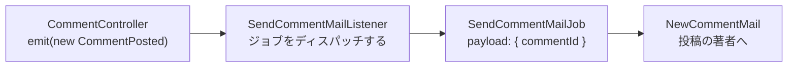

# 第 11 章: イベントとメール

ここまでの処理は、検証して行を書き込み、リダイレクトするところまで、すべてリクエストの中で完結していました。この章では、リクエストの中で済ませるべきでない仕事を扱います。Bob が Ada の投稿にコメントすると Ada にメールが届きますが、メールサーバーの応答を待ってから Bob のブラウザにページを表示するようでは困ります。

この 1 文で表される処理には 4 つの部品が関わります。この章の大半は、なぜ 4 つに分けるのかの説明です。

| 部品 | 役割 |
|---|---|
| **イベント** | 何かが起きたこと。コントローラーはそれを告知したら、あとは関知しません。 |
| **リスナー** | その出来事に関心を持つ側。告知を受けて何をするかを決めます。 |
| **ジョブ** | リクエストが終わったあとも続く仕事。キューに載ったペイロードで、取り出した側が実行します。 |
| **メール** | メッセージそのもの。件名、本文、宛先を持ちます。 |

リクエストは最初の箱で終わり、そこから先の仕事は閲覧者を待たせずに進みます。



**この章で学ぶこと:**

- 4 つの部品それぞれを登録する場所と、どのチェックも確かめてくれない唯一の登録
- ジョブのペイロードをレコードでなく id にする理由
- `QUEUE_CONNECTION=sync` の実際の動きと、sync をやめたときに変わること
- メールとキューをコンテナ経由でフェイクに差し替える方法と、どちらのフェイクも本物のマネージャーの中に入れる理由

開発サーバーが動いていなければ起動します。

```bash run background
bun run dev
```

## 1. 3 つのレイヤーと 3 つのコマンド

```bash run
bunx guren add events
```

```bash run
bunx guren add queue
```

```bash run
bunx guren add mail
```

3 つのコマンドはそれぞれ、その種類のサンプルと、それを動かす仕組みを書き出し、`src/app.ts` に登録しました。ファイルを開くと、providers の配列が 1 行に書き直され、末尾に 3 つ増えているのが分かります。events 用のフレームワークのプロバイダーとアプリのプロバイダー、queue 用の `JobsProvider` です。キューとメールのマネージャーは providers には入らず、`config: [...]` の `queue` と `mail` にあります。配列を 1 行にまとめたのはコマンドのパッチ処理で、どの `add` コマンドも実行後はこの形になります。

次のファイルには目を通しておいてください。うち 2 つは、このあと編集します。

- `app/Providers/EventProvider.ts` はリスナークラスを `events.listen()` に渡し、クラスで指定したイベントを購読させます。この結び付けはコード 1 行で明示していて、`app/Listeners/` を走査してリスナーを自動で見つける仕組みはありません。
- `config/queue.ts` はキューマネージャーを組み立て、`app/Providers/JobsProvider.ts` はジョブクラスごとに `registerJob()` を呼びます。config のドライバーの行を見てください。`QUEUE_CONNECTION=sync` では、ディスパッチされたジョブが**ディスパッチしたプロセスの中で、その場で**実行されます。`memory` では、ジョブはキューに積まれ、ワーカーが取り出して実行します。`guren add queue` は `.env` に `sync` を書き込んでいます。
- `config/mail.ts` はメールマネージャーを組み立てます。同じく `.env` に書き込まれた `MAIL_MAILER=log` の設定では、メールは送信されず、送る予定の内容がサーバーの出力に表示されます。外部サービスへの登録は要らず、誤って本当に配信してしまう心配もありません。

サンプル(`OrderPlaced`、`SendOrderReceiptListener`、`ProcessWelcomeSequenceJob`、`WelcomeEmailMail`)は、各ファイルの形を確認できるように置かれています。4 つとも第 3 節で置き換えます。

## 2. メールのテストを先に書く

テストは 3 つあります。3 つともメールのトランスポートをフェイクにし、3 つ目はキューもフェイクにします。アサーションより先に、セットアップの部分を読んでください。

```ts file=tests/CommentMail.test.ts
import { beforeAll, beforeEach, describe, it } from 'bun:test'
import { MailManager, createQueueManager } from '@guren/core'
import { TestApp, fakeMail, fakeQueue } from '@guren/testing'
import app from '../src/app.js'
import { resetDatabase } from '../config/database.js'
import { Post, type PostRecord } from '../app/Models/Post.js'
import { User, type UserRecord } from '../app/Models/User.js'
import { SendCommentMailJob, type SendCommentMailPayload } from '../app/Jobs/SendCommentMailJob.js'

const mail = fakeMail()

describe('comment mail', () => {
  let http: TestApp
  let ada: UserRecord
  let bob: UserRecord
  let post: PostRecord
  let asBob: TestApp

  beforeAll(async () => {
    http = await TestApp.fromApp(app)
    // Mail.send() asks the manager for a transport, so the fake goes inside a
    // real manager rather than in place of one.
    const manager = new MailManager({ default: 'fake', from: { email: 'blog@example.com', name: 'Blog' } })
    manager.registerTransport('fake', () => mail.getTransport())
    app.container.fake('mail', manager)
  })

  beforeEach(async () => {
    await resetDatabase()
    mail.clear()
    ada = await User.create({ name: 'Ada', email: 'ada@example.com', password: 'correct horse battery' })
    bob = await User.create({ name: 'Bob', email: 'bob@example.com', password: 'correct horse battery' })
    post = await Post.forceCreate({ title: 'Relativity', body: 'A body', authorId: ada.id })
    asBob = await http.actingAs(bob).withCsrf()
  })

  it('mails the post author when someone else comments', async () => {
    await asBob.post(`/posts/${post.id}/comments`, { body: 'Nice post' }).assertRedirect(`/posts/${post.id}`)

    mail.assertSentTo('ada@example.com')
    mail.assertSentWithSubject('New comment on Relativity')
    mail.assertSentWithBodyContaining('Bob')
  })

  it('does not mail you about your own comment', async () => {
    const asAda = await http.actingAs(ada).withCsrf()

    await asAda.post(`/posts/${post.id}/comments`, { body: 'A note to myself' }).assertRedirect(`/posts/${post.id}`)

    mail.assertNothingSent()
  })

  it('hands the mail to the queue instead of sending it in the request', async () => {
    const queue = fakeQueue()
    // Job.dispatch() sends through the bound queue manager's default driver, so
    // the fake driver goes inside a real manager too. `using` restores the app's
    // own manager when the test ends.
    using _queue = app.container.fake(
      'queue',
      createQueueManager({ default: 'fake', drivers: { fake: () => queue.getDriver() } }),
    )

    await asBob.post(`/posts/${post.id}/comments`, { body: 'Nice post' }).assertRedirect(`/posts/${post.id}`)

    queue.assertPushed<SendCommentMailPayload>(SendCommentMailJob, (payload) => payload.commentId > 0)
    mail.assertNothingSent()
  })
})
```

`assertPushed` にはペイロードの型を明示的に渡しています。`Job.dispatch` はジェネリックな static メソッドなので、ジョブクラスだけではペイロードの型が TypeScript に伝わりません。推論結果が `unknown` になると、述語がコンパイルできなくなります。

3 つ目のテストは、機能よりも設計を確かめるためのものです。フェイクのキュードライバーを差し込むと、ジョブは記録されるだけで実行されないので、メールは 1 通も送られません。もしこのテストが通っていて、*しかも*メールが送られているなら、コントローラーが自分で仕事をしていることになります。

```bash run expect-fail
bun test
```

import の時点で失敗します。`SendCommentMailJob` がまだ無いからです。

## 3. 4 つの部品を手で書く

イベントには、何が起きたかを特定できる最小限の情報だけを持たせます。

```ts file=app/Events/CommentPosted.ts
import { Event } from '@guren/core'

export class CommentPosted extends Event {
  static override eventName = 'CommentPosted'

  constructor(public readonly commentId: number) {
    super()
  }
}
```

リスナーは、その出来事を受けて何をするかを決めます。このリスナーは自分では仕事をせず、仕事をキューに渡してすぐに戻ります。

```ts file=app/Listeners/SendCommentMailListener.ts
import { Listener } from '@guren/core'
import { CommentPosted } from '../Events/CommentPosted.js'
import { SendCommentMailJob } from '../Jobs/SendCommentMailJob.js'

export class SendCommentMailListener extends Listener<CommentPosted> {
  static override event = CommentPosted

  async handle(event: CommentPosted): Promise<void> {
    await SendCommentMailJob.dispatch({ commentId: event.commentId })
  }
}
```

ジョブは、別のプロセスで数分後に実行されることもある部品です。

```ts file=app/Jobs/SendCommentMailJob.ts
import { Job } from '@guren/core'
import { Comment } from '../Models/Comment.js'
import { User } from '../Models/User.js'
import { NewCommentMail } from '../Mail/NewCommentMail.js'

/** A queued payload is JSON on its way to another process: ids, never records. */
export interface SendCommentMailPayload {
  commentId: number
}

export class SendCommentMailJob extends Job<SendCommentMailPayload> {
  static override queue = 'default'
  static override maxAttempts = 3

  async handle(payload: SendCommentMailPayload): Promise<void> {
    const comment = await Comment.findWith(payload.commentId, ['post', 'author'])
    if (!comment?.post || !comment.author) return

    const postAuthor = await User.find(comment.post.authorId)
    if (!postAuthor || postAuthor.id === comment.authorId) return

    await new NewCommentMail(this.make('mail'), {
      postTitle: comment.post.title,
      commenter: comment.author.name,
      body: comment.body,
      url: `/posts/${comment.post.id}`,
    })
      .to(postAuthor.email)
      .send()
  }
}
```

このファイルには、この章で押さえておきたい判断が 2 つあります。1 つは、ペイロードをコメントそのものではなく `commentId` にしていることです。ジョブが実行されるころには行が変わっているかもしれませんし、そもそもレコードはキューにシリアライズできません。もう 1 つは、「自分のコメントについて自分にはメールを送らない」というルールを、コントローラーではなく送信処理のすぐ隣に置いていることです。コントローラーは何が起きたかを告知するだけで、誰がメールを受け取るべきかは決めません。

メールはメッセージそのものを表し、それ以外のことはしません。

```ts file=app/Mail/NewCommentMail.ts
import { Mail, type MailManager } from '@guren/core'

export interface NewCommentMailData {
  postTitle: string
  commenter: string
  body: string
  url: string
}

export class NewCommentMail extends Mail {
  constructor(
    manager: MailManager,
    private readonly data: NewCommentMailData,
  ) {
    super(manager)
  }

  build(): this {
    return this.subject(`New comment on ${this.data.postTitle}`).text(
      `${this.data.commenter} wrote:\n\n${this.data.body}\n\nRead it: ${this.data.url}`,
    )
  }
}
```

`build()` を自分で呼ぶことはありません。`send()` が 1 回だけ呼び出し、宛先、件名、本文がそろっているかを確かめてから、トランスポートに渡します。

続いて 2 か所の登録です。まずイベントプロバイダーで、クラスを購読として登録します。

```ts file=app/Providers/EventProvider.ts
import { ServiceProvider, type EventManager } from '@guren/core'
import { SendCommentMailListener } from '../Listeners/SendCommentMailListener.js'

export default class EventProvider extends ServiceProvider {
  register(): void {}

  boot(): void {
    const events = this.container.make<EventManager>('events')

    events.listen(SendCommentMailListener)
  }
}
```

`listen()` はクラスを受け取り、設定をクラス自身から読み取ります。`event` は購読するイベント、`priority` は同じイベントのリスナー間での順番で、値が大きいほうが先に実行されます。クラスに `shouldHandle()` を定義しておけば、`handle` の前にイベントを見送れます。`shouldQueue = true` にすると、リスナーは直接呼ばれず、`queue` で指定したキューに渡されます。ただし `sync` のキューはその場で実行するので、リクエストの外で動くのは、本物のキューをワーカーが処理するときだけです。インスタンスはイベントのたびに作り直されるため、あるコメントのときに持った状態が次のコメントに持ち越されることはありません。

`SendCommentMailListener` は `shouldQueue` を `false` のままにして、代わりにジョブをディスパッチします。キューに載せたリスナーの場合、ワーカーに送られるのはイベントです。ジョブなら自分で決めたペイロードを送れて、ジョブ独自の `maxAttempts` も持てます。3 つ目のテストがフェイクのキューで探しているのも、このジョブです。

`events.on(CommentPosted, (event) => listener.handle(event))` と書いてもリスナーは動きますが、`Listener` クラスにはこの配線を使わないでください。`on()` は関数を受け取るだけで、その関数がどのクラスから来たのかを知りません。そのため `shouldHandle()` も `shouldQueue` も、何の警告も出ないまま無視されます。

次にジョブプロバイダーで、ジョブクラスをディスパッチできるように登録します。

```ts file=app/Providers/JobsProvider.ts
import { ServiceProvider, registerJob } from '@guren/core'
import { SendCommentMailJob } from '../Jobs/SendCommentMailJob.js'

// config/queue.ts binds the queue; this registers the jobs it runs.
export default class JobsProvider extends ServiceProvider {
  register(): void {}

  boot(): void {
    // A queued message carries the job's name, so the driver can only run a job
    // the registry knows. Nothing in `guren check` looks for a missing one.
    registerJob(SendCommentMailJob)
  }
}
```

最後に、コントローラーでイベントを告知します。

```ts file=app/Http/Controllers/CommentController.ts
import { Controller } from '@guren/core'
import { Post } from '../../Models/Post.js'
import { Comment } from '../../Models/Comment.js'
import type { UserRecord } from '../../Models/User.js'
import { CommentPosted } from '../../Events/CommentPosted.js'
import { CommentPayloadSchema } from '../Validators/CommentValidator.js'

export default class CommentController extends Controller {
  async store(): Promise<Response> {
    const post = this.model(Post)
    await this.authorize('create', Comment)
    const author = await this.auth.userOrFail<UserRecord>()
    const data = await this.validateBody(CommentPayloadSchema)
    const comment = await Comment.forceCreate({ ...data, postId: post.id, authorId: author.id })
    await this.make('events').emit(new CommentPosted(comment.id))
    return this.redirect(`/posts/${post.id}`)
  }

  async destroy(): Promise<Response> {
    const comment = this.model(Comment)
    await this.authorize('delete', [Comment, comment])
    await Comment.delete({ id: comment.id })
    return this.redirect(`/posts/${comment.postId}`)
  }
}
```

`emit` は await されていて、その中ではすべてのリスナーが優先度順に await されます。つまり `sync` のもとでは、ジョブを含む一連の処理がすべて終わってから、リダイレクトが返ります。この点は正しく理解しておいてください。`sync` を使っても、*コード*が非同期の形になるだけで、仕事そのものが非同期になるわけではありません。ワーカーに移行しても、コントローラーは変わりません。

ブループリントが置いた 4 つのサンプルは、もう使いません。

```bash run
rm app/Events/OrderPlaced.ts app/Listeners/SendOrderReceiptListener.ts app/Jobs/ProcessWelcomeSequenceJob.ts app/Mail/WelcomeEmailMail.ts
```

```bash run
bun test
```

テストが通りました。出力に `[guren] Deprecation` で始まる行が 1 つも無いことも確かめてください。キューのフェイクはコンテナ経由で差し込んでいるので、非推奨の API を通っていません。

**チェックポイント:** ブラウザで他人の投稿にコメントし、`bun run dev` を実行しているターミナルを見てください。

```bash manual
[mail] ------------------------------------------------------------
[mail] To: ada@example.com
[mail] From: hello@example.com
[mail] Subject: New comment on Relativity
[mail] Bob wrote:
[mail]
[mail] Nice post
[mail]
[mail] Read it: /posts/1
[mail] ------------------------------------------------------------
```

これが `log` トランスポートの出力です。`MAIL_MAILER` を本物のトランスポートに切り替えれば、同じメッセージが実際に外へ送られます。

```bash run
bunx guren gate
```

```bash run
git add -A
git commit -m "feat: mail the post author when someone comments"
```

## 4. どのチェックも確かめない登録

整合性チェックを実行して、そこに*出てこない*ものに注目してください。

```bash run
bunx guren check
```

このコマンドはルート、ページ、スキーマ、attachments については検査しますが、`app/Jobs/` については何も報告しません。`registerJob()` に登録されていないジョブクラスも、問題が無いように見えます。コンパイルも lint も通り、キューをフェイクにしたテストなら通ります。失敗するのは実際にディスパッチされた最初のときで、そのときのエラーメッセージから、少なくとも問題の中身は分かります。

```bash manual
SyncDriver: job class "SendCommentMailJob" is not registered. Call registerJob() with the class whose jobName (or class name) is "SendCommentMailJob".
```

これは第 8 章で扱ったのと同じ状況で、フレームワークからは見えない、プロジェクト固有の不変条件です。エージェントが読む場所に書き留めておきましょう。

```md file=.claude/rules/background-work.md
---
paths:
  - "app/Events/**"
  - "app/Listeners/**"
  - "app/Jobs/**"
  - "app/Mail/**"
  - "app/Providers/EventProvider.ts"
  - "app/Providers/JobsProvider.ts"
---

# Background work

1. **Every `Job` subclass is registered.** Add `registerJob(TheJob)` to `boot()` in `app/Providers/JobsProvider.ts` in the same change that adds the class. A queued message carries the job's name and the driver resolves it through that registry; an unregistered job throws at dispatch time and `guren check` says nothing about it.
2. **Every listener is wired with `listen()`.** A class in `app/Listeners/` runs only because `boot()` in `app/Providers/EventProvider.ts` calls `events.listen(TheListener)`. That call reads the class's `event`, `priority`, `shouldQueue`, `queue` and `shouldHandle()`. Never wire a `Listener` class through `events.on(TheEvent, (event) => listener.handle(event))`: `on()` sees only the function, so `shouldHandle()` and `shouldQueue` are silently ignored. To queue work, dispatch a job from `handle`; set `shouldQueue` only when the listener itself should run on the worker.
3. **A job payload is JSON: ids, never records.** The job may run in another process, after the row has changed. Load what you need inside `handle`, and return early when the record is gone.
4. **Controllers announce, listeners decide.** A controller emits an event and returns. Rules about who gets mail (skip the actor, skip duplicates) live in the job or the listener, not in the action.
5. **Test the seam, not the plumbing.** A fake goes inside a real manager, and the manager is bound with `app.container.fake(key, manager)`. For mail, register a `fakeMail()` transport on a `MailManager` and bind it as `mail`. For the queue, give `createQueueManager()` a driver factory that returns `fakeQueue().getDriver()` and bind it as `queue` with `using`, so the app's own manager comes back when the test ends. Neither fake is a manager, so binding one directly throws. Do not use `setQueueDriver()`: it is deprecated and removed in 3.0.0.
```

`PostToolUse` hook は編集のたびに `guren check --arch` を実行しますが、この 5 項目のどれについても check は何も言いません。ここでは、このルールがチェックの代わりになります。

```bash run
git add -A
git commit -m "docs: add a background-work rule for the agent"
```

## 5. 告知のテストを先に書く

投稿を公開したら、わざわざコメントしてくれた人全員に知らせたいところです。使う部品は同じ 4 つですが、今回は重複を取り除くルールを伴う一斉送信なので、少し難しくなります。

```ts file=tests/PostPublishedMail.test.ts
import { beforeAll, beforeEach, describe, it } from 'bun:test'
import { MailManager } from '@guren/core'
import { TestApp, fakeMail } from '@guren/testing'
import app from '../src/app.js'
import { resetDatabase } from '../config/database.js'
import { Post, type PostRecord } from '../app/Models/Post.js'
import { Comment } from '../app/Models/Comment.js'
import { User, type UserRecord } from '../app/Models/User.js'

const mail = fakeMail()

describe('publishing a post', () => {
  let http: TestApp
  let ada: UserRecord
  let post: PostRecord
  let asAda: TestApp

  beforeAll(async () => {
    http = await TestApp.fromApp(app)
    const manager = new MailManager({ default: 'fake', from: { email: 'blog@example.com', name: 'Blog' } })
    manager.registerTransport('fake', () => mail.getTransport())
    app.container.fake('mail', manager)
  })

  beforeEach(async () => {
    await resetDatabase()
    mail.clear()
    ada = await User.create({ name: 'Ada', email: 'ada@example.com', password: 'correct horse battery' })
    post = await Post.forceCreate({ title: 'Relativity', body: 'A body', authorId: ada.id })
    asAda = await http.actingAs(ada).withCsrf()
  })

  it('mails everyone who commented, once each', async () => {
    const bob = await User.create({ name: 'Bob', email: 'bob@example.com', password: 'correct horse battery' })
    const cleo = await User.create({ name: 'Cleo', email: 'cleo@example.com', password: 'correct horse battery' })
    await Comment.forceCreate({ body: 'First', postId: post.id, authorId: bob.id })
    await Comment.forceCreate({ body: 'Second', postId: post.id, authorId: bob.id })
    await Comment.forceCreate({ body: 'Third', postId: post.id, authorId: cleo.id })

    await asAda.post(`/posts/${post.id}/publish`).assertRedirect(`/posts/${post.id}`)

    mail.assertSentTo('bob@example.com')
    mail.assertSentTo('cleo@example.com')
    mail.assertSentWithSubject('Relativity is published')
    mail.assertSentTimes(2)
  })

  it('does not mail the author their own post', async () => {
    await Comment.forceCreate({ body: 'A note to myself', postId: post.id, authorId: ada.id })

    await asAda.post(`/posts/${post.id}/publish`).assertRedirect(`/posts/${post.id}`)

    mail.assertNothingSent()
  })
})
```

最初のテストの要は `assertSentTimes(2)` です。Bob は 2 回コメントしましたが、受け取るメールは 1 通です。

```bash run expect-fail
bun test
```

失敗するのは 1 件です。2 つ目のテストは最初から通っていますが、これはたまたまです。まだメールを送る処理が何も無いので、何もしないアプリでも `assertNothingSent()` を満たしてしまいます。このテストが意味を持つのは、1 つ目のテストが通るようになってからです。

## 6. エージェントに任せる

エージェントに次のプロンプトを送ります。

```text
When a post is published, mail everyone who commented on it. Emit a `PostPublished` event from `publish` in `PostController`, wire a listener in `EventProvider` that dispatches a `NotifyCommentersJob`, and send a `PostPublishedMail` to each distinct commenter, skipping the post's author. `tests/PostPublishedMail.test.ts` describes it; make it pass.
```

このプロンプトは `registerJob` に触れていませんが、触れなくてかまいません。第 4 節で書いたルールは `app/Jobs/**` と `app/Providers/JobsProvider.ts` を対象にしているので、エージェントはどちらかのファイルを書く前にそのルールを読みます。ここではその働きを試しています。diff では、ほかの何よりも先に登録の行を確認してください。

**手元にエージェントが無い場合は、** イベントに投稿を持たせます。

```ts file=app/Events/PostPublished.ts fallback
import { Event } from '@guren/core'

export class PostPublished extends Event {
  static override eventName = 'PostPublished'

  constructor(public readonly postId: number) {
    super()
  }
}
```

```ts file=app/Listeners/NotifyCommentersListener.ts fallback
import { Listener } from '@guren/core'
import { PostPublished } from '../Events/PostPublished.js'
import { NotifyCommentersJob } from '../Jobs/NotifyCommentersJob.js'

export class NotifyCommentersListener extends Listener<PostPublished> {
  static override event = PostPublished

  async handle(event: PostPublished): Promise<void> {
    await NotifyCommentersJob.dispatch({ postId: event.postId })
  }
}
```

```ts file=app/Mail/PostPublishedMail.ts fallback
import { Mail, type MailManager } from '@guren/core'

export interface PostPublishedMailData {
  postTitle: string
  url: string
}

export class PostPublishedMail extends Mail {
  constructor(
    manager: MailManager,
    private readonly data: PostPublishedMailData,
  ) {
    super(manager)
  }

  build(): this {
    return this.subject(`${this.data.postTitle} is published`).text(
      `A post you commented on is now published.\n\nRead it: ${this.data.url}`,
    )
  }
}
```

```ts file=app/Jobs/NotifyCommentersJob.ts fallback
import { Job } from '@guren/core'
import { Post } from '../Models/Post.js'
import { Comment } from '../Models/Comment.js'
import { User } from '../Models/User.js'
import { PostPublishedMail } from '../Mail/PostPublishedMail.js'

export interface NotifyCommentersPayload {
  postId: number
}

export class NotifyCommentersJob extends Job<NotifyCommentersPayload> {
  static override queue = 'default'
  static override maxAttempts = 3

  async handle(payload: NotifyCommentersPayload): Promise<void> {
    const post = await Post.find(payload.postId)
    if (!post) return

    const comments = await Comment.where('postId', post.id).get()
    const recipientIds = [...new Set(comments.map((comment) => comment.authorId))].filter(
      (id) => id !== post.authorId,
    )
    if (recipientIds.length === 0) return

    const recipients = await User.where({ id: recipientIds }).get()
    const manager = this.make('mail')

    for (const recipient of recipients) {
      await new PostPublishedMail(manager, {
        postTitle: post.title,
        url: `/posts/${post.id}`,
      })
        .to(recipient.email)
        .send()
    }
  }
}
```

```ts file=app/Providers/EventProvider.ts fallback
import { ServiceProvider, type EventManager } from '@guren/core'
import { SendCommentMailListener } from '../Listeners/SendCommentMailListener.js'
import { NotifyCommentersListener } from '../Listeners/NotifyCommentersListener.js'

export default class EventProvider extends ServiceProvider {
  register(): void {}

  boot(): void {
    const events = this.container.make<EventManager>('events')

    events.listen(SendCommentMailListener)
    events.listen(NotifyCommentersListener)
  }
}
```

```ts file=app/Providers/JobsProvider.ts fallback
import { ServiceProvider, registerJob } from '@guren/core'
import { SendCommentMailJob } from '../Jobs/SendCommentMailJob.js'
import { NotifyCommentersJob } from '../Jobs/NotifyCommentersJob.js'

// config/queue.ts binds the queue; this registers the jobs it runs.
export default class JobsProvider extends ServiceProvider {
  register(): void {}

  boot(): void {
    // A queued message carries the job's name, so the driver can only run a job
    // the registry knows. Nothing in `guren check` looks for a missing one.
    registerJob(SendCommentMailJob)
    registerJob(NotifyCommentersJob)
  }
}
```

そして publish アクションで告知します。

```ts file=app/Http/Controllers/PostController.ts fallback
import { Controller, ValidationException, paginate, type PaginatedPageProps } from '@guren/core'
import { pages } from '@/.guren/pages.gen'
import { Post } from '../../Models/Post.js'
import { Comment } from '../../Models/Comment.js'
import { Tag } from '../../Models/Tag.js'
import { PostTag } from '../../Models/PostTag.js'
import type { UserRecord } from '../../Models/User.js'
import { PostPublished } from '../../Events/PostPublished.js'
import { PostResource, type PostResourceData } from '../Resources/PostResource.js'
import { CommentResource } from '../Resources/CommentResource.js'
import { ListPostsQuerySchema, PostIdParamSchema, PostImageParamSchema, PostPayloadSchema } from '../Validators/PostValidator.js'

type PostsIndexProps = PaginatedPageProps<PostResourceData>

async function syncTags(postId: number, names: string[]): Promise<void> {
  await PostTag.delete({ postId })
  for (const name of names) {
    const tag = (await Tag.first({ name })) ?? (await Tag.create({ name }))
    await PostTag.forceCreate({ postId, tagId: tag.id })
  }
}

export default class PostController extends Controller {
  async index(): Promise<Response> {
    const { page } = this.validateQuery(ListPostsQuerySchema)
    const result = await Post.withPaginate('author', { page, perPage: 10, orderBy: ['id', 'desc'] })
    const paginator = paginate(result, { path: this.request.path ?? '/posts' })

    return this.inertia(pages.posts.Index, {
      data: result.data.map((post) => new PostResource(post).toJSON()),
      pagination: {
        meta: paginator.meta(),
        links: paginator.links(),
      },
    } satisfies PostsIndexProps)
  }

  async show(): Promise<Response> {
    const { id } = this.validateParams(PostIdParamSchema)
    const post = await Post.findWithOrFail(id, ['author', 'tags'])
    const [withFiles] = await Post.withAttachments([post], ['cover', 'images'])
    const comments = await Comment.where('postId', post.id).with('author').orderBy('id', 'asc').get()

    return this.inertia(pages.posts.Show, {
      post: new PostResource(withFiles!).toJSON(),
      canManage: await this.can('update', [Post, post]),
      comments: await Promise.all(
        comments.map(async (comment) => ({
          ...new CommentResource(comment).toJSON(),
          canDelete: await this.can('delete', [Comment, comment]),
        })),
      ),
    })
  }

  async create(): Promise<Response> {
    return this.inertia(pages.posts.New, {})
  }

  async store(): Promise<Response> {
    const author = await this.auth.userOrFail<UserRecord>()
    const { tags, ...data } = await this.validateBody(PostPayloadSchema)
    const post = await Post.forceCreate({ ...data, authorId: author.id })
    await syncTags(post.id, tags)
    const cover = await this.file('cover')
    if (cover) {
      await Post.attach(post.id, 'cover', cover)
    }
    for (const file of await this.files('images')) {
      await Post.attach(post.id, 'images', file)
    }
    return this.redirect(`/posts/${post.id}`)
  }

  async edit(): Promise<Response> {
    const post = this.model(Post)
    await this.authorize('update', [Post, post])
    const withTags = await Post.findWithOrFail(post.id, 'tags')

    return this.inertia(pages.posts.Edit, {
      post: new PostResource(withTags).toJSON(),
    })
  }

  async update(): Promise<Response> {
    const post = this.model(Post)
    await this.authorize('update', [Post, post])
    const { tags, ...data } = await this.validateBody(PostPayloadSchema)
    await Post.update({ id: post.id }, data)
    await syncTags(post.id, tags)
    return this.redirect(`/posts/${post.id}`)
  }

  async cover(): Promise<Response> {
    const post = this.model(Post)
    await this.authorize('update', [Post, post])
    const cover = await this.file('cover')
    if (!cover) {
      throw new ValidationException({ cover: ['Choose an image.'] })
    }
    await Post.attach(post.id, 'cover', cover)
    return this.redirect(`/posts/${post.id}`)
  }

  async destroyImage(): Promise<Response> {
    const post = this.model(Post)
    await this.authorize('update', [Post, post])
    const { attachment } = this.validateParams(PostImageParamSchema)
    await Post.detach(post.id, 'images', attachment)
    return this.redirect(`/posts/${post.id}`)
  }

  async destroy(): Promise<Response> {
    const post = this.model(Post)
    await this.authorize('delete', [Post, post])
    await Post.purgeAttachments(post.id)
    await Post.delete({ id: post.id })
    return this.redirect('/posts')
  }

  async publish(): Promise<Response> {
    const post = this.model(Post)
    await this.authorize('publish', [Post, post])
    await Post.forceUpdate({ id: post.id }, { publishedAt: new Date().toISOString() })
    await this.make('events').emit(new PostPublished(post.id))
    return this.redirect(`/posts/${post.id}`)
  }

  async unpublish(): Promise<Response> {
    const post = this.model(Post)
    await this.authorize('publish', [Post, post])
    await Post.forceUpdate({ id: post.id }, { publishedAt: null })
    return this.redirect(`/posts/${post.id}`)
  }
}
```

```bash run
bun test
```

確認項目は次のとおりです。

- `JobsProvider.boot()` に `registerJob(NotifyCommentersJob)` があり、`EventProvider.boot()` に `events.listen(NotifyCommentersListener)` がある。どちらかが欠けていると、この機能はコンパイルは通るのに動かないコードになります。`events.on(...)` で配線したリスナーもここでは動きますが、ルールの 2 番目の項目に反します。
- ペイロードは `{ postId }` で、宛先は引数で渡さず `handle` の中で解決している。
- コメントした人の重複を著者 id で取り除き、投稿の著者をリストから外す処理を、ジョブの中で行っている。Bob が 2 回コメントしても、Bob に届くメールは 1 通です。
- `publish` はイベントを emit して戻るだけで、コメントを問い合わせることも、メールの存在を知ることもない。
- 新しいテスト 2 件と、第 2 節の 3 件がすべて通る。

**チェックポイント:** 下書きに 2 つのアカウントからコメントしてから公開し、`[mail]` のブロックが 2 つ出ること、自分宛ての 3 つ目は出ないことを確かめてください。

```bash run
bunx guren gate
```

```bash run
git add -A
git commit -m "feat: mail commenters when a post is published"
```

## ここまでの状態

- イベント、リスナー、ジョブ、メールができ、それぞれどこで登録しているかを指し示せます。
- コントローラーは告知を出してすぐに戻り、宛先に関する業務ルールは送信処理のそばに置いてあります。
- テストの継ぎ目が 3 つあります。本物のマネージャーの中のメールトランスポート、もう 1 つのマネージャーの中のキュードライバー、そしてその 2 つがつながっていることを示すリクエストです。
- `guren check` が判断しない唯一の不変条件をプロジェクトのルールに書き、エージェントがそれに従いました。

## よくあるつまずき

- **`SyncDriver: job class "X" is not registered.`** `JobsProvider.boot()` に `registerJob(X)` がありません。第 4 節のルールは、このエラーを防ぐためのものです。
- **`Email must have at least one recipient`(あるいは subject、body)。** `send()` は組み立てたメッセージを検証します。`undefined` を受け取った `to()` や、件名を設定する前に return してしまう `build()` があると、このエラーになります。
- **何も届かないのにエラーも出ない。** `EventProvider.boot()` でリスナーを配線しているか確かめてください。リスナーが 1 つも無いイベントでも、`emit` 自体は成功します。
- **キューをフェイクにしたテストで `manager.getDefaultDriverName is not a function` が出て、リクエストが 500 を返す。** `fakeQueue()` を `queue` に直接バインドしています。このキーに入るのは `QueueManager` で、フェイクはドライバーです。`fakeMail()` を `mail` にバインドしたときと同じ間違いです。`createQueueManager()` のファクトリーからドライバーを返し、そのマネージャーをバインドしてください。
- **テストの出力に `[guren] Deprecation (global-service-setters): setQueueDriver() is deprecated` が出る。** ドライバーを直接固定しているテストが残っています。第 2 節と同じように、`app.container.fake('queue', …)` でマネージャーをバインドしてください。ドライバーを固定するこの方法は 3.0.0 で削除されます。
- **`fakeMail()` で `mail` を直接フェイクにしたテストが例外を投げる。** `Mail.send()` は `manager.transport(name)` を呼びますが、フェイクはマネージャーではなくトランスポートです。フェイクを本物の `MailManager` に登録し、そのマネージャーをバインドしてください。
- **キューがあるのに、メールがリクエストの中で送られる。** `QUEUE_CONNECTION=sync` が設計どおりに動いている状態です。`memory` に変えて `bunx guren queue:work` を実行すると、ワーカーがキューを処理するようになります。

## 演習

1. `.env` の `QUEUE_CONNECTION` を `memory` にしてサーバーを再起動し、コメントを投稿してください。メールは出ません。続いて別のターミナルで `bunx guren queue:work --once` を実行しても、やはり何も起きません。その理由を説明してから、値を元に戻してください。この答えが、`memory` が開発用のドライバーで、デプロイには向かない理由です。
2. `CommentPosted` に、ログを出すだけのリスナーを `priority` を高くしてもう 1 つ登録してください。どちらが先に実行されますか。次に、先に実行されるほうで例外を投げるようにして、もう一方のリスナーとリクエストがどうなるかを答えてください。

## 次へ

[第 12 章: アプリをエージェントのツールにする](./12-agent-tools.md) では、すでにあるルートを、エージェントが呼び出せるツールにします。第 7 章で見た認可の抜けは audit では通ってしまいましたが、ここでははっきりした失敗として現れます。
