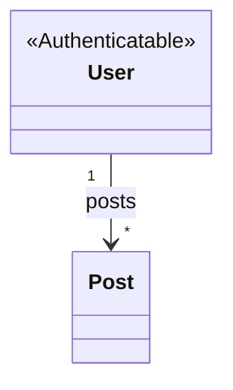

<!-- Generated by `bunx guren spec:generate` — do not edit by hand. -->

# Domain Model

Model classes and their declared relationships, grouped by module. Attributes live in the ER view (`er.md`).

## Models

- **Post** (app/Models/Post.ts) — table: `posts`
  - belongsTo: `author` → PostAuthorSummary
- **User** (app/Models/User.ts) — table: `users`
  - hasMany: `posts` → Post
