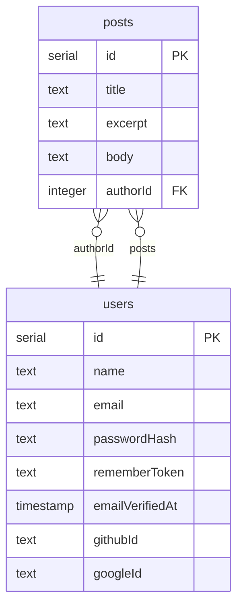

<!-- Generated by `bunx guren spec:generate` — do not edit by hand. -->

# ER Diagram

Entities and attributes are derived from `db/schema.ts` (and every module schema); edges from model relationship declarations and explicit `.references()` foreign keys.

## posts

| Column | Type | Constraints |
|--------|------|-------------|
| id | serial | primary key |
| title | text | not null |
| excerpt | text | not null |
| body | text |  |
| authorId | integer | not null, references users.id |

## users

| Column | Type | Constraints |
|--------|------|-------------|
| id | serial | primary key |
| name | text | not null |
| email | text | not null |
| passwordHash | text | not null |
| rememberToken | text |  |
| emailVerifiedAt | timestamp |  |
| githubId | text |  |
| googleId | text |  |
