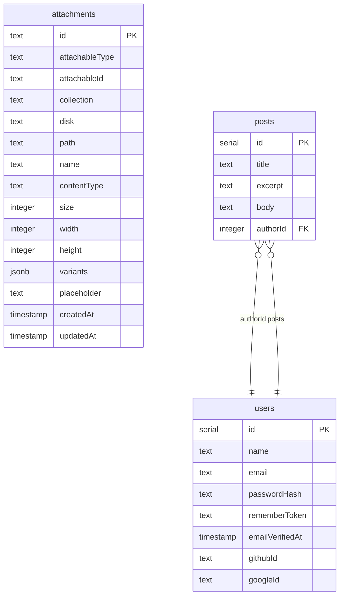

<!-- Generated by `bunx guren spec:generate` — do not edit by hand. -->

# ER Diagram

Entities and attributes are derived from `db/schema.ts` (and every module schema); edges from model relationship declarations and explicit `.references()` foreign keys.

This is a minimal, diff-able view. For interactive exploration of the Drizzle schema, tools like drizzle-lab or Liam ERD complement it.

## attachments

| Column | Type | Constraints |
|--------|------|-------------|
| id | text | primary key |
| attachableType | text | not null |
| attachableId | text | not null |
| collection | text | not null |
| disk | text | not null |
| path | text | not null |
| name | text | not null |
| contentType | text | not null |
| size | integer | not null |
| width | integer |  |
| height | integer |  |
| variants | jsonb |  |
| placeholder | text |  |
| createdAt | timestamp | not null |
| updatedAt | timestamp | not null |

## posts

| Column | Type | Constraints |
|--------|------|-------------|
| id | serial | primary key |
| title | text | not null |
| excerpt | text | not null |
| body | text |  |
| authorId | integer | not null, references users.id |

## users

| Column | Type | Constraints |
|--------|------|-------------|
| id | serial | primary key |
| name | text | not null |
| email | text | not null |
| passwordHash | text | not null |
| rememberToken | text |  |
| emailVerifiedAt | timestamp |  |
| githubId | text |  |
| googleId | text |  |
