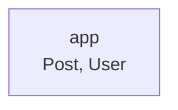

<!-- Generated by `bunx guren spec:generate` — do not edit by hand. -->

# Modules

This app has no `modules/` directory — all code lives at the application root.

## app

Models (2):

- Post — app/Models/Post.ts
- User — app/Models/User.ts
