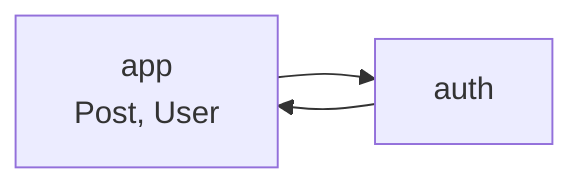

<!-- Generated by `bunx guren spec:generate` — do not edit by hand. -->

# Modules

Application modules under `modules/`, the models each owns, and the dependencies between them — derived from the directory layout and static imports, not this document.

## app

Depends on: auth

Models (2):

- Post — app/Models/Post.ts
- User — app/Models/User.ts

## auth

Depends on: app

Models (0):

- none
