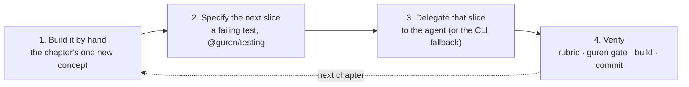

# RFC: The Guren Tutorial — hand-write once, then delegate

**Author:** Urata Daiki (@7nohe)
**Date:** 2026-09-06
**Status:** Draft

> Why an RFC for documentation: the course below is a multi-month, multi-PR
> project that restructures `docs/*/tutorials/`, adds a CI gate that executes
> the tutorial text, and fixes the pedagogy every later chapter must follow.
> The individual chapters are ordinary docs PRs; the shape they share is what
> needs deciding once.

## Problem

Rails spread in large part because of the Rails Tutorial. It did not teach
Rails so much as it taught *web engineering* with Rails as the vehicle: HTTP,
cookies and sessions, password hashing, REST, relational modelling, tests
written before code, and a commit plus a deploy at the end of every chapter.
A reader finished it as someone who could build and ship a web application.

Guren's tutorial today is three parts under `docs/en/tutorials/` (about 8,600
words, 15 to 25 minutes each). It is good at what it set out to do, the
"generate with the CLI, read the generated code, verify with `check` and
`audit`" loop, but measured against the Rails Tutorial it has four gaps:

| | Rails Tutorial | Guren tutorial today |
|---|---|---|
| Chapters | 14 | 3 |
| Tests | every chapter, written first | none |
| `git commit` and deploy | every chapter | none |
| Sessions and authentication | built by hand | `bunx guren add auth` |
| Verified against the framework | by hand, per edition | `scripts/smoke/docs-audit.ts` substring checks only |

Two of these are structural rather than a matter of length:

1. **A reader who never wrote a session cannot judge one.** Every chapter
   produces code the reader did not write, first from a generator and, in
   day-to-day Guren work, from a coding agent. Reviewing that output is the
   skill the course has to teach, and it cannot be taught to someone who has
   never written the thing being reviewed.
2. **Nothing distinguishes it from any framework's tutorial.** Guren's claim
   is that it is a framework built for the agent era: a harness the agent
   reads (`guren agent:init`), gates the agent's output must pass (`guren
   gate`, the Stop hook), a context map it queries (`guren context`), and
   route contracts that turn the app itself into an agent's tool (RFC 0016).
   The tutorial mentions none of it, so it demonstrates none of it.

The Rails Tutorial also had a maintenance cost its author paid by hand through
seven editions. Guren has drift gates for specs and docs already; a tutorial
that CI cannot execute is the one long document in the repository that rots
silently.

## Proposed Solution

### 1. Every chapter has the same four beats



- **Hand.** The reader writes only the code that carries the chapter's new
  concept: a table and model, a login, a policy, a pivot table. Never the
  React page for the third CRUD screen. Writing the concept once is what makes
  beat 4 possible. Skeletons from `make:*` are allowed where the ceremony is
  not the lesson; the file whose structure *is* the lesson starts blank.
- **Specify.** Before the delegated slice exists, the reader writes the test
  that will judge it, with `TestApp` from `@guren/testing`, and runs it red.
  This is not "test-first" for the hand-written code (that is written first,
  then covered); it is a specification of what the reader will accept from
  the agent. The chapter states which of the two it is doing.
- **Delegate.** The chapter gives the prompt verbatim, in a quoted block,
  worded for any of the harness's targets (`guren agent:init --target all`
  covers claude, codex, cursor, copilot and opencode; Claude Code is the path
  the screenshots show). Every delegation names its deterministic fallback
  (`bunx guren add …`, `bunx guren make:*`, or a `file=` block), so the course
  is completable without an agent subscription and so CI can run it. A
  fallback may over-deliver (`add resource` writes more than one chapter asks
  for); the text says what to ignore until its chapter.
- **Verify.** The reader reviews the agent's output against a short rubric
  the chapter gives (what must be there, what must not, where to look), runs
  `bunx guren gate` and `bun run build`, and commits. `gate` runs codegen,
  typecheck, lint, check, audit and test; it does not build, so the build is
  a separate step. The Stop hook of the Claude, Codex and Cursor targets runs
  the gate when a turn ends with a dirty tree (`stopGateFindings` in
  `packages/cli/src/gate.ts`); Copilot and OpenCode are told to run it by
  hand. Chapter 1 shows both, so from chapter 2 on the reader is using the
  harness exactly as it ships.

Agent output is non-deterministic, so **the chapter text never presents "the
code the agent will write".** The hand-written version is the reference and
lives in the text; the agent's version is judged by the test, the rubric and
the gate. This keeps the prose stable across framework releases and teaches
verification criteria rather than output matching.

**What the gates can and cannot catch is itself a lesson.** `guren audit`
verifies *authentication* on mutating routes and reports a miss as a warning,
which `gate` does not fail on; it cannot see record-level *authorization* on
an ordinary route. Chapter 7 is built on that: the reader's 403 test, written
before delegation, is what catches an agent that forgot the policy. Chapter
12 closes the loop: on a route declaring `.agent()`, a missing authorization
is a hard `check` failure (`packages/cli/src/agent-route-check.ts`), so the
same omission is caught mechanically once the route is an agent's tool.

**The fallback path is the one CI runs**, so every chapter must be written to
continue from the fallback's output, not only from a particular agent's.

**The harness is a subject, not scenery.** The Rails Tutorial taught git and
Heroku alongside Rails because a working engineer needed both. The equivalent
here is the agent harness `agent:init` installs: the `SessionStart` hook that
injects `guren context`, the `PostToolUse` hook that re-runs `check` after an
edit, the Stop hook, the glob-scoped rules in `.claude/rules/`, the skills,
the `code-review` and `test-writer` subagents, the `.mcp.json` pointing at the
dev MCP endpoint, and `agent:sync` for keeping all of it current. Each chapter's
delegation beat therefore introduces **one harness lever** (the last column of
the table), so by chapter 8 the reader has used the hooks, the rules, a
skill and both subagents, and chapter 8 has them build their own: a project rule, a skill, and a subagent brief. The
lesson of the course is that the agent is only as good as the harness the
reader gives it, and that the harness is theirs to shape.

### 2. Chapter plan

Fourteen chapters plus an overview, 5,000 to 7,000 words each (75,000 to
100,000 words in English, mirrored in Japanese). The current three parts fold
into chapters 3–4, 5–7 and 9. Chapter 1 is, like Hartl's chapter 1, the setup
chapter and the one exception to the four beats.

| # | Chapter | Hand-write | Specify | Delegate (fallback) | New surface | Harness lever |
|---|---|---|---|---|---|---|
| 0 | Overview | — | — | — | The four beats; prerequisites; the edition pin | What a harness is |
| 1 | Zero to deployed | Read what the scaffold installed: CLAUDE.md, `.claude/rules/`, `tests/HomeController.test.ts`, `.github/workflows/ci.yml`; change the home page and watch the hooks react | — | Ask the agent what the project is | `create-guren-app`, `agent:init`, `guren gate`, first deploy | `SessionStart` injects `guren context`; `PostToolUse` re-runs `check`; the Stop hook runs `gate` |
| 2 | One request, by hand | Route and controller returning a plain response, then the Inertia page for `/about` | `TestApp` HTTP assertions | A second page (`make:controller` + `file=`) | Router, Controller, `this.inertia()`, codegen, props | Glob-scoped rules: `routes-codegen.md` and `controllers-http.md` load only when those files are edited |
| 3 | The posts table | Schema, `make:migration`, `db:migrate`, model, `index`/`show` | `new`/`create` assertions | `new`/`create` (`add resource Post`) | Drizzle schema, `defineModel`, `paginate` | The `scaffold` skill: the agent reaches for `make:*` instead of typing |
| 4 | Validation and resources | Zod validator, `Resource`, 422 error display | `edit`/`update`/`destroy` and pagination assertions | `edit`/`update`/`destroy`, pagination (already in the `add resource` output) | `validateBody`, `validateParams`, `Data.*` | The `code-review` subagent as beat 4's second reader |
| 5 | Users and passwords | `users` table, `Hash`, registration, `this.auth.login()`, logout | Login flow, `actingAs` | Profile page | Session middleware, guards, CSRF, flash | `guren context User`: the entity bundle the agent reads before touching a model |
| 6 | Protecting routes | `requireAuthenticated`, author FK as nullable → backfill → not null | 401 redirects | `add auth` on a branch; diff password reset and email verification | Migrations you can run on real data | The `db-manage` skill and its safety checks |
| 7 | Authorization, and what the gate cannot see | A policy (`make:policy`), author-only edit | The 403 test | "Add publish/unpublish" (prompt omits authorization) | `authorize()`, why `audit` warns instead of failing | The `test-writer` subagent, and why it cannot replace beat 2 |
| 8 | Teach the agent your project | A project rule (`.claude/rules/policies.md`: every mutation has a policy and a 403 test), a skill (`resource-with-policy`), a subagent brief | The rule's own test: delegate a fourth resource and assert the policy and test exist | A fourth resource under the new rule (`add resource` + `make:policy`) | `guren guidelines`, `agent:sync`, rules vs skills vs subagents, the dev MCP endpoint (`GUREN_MCP=1`, `.mcp.json`) | Authoring, not using |
| 9 | Relationships | Comments: `hasMany`/`belongsTo`, eager loading; the tags pivot table | Relationship assertions | Tags end to end, not only the UI (amended, see below) | Relations, `with()`, `belongsToMany` | The `orm-models.md` rule and the API-signature digest in the context map |
| 10 | Files | After `add attachments`: declare the cover on `Post`, the upload form, one signed delivery route | Attachment assertions | Gallery (`many`) | RFC 0013 / RFC 0015 | `guren check` catching attachment wiring the agent got wrong |
| 11 | Events and mail | "Author is notified of a comment": event, listener, queued job and mailable | `fakeQueue()`, `fakeMail()` | Mail every commenter when a post is published (amended, see below) | `add events`/`queue`/`mail` | A project rule for the job registration nothing checks (amended, see below) |
| 12 | Your app as an agent's tool | One `.agent()` contract, `tool:list`, `tool:inspect` | `TestAgent` | The remaining contracts; install `@guren/plugin-mcp` and connect Claude Code to the running app | RFC 0016; `check` failing on a tool without authorization | The `agent-interface` skill; app MCP vs dev MCP |
| 13 | The system, documented | One ADR, `spec:generate`, `check --docs --spec` | The drift gate as the test | An issue-driven change via the RFC 0018 harness skill | OKF docs, Docs Graph, `docs:graph` | The harness reading `docs/` before an entity change |
| 14 | Production | Postgres switch, database-backed sessions, rate limiting, `add lint`; read the CI the scaffold gave you | CI green on the reader's fork | — | `NODE_ENV`, deploy targets | `agent:sync` after a framework upgrade; the harness on CI |

### Amendments during implementation

Recorded here rather than rewritten above, so the original design stays
readable beside what shipped.

- **Chapter 9's delegated slice** is the whole tags feature (schema, `Tag` and
  `PostTag` models, validator normalisation, resource, controller and pages),
  ~~the tag UI~~. A UI-only slice would not have exercised the pivot, which is
  the concept the chapter teaches.
- **Chapter 9 does not run `spec:generate`.** One run commits `docs/spec/`, and
  from that moment every later chapter's `guren gate` fails on drift until the
  reader regenerates. The views therefore arrive in chapter 13, which owns
  them; chapter 9 only says that relations feed them.
- **Chapter 11's delegated slice** is mailing every commenter when a post is
  published, ~~a notification channel~~. The `database` channel keeps
  notifications in a process-memory array with no table behind it, so a
  notifications feature would teach a store the reader has not built.
- **Chapter 11 needs no `add mail --force`.** The claim above assumed the
  course reaches chapter 11 having run `add auth`, which writes
  `app/Providers/MailProvider.ts` and `config/mail.ts`. The course hand-writes
  the auth provider in chapter 5 instead, so nothing is in the way and
  `add mail` installs its own provider cleanly.
- **Chapter 11's harness lever** is a project rule
  (`.claude/rules/background-work.md`) carrying the `registerJob` invariant,
  ~~the `guren-api` skill~~. `guren check` emits nothing at all about
  `app/Jobs/`, which makes the rule the only thing standing between the agent
  and a job that compiles and never runs.
- **Open Question 1 is decided.** Chapter 1 ends with a container image
  (`guren deploy --target docker`, then `docker build`/`docker run` shown but
  not executed); the hosted deploy belongs to chapter 14. Every chapter in
  between ends with `guren gate` and `bun run build`.

Rails Tutorial equivalents, for orientation: chapters 1–2 ≈ Hartl 1–3,
chapters 5–6 ≈ Hartl 6–9 (the by-hand auth core), chapter 9 ≈ Hartl 13–14.
Chapters 7, 8, 12 and 13 have no equivalent; they are the agent-era content.

Chapter 8 sits where it does because chapter 7 has just shown the agent
forgetting a policy. The reader's answer is not a better prompt but a rule
the agent reads every time it touches a mutation, a skill that scaffolds
resource, policy and test together, and a brief for the `code-review`
subagent to check for exactly that omission. Beat 2 of that chapter tests
the harness itself: delegate a fourth resource and assert the policy and its
403 test exist. Rules, skills and subagents are distinguished by *when* they
act (always, on request, as a second reader), and `guren guidelines` shows
what the framework can derive for the reader before they write a rule.

Dependencies outside this RFC: chapter 12 needs `@guren/plugin-mcp`
(shipped); chapter 13 needs the RFC 0018 harness skill (Part 3, in review as
PR #700) and is written last.

### 3. The tutorial is executable: `smoke:tutorial`

Fenced blocks in a chapter carry attributes after the language token. The
site renderer already highlights on the first token only (`marked-highlight`
takes `/\S*/` of the info string; `web/app/Services/MarkdownRenderer.ts`
receives `bash`, not `bash run`), and GitHub does the same, so the markers
are invisible to readers.

````markdown
```bash run
bunx guren make:policy Post
```

```ts file=app/Policies/PostPolicy.ts
// the complete file, never an excerpt
```

```bash run expect-fail
bun test tests/PostPolicy.test.ts
```

```bash run fallback
bunx guren add resource Tag --fields "name:string"
```

```bash manual
git push && fly deploy
```
````

Block grammar (a lint rejects anything else):

| Attribute | Meaning |
|---|---|
| `run` | Execute in the app root; non-zero exit fails the smoke |
| `run expect-fail` | Execute; a zero exit fails the smoke. This is how the red step of beat 2 is proven, not assumed |
| `run background` | Start and keep (`bun run dev`); stopped at chapter end; the port is read from the app's banner, never assumed |
| `run fallback` | Executed by the smoke in place of the agent beat it follows |
| `file=<path>` | Write the complete file at `<path>`, relative to the app root. `..`, absolute paths and symlink escapes are rejected after canonicalisation; a second `file=` for the same path is a full replacement and must say so in prose |
| `manual` | Shown to the reader, never executed (deploys, anything needing credentials or an identity) |

`scripts/smoke/tutorial.ts` walks `docs/en/tutorials/` in chapter order,
applies the blocks, and runs `bunx guren gate` and `bun run build` at the
end of every chapter. It reuses the vendoring in
`scripts/smoke/local-packages.ts`: the one substitution it makes is
`bunx create-guren-app` → the checkout's build with the `@guren/*` ranges
rewritten, and `create-guren-app` is invoked with explicit `--mode`, `--db`,
`--agents` and `--git` flags in the text so the interactive and CI paths
scaffold the same app. Nothing else in the document is rewritten.

Two consequences fall out of this:

- **The Japanese mirror cannot drift in code.** A companion check asserts
  that the ordered sequence of `run`, `file=` and `manual` blocks in
  `docs/ja/tutorials/` is byte-identical to the English one. Code, including
  test names and UI strings inside `file=` blocks, stays English in both
  locales; prose translates. Untagged illustrative fences are outside the
  check and are linted only for the grammar.
- **A framework change that breaks a chapter fails CI**, the same way
  `check --spec` fails on a drifted spec view today. This is the property
  the Rails Tutorial never had.

The smoke's per-chapter output doubles as the reader's checkpoints: a
scheduled job pushes each chapter's end state as a tag to a companion
repository (`gurenjs/tutorial-app`, `chapter-07`, …), so a reader can start
at chapter 8 or recover from a divergent agent run by checking out the tag.
The checkpoints are generated, never hand-maintained.

### 4. Site and repository changes

- `web/app/Services/docs-config.ts`: `TUTORIAL_SECTIONS` grows from one
  section to six (Foundations 1–4, Users 5–7, Your harness 8, Data 9–11,
  Agents 12–13, Production 14).
- A docs redirect map: the site has none today (`DocsController` renders a
  404 for an unknown slug), so the three retired slugs need a small
  `DOC_REDIRECTS` table honoured with a 301.
- `docs/CLAUDE.md`: a section on the four beats and the block grammar, so
  agents editing a chapter keep its shape.
- `scripts/smoke/docs-audit.ts`: the substring assertions on the old parts
  move to the new chapters or are retired in favour of `smoke:tutorial`.
- `package.json`: `smoke:tutorial` (fallback path, in CI) and
  `smoke:tutorial:agent` (Open Question 2). The CI job runs in a
  credential-free environment: `manual` blocks are the only ones that need
  secrets, and they are never executed.
- Edition pin: chapter 0 names the `create-guren-app` version the course was
  verified against, and the smoke installs that version's local equivalent.
  A framework minor that changes a chapter's output is a tutorial edition
  bump, made in the same PR the smoke turns red in.

### 5. Delivery

Each PR ships one or two chapters in both locales plus their smoke coverage,
so `smoke:tutorial` grows chapter by chapter and never covers text that does
not exist yet.

1. This RFC, the block-grammar lint, the smoke skeleton, chapter 0 and
   chapter 1. Chapter 1 is where Open Question 1 gets decided by building it.
2. Chapters 2–4 (foundations; absorbs the current Part 1).
3. Chapters 5–8 (users and the reader's own harness; absorbs Part 2).
4. Chapters 9–11 (data; absorbs Part 3).
5. Chapter 12, then 13 once RFC 0018 Part 3 ships.
6. Chapter 14, the section restructure, the redirects.

## Alternatives Considered

**Adopt the Rails Tutorial pedagogy as-is: type everything.** Rejected. It
contradicts the "generate, then read" positioning the current tutorial
already commits to, it roughly triples the length for the same concepts, and
it demonstrates nothing about the agent era. The by-hand beat keeps what made
that pedagogy work (you cannot review what you never wrote) without the toil.

**Agent-only: no hand-writing, the reader prompts and reviews.** Rejected.
The reader has no reference to compare against and no basis for judging the
output; the course would teach prompting, not engineering. The Rails
Tutorial's lasting value was fundamentals, and fundamentals are learned by
building the thing once.

**Present the agent's output in the text.** Rejected; it is non-deterministic
and would go stale on every model release. The hand-written reference plus
the test, rubric and gate is the stable form.

**A separate book site or repository, as Hartl did.** Rejected for now.
`docs/` is where the drift gates, the locale mirror, and the docs viewer
live; a separate repository loses `smoke:tutorial`, which is the property
that makes this maintainable by one person.

**An in-browser interactive course (Rust Book, Svelte tutorial style).** Out
of scope. The four-beat shape does not depend on the delivery medium, so this
can be layered on later without changing the chapters.

**A script that mirrors each chapter, plus a check that every command in the
doc appears in the script.** Rejected in favour of executing the document
directly. A mirror is a second copy, and the check only catches commands that
vanished, not steps that changed meaning.

**Excerpts in `file=` blocks with patch semantics (`append`, `replace`).**
Rejected for the first edition: patch blocks are a second language the reader
has to learn and the smoke has to implement. Complete files are longer on the
page but unambiguous; a chapter that needs to show a diff shows it in an
untagged fence and gives the whole file once.

## Migration Path

Additive to the framework; no public API changes. For readers of the current
three parts, the retired slugs redirect to the absorbing chapters and the
content they cover survives (chapters 3–9). The old parts stay live until
the absorbing chapters ship. For contributors, `docs/CLAUDE.md` carries the
chapter shape and the block grammar.

## Open Questions

1. **Deploy target for "every chapter ends deployed".** *Decided while
   building chapter 1: a container image there, the hosted deploy in chapter
   14; see the amendments above.* It must be free for
   the reader and support password login. That rules out Cloudflare Workers'
   free plan for this course (`docs/en/guides/cloudflare.md`: the 10 ms CPU
   budget rules out password hashing; sessions must be database-backed).
   Recommendation: a real deploy in chapters 1 and 14 only, to one of the
   `guren deploy` targets (`docker`, `fly`, `railway`) chosen in chapter 1;
   every other chapter ends with `bun run build` and a production-mode
   `bin/serve.ts` health check as its "ship it" step. Decide by building
   chapter 1.
2. **Should anything ever run a real agent?** `smoke:tutorial` uses the
   fallback commands and is deterministic. A scheduled, non-blocking
   `smoke:tutorial:agent` could run one agent headless with a pinned model
   and a fixed budget against each chapter's prompt, in the same
   credential-free environment, and publish whether the gate passed, as a
   measure of how well the harness steers an agent through the course.
   Recommendation: yes, scheduled beside `Published Package Drift`, never a
   required status, and only after the fallback smoke has been green for a
   full delivery cycle.
3. **Block grammar.** Info-string attributes as above. The alternative is an
   HTML comment before the fence, which GitHub also hides but which separates
   the marker from the block it governs. Recommendation: info-string
   attributes, with the lint from PR 1.
4. **Blank files or `make:*` skeletons for the hand beat?** Skeletons by
   default; blank where the structure is the lesson (the controller in 2, the
   model in 3, the policy in 7). A generator must not pre-solve the concept
   the beat claims to teach.
5. **Assumed background.** TypeScript and basic shell and git, not React or
   Inertia. Chapter 2 carries the minimal page/props/form model; an appendix
   reinforces it. Assuming no TypeScript would add three chapters that are
   not about Guren.
6. **Browser-level verification.** `TestApp` and `gate` prove the server,
   not that a React form or an upload works in a browser. Recommendation:
   out of scope for the first edition; chapter 14 mentions Playwright and the
   `e2e` scripts the blog example uses, and a later edition can add a
   `run e2e` block class.
7. **Maintenance budget.** Two locales times fourteen chapters means every
   framework change that moves a chapter's output blocks on both. The
   locale check makes the code half mechanical; the prose half is the cost
   of having a Japanese course at all, and it is accepted.
